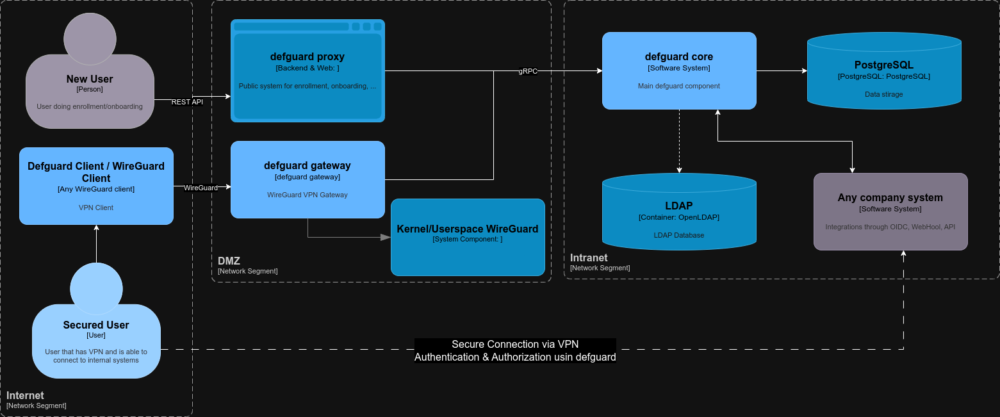
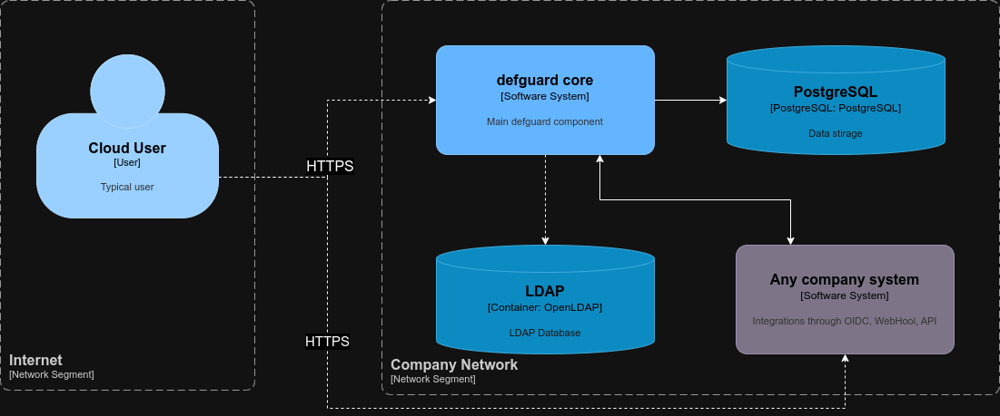

# Introduction

Better quality video can [be found here to download](https://github.com/DefGuard/docs/raw/docs/screencasts/defguard-screencast.mkv)

## What is Defguard?

In a nutshell, from a **functionality** point defguard is an **OpenID Identity Provider** (SSO for your apps) and **Wireguard VPN  Service** for building secure private networks (roadwarrior, mesh/peer-to-peer, site-to-site).

On a broader aspect, it's a **security platform** for building **secure** and **privacy-aware organizations (with its secure architecture).**

By design **defguard core is meant to be deployed in your secure network segments** (available only from an internal network or by VPN) and operations that require public access (like user onboarding, enrollment, password reset, etc.) **are done using a secure proxy:**

<figure><figcaption>
Secure architecture
</figcaption></figure>

This architecture and approach gives you options - **either you secure your systems (with VPN\&Proxy),** or you can deploy typical architecture **without VPN/Gateway\&Proxy - and defguard as an OIDC provider** and your apps can be available from the Internet:

<figure><figcaption>
Simple Cloud architecture secured only with HTTPS
</figcaption></figure>

### Why should I care for a secure platform and not just functionalities (i just want VPN/OpenID...)?

You may not, you can just use defguard selected modules (and disable others in UI and not even see them) and be happy with a **really nice UI to manage users, apps, networks, devices, and hardware security keys.**

Or use another dedicated system just for that functionality (there are a lot OpenID/Identity, Wireguard VPN providers - commercial or open-source), but what typically happens is you start with one selected functionality/system  - and over time (when your user base, network, and apps grow) - is that you need another functionality. Then, you need to deploy another and another system - and **integrate them.** Most of the time it's really **hard** (and sometimes impossible) to integrate those systems - even if you can, it's **costly.** But what is most important: **it takes time** to integrate various systems into one platform, and even if you do it - most likely it will **not be easy to use by users** and **hard to maintain by developers and administrators.**

That's why defguard came to be, being a company that:

* built small projects/organizations that grew over time we saw how difficult and costly it is to expand
* at the same time working with large organizations - we saw the horror of users that use multiple (ugly and unintuitive systems) - and large devops/admin/developer teams to maintain this

### What does it mean to build a secure "organization" (or even a small network like a homelab)?

First of all, It means implementing a **secure architecture** for your network and systems. In the age of "cloud," all systems (and data) are **public.** But that should be **for you to decide!**

That's why defguard architecture (and implementation) is secure (and thoroughly and comprehensively audited by one of the best security researchers). If you want full privacy, defguard only exposes its VPN gateway (to provide a secure channel to all internal systems that should be behind the firewall) and the public proxy (for the remote user enrollment process).

It also means having an architecture (systems, networks), that will cover all **fundamental processes,** like:

* secure remote user enrollment (self-service)
* user self-service to manage their own data, change passwords, add/remove VPN devices, connect securely to networks
* for administrators to easily setup, manage and monitor multiple VPN networks (with access control) to provide a secure connection to applications that should not be visible on the internet
* deploy an Identity Provider to have one place to manage all users
* that Identity Provider should provide SSO functionality to enable users to log in to all systems with one login/password
  * have 2FA/MFA functionality to harden security
* setup Yubikey Hardware keys to enable the best 2FA security, secure SSH login with private keys on a secure hardware
* integrate all your systems with API, and Webhooks (to access defguard functionalities or users' data)

**Building a secure organization has always been difficult and costly. Defguard provides a beautiful, easy-to-use (business users) and deploy (admin/DevOps) fundament to make your organization secure.**

## Features

[OpenID Connect provider](https://openid.net/developers/how-connect-works/) with some **unique features:**

* Secure remote (over the internet) [user enrollment](https://defguard.gitbook.io/defguard/help/remote-user-enrollment)
* User [onboarding after enrollment](https://defguard.gitbook.io/defguard/help/remote-user-enrollment/user-onboarding-after-enrollment)
* LDAP (tested on [OpenLDAP](https://www.openldap.org/)) synchronization
* nice UI to manage users
* Users **self-service** (besides typical data management, users can revoke access to granted apps, MFA, Wireguard, etc.)

[Wireguard](https://www.wireguard.com/) VPN management with:

* multiple VPN Locations (networks/sites) - with defined access (all users or only Admin group)
* multiple [Gateways](https://github.com/DefGuard/gateway) for each VPN Location (**high availability/failover**) - supported on a cluster of routers/firewalls for Linux, FreeBSD/PFSense/OPNSense
* import your current WireGuard server configuration (with a wizard!)
* _easy_ device setup by users themselves (self-service)
* automatic IP allocation
* kernel (Linux, FreeBSD/OPNSense/PFSense) & userspace WireGuard support
* dashboard and statistics overview of connected users/devices for admins
* _defguard is not an official WireGuard project, and WireGuard is a registered trademark of Jason A. Donenfeld._

[Multi-Factor/2FA](https://en.wikipedia.org/wiki/Multi-factor\_authentication) Authentication:

* [Time-based One-Time Password Algorithm](https://en.wikipedia.org/wiki/Time-based\_one-time\_password) (TOTP - e.g. Google Authenticator)
* WebAuthn / FIDO2 - for hardware key authentication support (eg. YubiKey, FaceID, TouchID, ...)
* Web3 - authentication with crypto software and hardware wallets using Metamask, Ledger Extension

[Yubikey hardware keys](https://www.yubico.com/) provisioning for users by _one click_

Webhooks & REST API

Web3 wallet validation

Build with [Rust](https://www.rust-lang.org/) for portability, security, and speed

Fronted in TypeScript with:

* a set of custom and beautiful components for the layout
* Responsive Web Design (supporting mobile phones, tablets, etc..)
* [iOS Web App](https://www.macrumors.com/how-to/use-web-apps-iphone-ipad/)

**Checked by professional security researchers** (see [comprehensive security report](https://defguard.net/images/decap/isec-defguard.pdf))

End2End tests

### Features in development / planned

Go to product [**ROADMAP**](features/roadmap.md)**.**

## Guides: Jump right in

Follow our handy guides to get started on the basics as quickly as possible:


[setting-up-your-instance](features/setting-up-your-instance/)



[create-your-vpn-network.md](features/wireguard/create-your-vpn-network.md)



[ldap-synchronization-setup.md](features/ldap-synchronization-setup.md)



[webhooks.md](community-features/webhooks.md)


## Fundamentals: Dive a little deeper

Learn the fundamentals of Defguard to get a deeper understanding of our main features:


[architecture.md](in-depth/architecture.md)



[Broken link](broken-reference)

