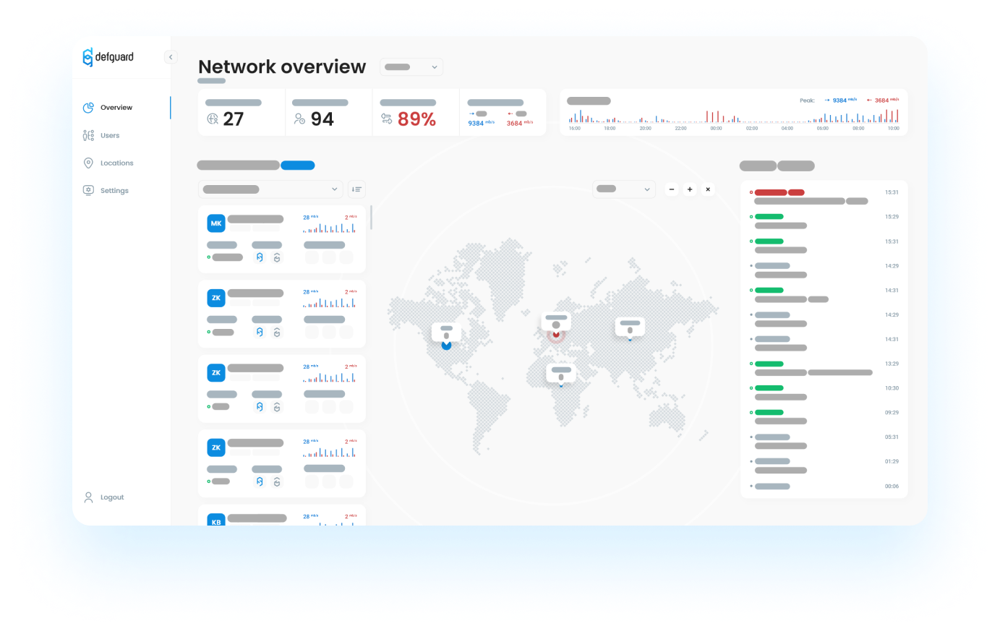

# Intro to Defguard

## What is Defguard?

Defguard is an open-source identity managment website made with the aim to make company managment as easy as possible. On this page you will find short description of three key features

* **Wireguard VPN managment**
* **LDAP synchronization**
* **Webhooks**

## Problems that defguard adresses and solves

* Your company have self hosted services for example: Git/Jira/Slack etc. and want easy to use central logging system with simple and nice UI
* Fast and easy to setup VPN (Remote access to company resources as above)
* Webhooks triggered after taking specified actions on user sending user data to provided url which allows you to automate stuff like sending welcome mail or creating accounts in different services

## VPN managment&#x20;

Defguard allows you for creating Wireguard VPN server in few simple steps. After that you can monitor your network by seeing overall usage and per user stats with information about all of their devices and download configuration files for new devices.

## LDAP synchronization

In a few simple steps you can synchronize your LDAP data for example import your ldap data to defguard and:&#x20;

* Handle users priviliges
* Create new users&#x20;
* Modify existing users
* Manage groups

## Webhooks

Easy to use and configure outgoing webhooks to help you automate certain tasks.

## Guides: Jump right in

Follow our handy guides to get started on the basics as quickly as possible:


[setting-up-your-instance.md](guides/setting-up-your-instance.md)



[create-your-vpn-network.md](guides/create-your-vpn-network.md)



[ldap-synchronization-setup.md](guides/ldap-synchronization-setup.md)



[webhooks.md](guides/webhooks.md)


## Fundamentals: Dive a little deeper

Learn the fundamentals of Defguard to get a deeper understanding of our main features:


[architecture.md](in-depth/architecture.md)



[wireguard-vpn.md](in-depth/wireguard-vpn.md)

