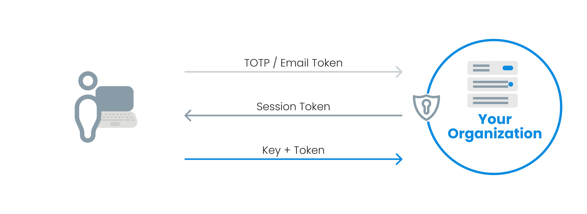
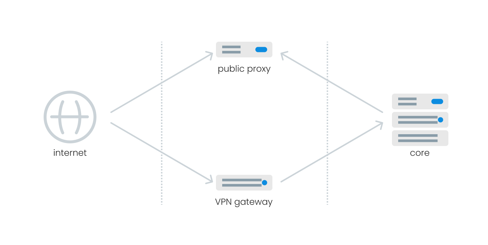

# About defguard



## What is Defguard?

Defguard is a **comprehensive Remote Access Management solution** incorporating in one solution:

* True Zero-Trust [WireGuard® VPN with 2FA/Multi-Factor Authentication](../admin-and-features/wireguard/),
* Identity Management with [SSO based on OpenID Identity Provider](../admin-and-features/openid-connect/),
* Account Lifecycle management with [secure remote account onboarding](../help/enrollment/).

***

<mark style="color:purple;">**Our primary focus at defguard is on prioritizing security. Then, we aim to make this challenging topic both useful and as easy to navigate as possible.**</mark>

***

Defguard is a true Zero-Trust [WireGuard® VPN with 2FA/Multi-Factor Authentication](../admin-and-features/wireguard/), as each connection requires MFA (and not only when logging in into the client application like other solutions):

<figure><figcaption></figcaption></figure>

Having said that, this security platform is for building **secure** and **privacy-aware organizations,** as we put great effort not only on functionality but first and foremost on secure code, architecture and testing (application and security).

### Basic security concept

The main architecture concept is that **all critical data should be in the internal (Intranet) network and not exposed in the public Internet** (contrary to typical and common cloud approach) and only services that need to be exposed to the Internet - should be exposed in a controled (DMZ) network segments:

<figure><figcaption>
Internet, DMZ &#x26; Internal network segments
</figcaption></figure>

This approach is **vastly different from most (if not all) VPN/IdP solutions**, which are a simple or monolithic applications focus on functionalities and most of the time is publicly available in the Internet for any attacker to exploit.

Of course you can deploy defguard in a typical scenario (all services on one server and even all publicly available) - but that should be **for you to decide!**

### Incorporating IdP and VPN in one solution

Incorporating IDM, ALM, VPN has also other advantages:

1. Internal IdP with 2FA/MFA enables us to provide [**real VPN 2FA/MFA**](../admin-and-features/wireguard/multi-factor-authentication-mfa-2fa/architecture.md) - and not like most applications just 2FA when opening the app (and not during the connection process). Even if you use [external OIDC](../enterprise/all-enteprise-features/external-openid-providers/) (Google/Microsoft/Custom - which defguard supports), we still use our internal IdP for 2FA/MFA.
2. Your organization may use just **one account** (login) for access control to all your applications as well as VPN.
3. It simplifies deployment, maintenance, audits.

More about [defguard's architecture and security can be found here](../in-depth/architecture/).

## Pentested!

**Checked by professional security researchers** (see [comprehensive security report](https://defguard.net/pdf/isec-defguard.pdf))

