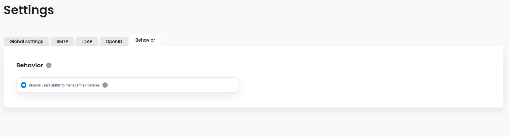

# Behavior customization


This feature requires version 1.0 and an enterprise plan.


Defguard supports behavior customization.

## Configuration

In order to configure behavior, go to the settings in the Defguard admin dashboard.

<figure><figcaption></figcaption></figure>

### Available options

* Disable users ability to manage their devices - when this option is enabled, only users in the Admin group can manage devices in user profile (it's disabled for all other users)
