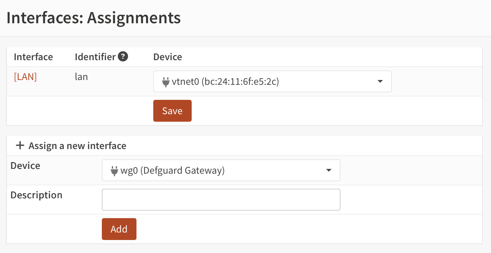
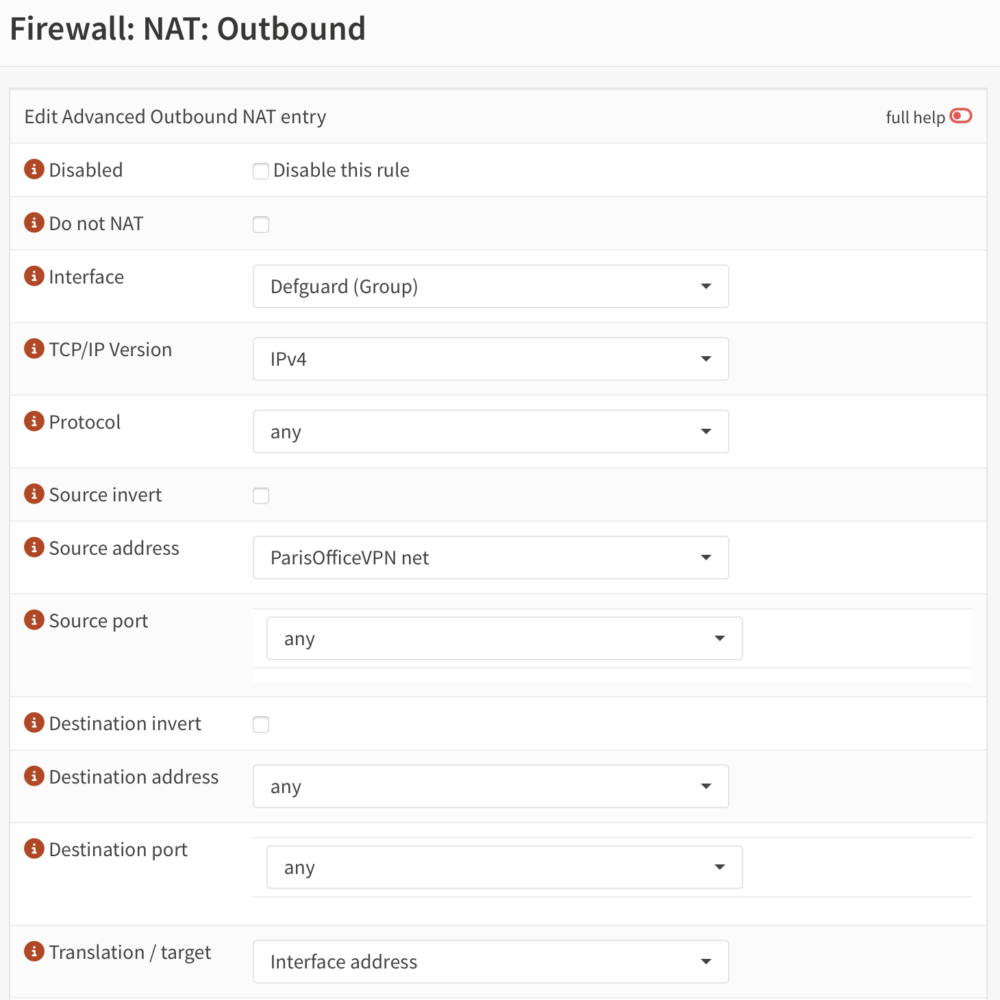
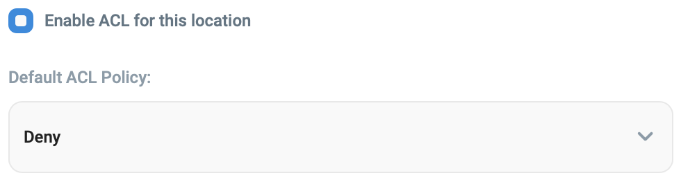

# OPSense Configuartion

[OPNsense®](https://opnsense.org/) is an open source, feature rich firewall and routing platform, offering cutting-edge network protection.

## Defguard Gateway Configuration

This instruction helps configuring Defguard Gateway in OPNsense. This is based on [WireGuard Road Warrior Setup](https://docs.opnsense.org/manual/how-tos/wireguard-client.html) from OPNsense documentation.

### Configure Defguard Gateway plugin

1. Go to **VPN → Defguard Gateway**
2. Fill out the appropriate values in the form. You can read more about the available configuration options here: [#gateway-configuration](../../../configuration.md#gateway-configuration "mention")
3. Eventually, **Start/Restart** the service.

<figure><figcaption></figcaption></figure>

### Assign a network interface to Defguard

1. Go to **Interfaces → Assignments**
2. Under **Assign a new interface**, select the Defgaurd Gateway network interface (e.g. _wg0_)
3. Add a descrption, for example _ParisOfficeVPN_
4. Click **Add**

<figure><figcaption></figcaption></figure>

5. Select the newly create interface by clicking on its name (in this example _\[ParisOfficeVPN]_).
6. Select **Enable Interface**
7. Select **Prevent interface removal**
8. Click **Save**, and then **Apply changes**

### Create an outbound NAT rule

1. Go to **Firewall → NAT → Outbound**
2. Make sure the selected **Mode** is **Hybrid outbound NAT rule generation**; if it wasn't selected, click **Save** and then **Apply changes**
3. Under **Manual rules**, add a new rule by clicking **+**.
4. Select **Interface** – this should be either WAN or LAN, depending on the needs.
5. Select **TCP/IP version** – either IPv4 or IPv6.
6. Select **Source address** – this should be interface name assigned above plus _net_, e.g. _ParisOfficeVPN net_.
7. Click **Save**, and then **Apply changes**

<figure><figcaption></figcaption></figure>

### Add firewall rules to allow WireGuard traffic in

1. Go to **Firewall → Rules → WAN**
2. Click **+** (plus) to add a new rule
3. The rule should _Pass_ the traffic _in_ with _quick_ option enabled
4. Select **WAN** interface
5. Choose **TCP/IP version** of your desire
6. Select **UDP** protocol.
7. Set **Destination** to **WAN address** and port to the port number provided in Defaurd Core: _Location configuration → Gateway port_
8. Click **Save**, and then **Apply changes**

<figure><figcaption></figcaption></figure>
