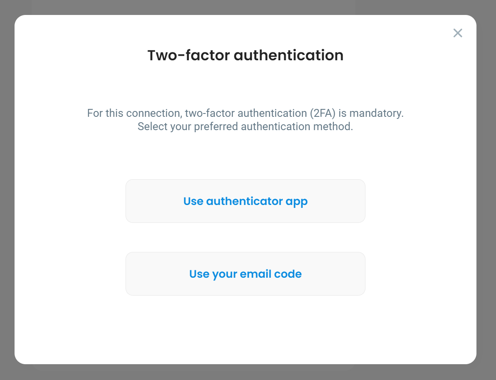
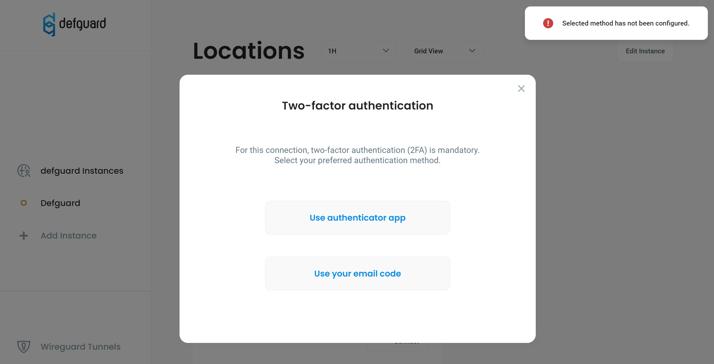

# Multi-Factor Authentication (MFA/2FA)

We support two types of Multi-Factor Authentication:

1. Based on our [Internal OIDC/SSO](../../openid-connect/) - called [Internal MFA ](./#internal-mfa)- using this method the Desktop & Mobile clients authenticate with **TOTP & Email codes** and after that with **session keys based on Wireguard Pre-Shared Keys** (PSK). For more details about this please refer to the [architecture section](architecture.md).
2. Based on [External OIDC/SSO](../../external-openid-providers/) - called [External MFA](./#externa-mfa) - this method is supported from version 1.5 ([currently in alpha](../../../deployment-strategies/pre-production-and-development-releases.md)) and requires the External SSO to be configured in the system. Each connection when using this method will open a web browser with authentication session to the SSO (like Google/Microsoft Entra/Okta/....) and after successful authentication **session keys based on WireGuard Pre-Shared Keys** (PSK) are exchanged between the client and server (for more details about this please refer to the [architecture section](architecture.md)).


From version 1.5 ([currently in alpha](../../../deployment-strategies/pre-production-and-development-releases.md)) **each VPN Location can be configured to use either Internal or External MFA.**


## Internal MFA

Enabling Internal MFA for a desired VPN Location is done by:

1. going into Defguard to **VPN Overview**
2. selecting the VPN Location from the dropdown list, and pressing the **Edit Location** button in the top right corner of the page
3. check the "**Require MFA for this Location**" checkbox under the Location Configuration section
4. set **Peer disconnect threshold** we recommend it to be min. 300 (5 min) - see chapter [below](./#peer-disconnect-threshold).
5. and **save changes**.

<figure><figcaption>
Example MFA Location configuration
</figcaption></figure>

### Peer disconnect **threshold**

When MFA is enabled on a location Defguard periodically (currently every **1 minute**) checks statistics if a client is connected and if the period of inactivity (defined in Peer disconnect threshold option) is met, a client is disconnected.

Thus the gateway needs to be configured to send statistics in that period.

We recommend to set:

* gateway to send statistics every 30sec
* Peer disconnect threshold we recommend it to be min. 300 (5 min)

### Client update after enabling MFA


When MFA configuration is changed, all clients must do an [Instance Update](../../../help/configuring-vpn/add-new-instance/update-instance.md).


### Testing MFA on Defguard client

If a VPN has MFA enabled, before connecting you will be asked to complete the authentication step first:

<figure><figcaption>
MFA in Defguard desktop client
</figcaption></figure>

### Supported MFA methods

For now, MFA is only available with the following methods:

* [TOTP - Time-based one-time password](../../../help/setting-up-2fa-mfa.md#one-time-password)
* Email - requires [SMTP to be configured](../../../notifications/setting-up-smtp-for-email-notifications.md)


Please remember to configure TOTP on you user account and/or SMTP settings for MFA on the desktop client to work..


### User MFA setup

After enabling MFA for a given VPN, users will need to enable MFA for their accounts to be able to connect. This process is described in [setting-up-2fa-mfa.md](../../../help/setting-up-2fa-mfa.md "mention"). For simplicity & security, the desktop client uses the same MFA methods as the Defguard server.

An error message will be shown if users attempt to select a MFA method that has not been enabled for their accounts:

<figure><figcaption>
Attempting to use an MFA method that has not been enabled on the user's account.
</figcaption></figure>

### Successful authentication

If authentication succeeds, the vpn two factor authentication modal will be closed and connection to the selected VPN will be attempted. Users will be asked to authenticate on every connection to a VPN with MFA enabled.

## External MFA

In order to enable the External MFA authentication:

1. Your instance **must have** [external OIDC/SSO configured](../../external-openid-providers/).
2. Select the VPN Location from the dropdown list on the Network Overview, and pressing the **Edit Location** button in the top right corner of the page.
3. Select the External MFA in the M

<figure><figcaption></figcaption></figure>

#### Client disconnect threshold

When MFA is enabled on a location, Defguard periodically (currently every **1 minute**) checks statistics if a client is connected and if the period of inactivity (defined in this option) is met, a client is disconnected.

Thus the gateway needs to be configured to send statistics in that period.


We recommend to set:

* gateway to send statistics every 30sec
* Peer disconnect threshold we recommend it to be min. 300 (5 min)


### Testing MFA on Defguard client

When a location has External MFA enabled, after clicking Connect in the Desktop client ([here you can find information about Mobile Client External MFA](../../../help/mobile-client/instance-connect.md#external-mfa)), there will be information displayed about authentication requirement:

<figure><figcaption></figcaption></figure>

In order to authenticate the user will be prompted to click on Authenticate with your configured OIDC (like Authenticate with Google) - which will open the browser and start the authentication session with your OIDC/SSO provider by the [Defguard Enrollment ](../../../help/enrollment/)service (which is the only public component).

After successful authentication the user will be informed by the enrollment service like so:

<figure><figcaption></figcaption></figure>

And the VPN should be connected.
