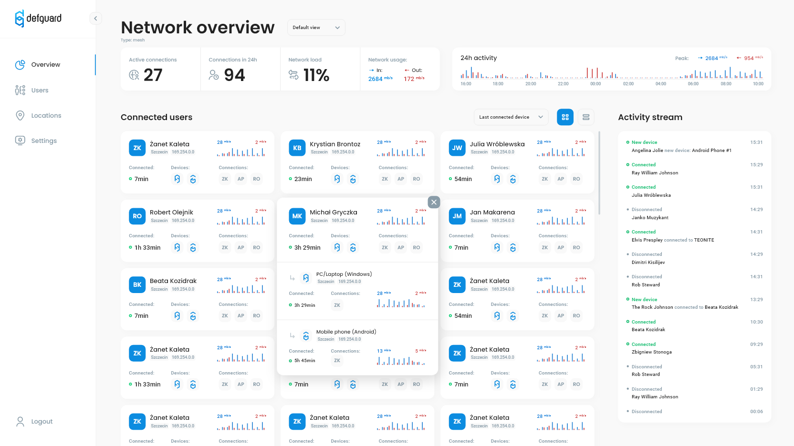

# Network overview

Once your gateway service is up and users start connecting to the VPN, upload/download summary data is stored and can be displayed in "overview" tab of Defguard web application. See [architecture overview](../../in-depth/architecture.md) for details of core-gateway interaction.

On the overview page, you'll see who is currently connected and how much data each connected user transferred. You'll also see overall network transfer charts.

