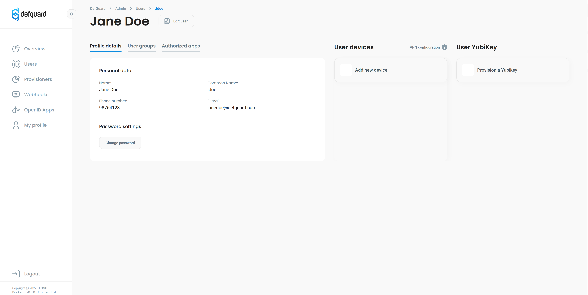
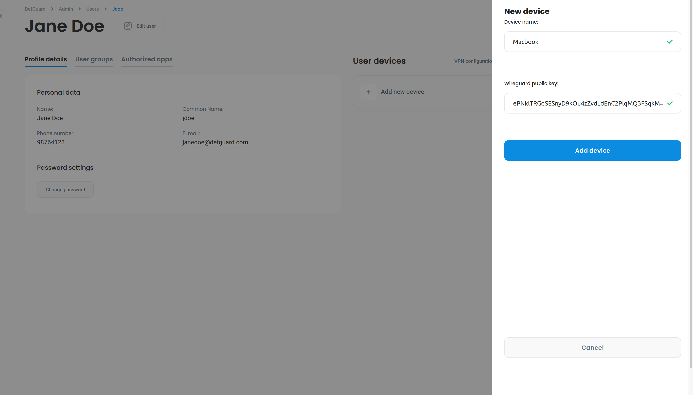

# Adding Wireguard devices

### On this site you learn how to:

* Add new wireguard device
* Download it's config
* Start your VPN connection

First make sure you have installed wireguard on this [site](https://www.wireguard.com/install/) you can find information how to download wireguard for any operating system.

### Creating new device

After you installed wireguard client and configured your network you can go to your profile which you''ll find on the navigation on the left side of the screen where you can add modify and delete your device or download configuration file for it.



Before creating new device make you sure generated your public and private keys which are necessary for VPN connection setup.

You can easily create new keys by running below command:

```
wg genkey | tee privatekey | wg pubkey > publickey
```

Click on add new device button then add contents of publickey file to form and pick a name for your newly created device.



After you created new device you will see it in your profile if you hover on it the settings button will pop up after you click on it you'll see option to download config.

```
[Interface]
PrivateKey = YOUR_PRIVATE_KEY
Address = 10.10.1.202


[Peer]
PublicKey = yKNQWaynkiZad6NJDycTm0tgLzKxI6r6yvq++QYncmA=
Endpoint = 10.1.1.0:7400
PersistentKeepalive = 25
```

Defguard will dynamically create device config and assign it's own unique IP address. After downloading config which look like this above you need to replace `YOUR_PRIVATE_KEY` with contents of created before privatekey file and move config file to `/etc/wireguard` directory on unix-like systems and on windows copy it contents run wireguard program and paste into new tunnel option.

After doing this you can run to start your VPN connection.

`wg-quick up <device_name>`

**Note** `<device_name>` is downloaded config file name without .conf extension.
