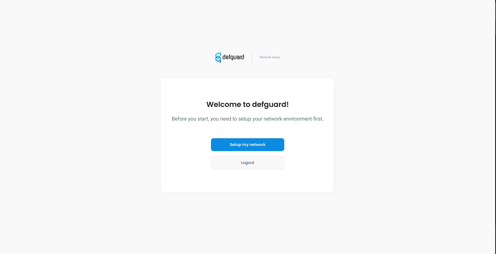
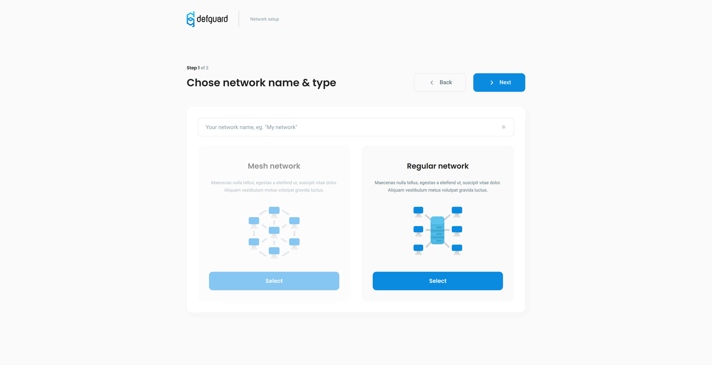
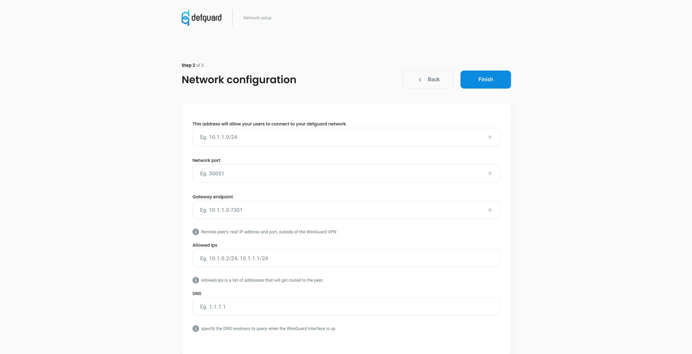

# Create your VPN network

## Before we start

* Make sure your defguard instance is [deployed](../setting-up-your-instance/) and running
* Make sure you downloaded our [Wireguard Gateway](https://github.com/DefGuard/wireguard-gateway)
* Make sure you know what [Wireguard](https://www.wireguard.com/) is and have basic understanding of how it works

## Network creation wizard

After successful deployment of your defguard instance first screen you'll see will look like this

### Network name and type

Nothing fancy in this step just pick your network name and type


Currently only supported network type is regular but we hope it'll change in a short future


### Network configuration

After choosing a name for your network you"ll be on to the next step which is network configuration this is where things might feel a little bit complicated but no worries it be as painless as possible.

### Let's briefly discuss all of these weird inputs

### **Address**

It’s the IP address of the network interface that WireGuard sets up for the peer.

The IP address for a WireGuard interface is defined with a network prefix, which tells the local host what other IP addresses are available on the same virtual subnet as the interface. In the above placeholder, this prefix is /24. That indicate to the localhost that other addresses in the same /24 block as the address itself (10.1.1.0 to 10.1.1.255) are routable through the interface.

### Network port

Port on which Wireguard listens on the gateway

### Gateway endpoint

It's IP address of your [gateway](https://github.com/DefGuard/wireguard-gateway) in Wireguard words Endpoint is the remote peer's "real" IP address and port, outside of the WireGuard VPN. This setting tells the localhost how to connect to the remote peer in order to set up a WireGuard tunnel.


Network port and gateway endpoint port can be different if Wireguard server is behind NAT/Firewall


### Optional settings:

### Allowed IPs

is the set of IP addresses the localhost should route to the remote peer through the WireGuard tunnel. This setting tells the localhost what goes in a tunnel.

### DNS

DNS specifies DNS resolvers to query when the Wireguard interface is up and domains to search for unqualified hostnames.


No worries if you get something wrong you can always change it later


## What to do after wizard completion?

After completing all steps from above you will be redirected to Network overview page which detect if your gateway is connected or not if your gateway never connected to defguard you'll see modal looking like this

### Wireguard Gateway setup

Wireguard Gateway is a client program which connects to defguard in order to setup your network and send all informations about your network and it's users. You can think about it like waiter which delivers food(data eg. stats, configuration) between client(defguard server) and server(wireguard server) and takes orders from defguard server to setup your network.

#### First run

After creating your network on defguard you'll se modal pop-up as in picture above with docker run command to start your gateway server but there are other options to start your server.

**Note** if you want to use above command make sure you have installed [docker](https://www.docker.com/) \

Second option is downloading source code from this [repo](https://github.com/DefGuard/wireguard-gateway) and building it using\
`cargo build --release` command then you'll find binary file named `wireguard-gateway` at `target/release` directory

#### Environmental variables / Arguments

If you're using docker image you can pass this value as environmental variables on binary you can pass them as arguments

`DEFGUARD_USERSPACE` , `-u` - Use userspace wireguard implementation, useful on systems without native wireguard support

`DEFGUARD_GRPC_URL` , `-g` - Defguard server GRPC endpoint URL default is https://localhost:50055

`DEFGUARD_STATS_PERIOD` ,`-p` - Defines how often (seconds) should interface statistics be sent to Defguard server

`DEFGUARD_TOKEN` ,`-t` - Token received on Defguard after completing network wizard

## VPN feature in depth

If you think something above is complicated or unclear you might want to take a look at our [in depth Wireguard VPN explaination](../../in-depth/wireguard-vpn.md).

