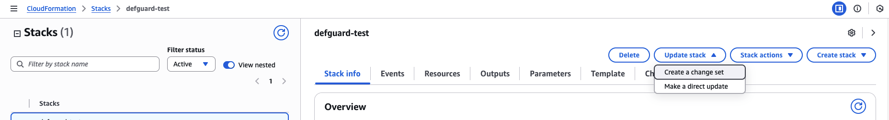
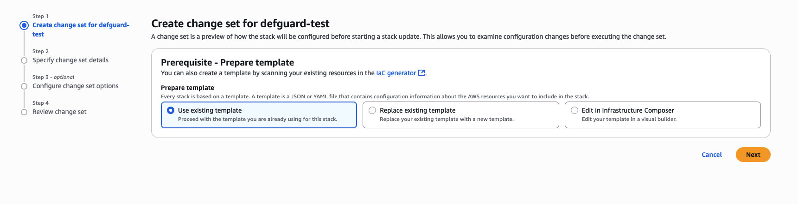
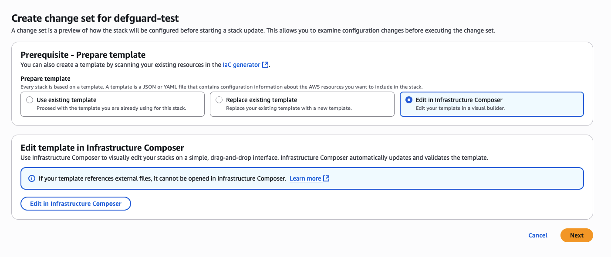

# AMIs and AWS CloudFormation


This feature is still under development. The documentation may be incomplete or refer to resources that are not yet available.


## AMIs (Amazon Machine Images)

We provide an AMI for each Defguard component (Core, Gateway and Proxy) which can be used to launch instances in AWS. The AMIs are available in the following regions:

* `us-east-1` (N. Virginia)
* `eu-west-1` (Ireland)
* `ap-northeast-1` (Tokyo)
* `eu-central-1` (Frankfurt)

We recommend using the AMIs either with a CloudFormation template or with our Terraform module, as they will automatically configure the instances with the necessary settings.

## CloudFormation Templates

You can import the CloudFormation template from the AWS Marketplace or from our GitHub [deployment repository](https://github.com/DefGuard/deployment).

The template consists of the following components:

* **Defguard Core**
* **Defguard Gateway** - The template has only one Gateway instance, but Defguard supports running multiple Gateways if you need more VPN locations.
* **Defguard Proxy**
* **PostgreSQL Database**

We recommend reading the [Architecture documentation](https://docs.defguard.net/in-depth/architecture) to understand how these components interact.

The template has the following configurable parameters:

### General

* `SshKeyName` (optional): EC2 Key Pair name for SSH access to instances. If not provided, SSH access will not be available. Requires a manual setup of SSH security group rules afterwards.

### Core Instance

* `CoreCookieInsecure` (optional): If set to `true`, Defguard Core will use insecure cookies. This is not recommended for production environments. Set it to `true` if you are using HTTP instead of HTTPS.
* `CoreGrpcPort` (optional): The gRPC port, default is `50051`. This is used for communication between Defguard components.
* `CoreHttpPort` (optional): The HTTP port on which Defguard Core should listen, default is `8000`. This is where the Defguard web UI will be accessible.
* `CoreInstanceType` (optional): The instance type (e.g., `t3.medium`, `m5.large`), default is `t3.micro`.
* `CoreLogLevel` (optional): The log level of Defguard Core, default is `info`. You can also set it to `error`, `debug` or `trace`.
* `CoreUrl` (required): The URL where Defguard Core will be accessible (e.g., `https://defguard.example.com`). This should be the URL that users will use to access the Defguard web interface.
* `CoreDefaultAdminPassword`: The password for the default `admin` user. Used to login to the web dashhboard.

### Database

* `DbInstanceClass` (optional): The instance class for the PostgreSQL database, default is `db.t3.micro`.
* `DbName` (optional): The name of the PostgreSQL database, default is `defguard`.
* `DbPassword`: The password for the PostgreSQL database.
* `DbPort` (optional): The port on which the PostgreSQL database will listen, default is `5432`.
* `DbStorage` (optional): The storage size for the PostgreSQL database, default is `20`. This is the size in GB.
* `DbUsername` (optional): The username for the PostgreSQL database, default is `defguard`.

### Gateway Instance

* `GatewayInstanceType` (optional): The instance type for the Gateway, default is `t3.micro`.
* `GatewayLogLevel` (optional): The log level for the Gateway, default is `info`. You can also set it to `error`, `debug` or `trace`.
* `GatewaySecret` (required): The secret used to authenticate the Gateway with Defguard Core. This should be a strong, random string, 64 characters long.

### Proxy Instance

* `ProxyGrpcPort` (optional): The gRPC port for the Proxy, default is `50051`.
* `ProxyHttpPort` (optional): The HTTP port for the Proxy, default is `8000`. This is where the Defguard Proxy web UI will be accessible. The proxy UI is used for user enrollment.
* `ProxyInstanceType` (optional): The instance type for the Proxy, default is `t3.micro`.
* `ProxyLogLevel` (optional): The log level for the Proxy, default is `info`. You can also set it to `error`, `debug` or `trace`.
* `ProxyUrl` (required): The URL where the Defguard Proxy will be accessible (e.g., `https://proxy.defguard.example.com`). This should be the URL that users will use to access the Defguard Proxy web UI.

### Network configuration

* `VpcCidr` (optional): The CIDR block for the VPC in which Defguard will be deployed, default is `10.0.0.0/16`.
* `VpcName` (optional): The name of the VPC, default is `defguard-vpc`.

### VPN Network (Location) configuration

* `VpnNetworkAddress` (optional): The CIDR address for the VPN network, default is `10.10.10.1/24`. The VPN clients will receive IP addresses from this range. The gateway will have the first address in the range.
* `VpnNetworkName` (optional): The name of the VPN network (location). This is displayed both to the clients and in the Defguard web UI, default is `vpn1`.
* `VpnNetworkNat` (optional): If set to `true`, the VPN will have masquerading enabled, allowing clients to access other networks through the VPN (e.g., the internet). Default is `true`.
* `VpnNetworkPort` (optional): The UDP port on which the VPN will listen for incoming VPN connections, default is `51820`.

### Outputs and next steps

After the deployment completes, you will receive a set of outputs. By default, your Defguard Proxy instance will be available under the following public URL:\
`http://<DefguardProxyPublicAddress>:<ProxyHttpPort>`

Where `DefguardProxyPublicAddress` is the public IP it has been assigned (output value).

Defguard Core won't have a public address and will be only accessible from the internal network at the following address:

`http://<DefguardCorePrivateAddress>:<CoreHttpPort>`

By default, HTTP will be used but it's strongly advised to use HTTPS in production. This can be achieved in multiple ways, either by installing a reverse proxy handling HTTPS termination on the host machines, manually installing certificates or adding AWS load balancers with certificates attached that will serve as a reverse proxy.

After the template deployment completes, you initially won't have access to the internal VPN network, as you don't have any device added. This means that you won't be able to access the Defguard Core web UI, where all the further configuration takes place.

In order to gain the first-time access, use the token displayed in the `UserDeviceEnrollmentToken` CloudFormation output to add your first device. Check this [guide](https://docs.defguard.net/using-defguard-for-end-users/desktop-client/instance-configuration#adding-instance) on adding a new instance in the Desktop client, to learn more about the process. As the instance URL, use the URL you defined in your Defguard Proxy instance configuration section of the CloudFormation template.

<figure><figcaption></figcaption></figure>

### Accessing the EC2 instances

To access the instances, use the key provided in the `SshKeyName` parameter. Note that you will need to allow SSH access to the EC2 instances using their respective AWS security groups. The default user is `admin`.

### Customizing the deployment

By default, the CloudFormation template will deploy Defguard with the settings according to the recommended architecture, that is:

| Component | Port         | Access allowed from |
| --------- | ------------ | ------------------- |
| Core      | 8000 (HTTP)  | Gateways            |
| Core      | 50055 (gRPC) | Gateways            |
| Proxy     | 50051 (gRPC) | Core                |
| Proxy     | 8000 (HTTP)  | Anywhere            |
| Gateway   | 51820 (UDP)  | Anywhere            |

You can customize the deployment by modifying the template or doing changes in the AWS Infrastructure Composer.

To modify an existing stack deployed from the template, you can use the AWS Console, navigate to the CloudFormation service, select your stack, click on "Update stack" and then choose "Create a change set".



Next, select how you want to update the stack. If you want to modify the parameters, select "Use existing template".



If you want to modify the template itself, the easiest way is to edit it in the Infrastructure Composer: select "Edit in Infrastructure Composer" and click the "Edit in Infrastructure Composer" button.



#### Granting SSH access to the instances

By default, the instances won't allow traffic on port 22. You can temporarily allow SSH access by modifying the security group of the instances. To do this, edit the template, and change the given component's security group to allow traffic on port 22 (ideally from your IP address).

For example, you can add the following rule to the security group of the Core instance:

```yaml
      SecurityGroupIngress:
        - IpProtocol: tcp
          FromPort: !Ref CoreHttpPort
          ToPort: !Ref CoreHttpPort
          SourceSecurityGroupId: !Ref GatewaySecurityGroup
          Description: HTTP access from gateways
        - IpProtocol: tcp
          FromPort: !Ref CoreGrpcPort
          ToPort: !Ref CoreGrpcPort
          SourceSecurityGroupId: !Ref GatewaySecurityGroup
          Description: gRPC communication with gateways
        - IpProtocol: tcp
          FromPort: 22
          ToPort: 22
          CidrIp: <YOUR_IP_ADDRESS>/32
          Description: SSH access from your IP address
```

### Adding a Reverse Proxy/Load Balancer

If you want to add a Reverse Proxy or Load Balancer in front of the Defguard Core and Proxy, you can do so by modifying the template. You can achieve this by adding two Application Load Balancers (ALBs) in front of the Core and Proxy components. One ALB (internal) will be used for the Core, and one (public) for the Proxy.

Adding a Load Balancer will require making a second public subnet:

```yaml
  PublicSubnet2:
    Type: AWS::EC2::Subnet
    Properties:
      VpcId: !Ref VPC
      CidrBlock: 10.0.4.0/24
      AvailabilityZone: !Select
        - 1
        - !GetAZs ""
      MapPublicIpOnLaunch: true
      Tags:
        - Key: Name
          Value: !Sub ${VpcName}-public-subnet-2
```

And adding a route table association:

```yaml
  PublicSubnet2RouteTableAssociation:
    Type: AWS::EC2::SubnetRouteTableAssociation
    Properties:
      SubnetId: !Ref PublicSubnet2
      RouteTableId: !Ref PublicRouteTable
```

Then, you can add the ALBs along with listeners and target groups:

```yaml
  ApplicationLoadBalancer:
    Type: AWS::ElasticLoadBalancingV2::LoadBalancer
    Properties:
      Name: defguard-public-alb
      Scheme: internet-facing
      Type: application
      IpAddressType: ipv4
      Subnets:
        - !Ref PublicSubnet
        - !Ref PublicSubnet2
      SecurityGroups:
        - !Ref LoadBalancerSecurityGroup
      Tags:
        - Key: Name
          Value: defguard-public-alb
  InternalApplicationLoadBalancer:
    Type: AWS::ElasticLoadBalancingV2::LoadBalancer
    Properties:
      Name: defguard-internal-alb
      Scheme: internal
      Type: application
      IpAddressType: ipv4
      Subnets:
        - !Ref PrivateSubnet1
        - !Ref PrivateSubnet2
      SecurityGroups:
        - !Ref InternalLoadBalancerSecurityGroup
      Tags:
        - Key: Name
          Value: defguard-internal-alb
  ALBListener:
    Type: AWS::ElasticLoadBalancingV2::Listener
    Properties:
      DefaultActions:
        - Type: forward
          TargetGroupArn: !Ref ProxyTargetGroup
      LoadBalancerArn: !Ref ApplicationLoadBalancer
      Port: 443
      Protocol: HTTP
  InternalALBListener:
    Type: AWS::ElasticLoadBalancingV2::Listener
    Properties:
      DefaultActions:
        - Type: forward
          TargetGroupArn: !Ref CoreTargetGroup
      LoadBalancerArn: !Ref InternalApplicationLoadBalancer
      Port: 443
      Protocol: HTTP
  CoreListenerRule:
    Type: AWS::ElasticLoadBalancingV2::ListenerRule
    Properties:
      Actions:
        - Type: forward
          TargetGroupArn: !Ref CoreTargetGroup
      Conditions:
        - Field: host-header
          Values:
            - !Select
              - 2
              - !Split
                - /
                - !Ref CoreUrl
      ListenerArn: !Ref InternalALBListener
      Priority: 100
  ProxyListenerRule:
    Type: AWS::ElasticLoadBalancingV2::ListenerRule
    Properties:
      Actions:
        - Type: forward
          TargetGroupArn: !Ref ProxyTargetGroup
      Conditions:
        - Field: host-header
          Values:
            - !Select
              - 2
              - !Split
                - /
                - !Ref ProxyUrl
      ListenerArn: !Ref ALBListener
      Priority: 100
  CoreTargetGroup:
    Type: AWS::ElasticLoadBalancingV2::TargetGroup
    Properties:
      Name: defguard-core-tg
      Port: !Ref CoreHttpPort
      Protocol: HTTP
      VpcId: !Ref VPC
      TargetType: instance
      HealthCheckEnabled: true
      HealthCheckPath: /api/v1/health
      HealthCheckProtocol: HTTP
      HealthCheckIntervalSeconds: 30
      HealthCheckTimeoutSeconds: 5
      HealthyThresholdCount: 2
      UnhealthyThresholdCount: 3
      Targets:
        - Id: !Ref CoreInstance
          Port: !Ref CoreHttpPort
      Tags:
        - Key: Name
          Value: defguard-core-tg
  ProxyTargetGroup:
    Type: AWS::ElasticLoadBalancingV2::TargetGroup
    Properties:
      Name: defguard-proxy-tg
      Port: !Ref ProxyHttpPort
      Protocol: HTTP
      VpcId: !Ref VPC
      TargetType: instance
      HealthCheckEnabled: true
      HealthCheckPath: /api/v1/health
      HealthCheckProtocol: HTTP
      HealthCheckIntervalSeconds: 30
      HealthCheckTimeoutSeconds: 5
      HealthyThresholdCount: 2
      UnhealthyThresholdCount: 3
      Targets:
        - Id: !Ref ProxyInstance
          Port: !Ref ProxyHttpPort
      Tags:
        - Key: Name
          Value: defguard-proxy-tg
```

Then, modify the Core and Proxy security groups to allow traffic from the ALBs:

```yaml
        # Add this to Core security group
        - IpProtocol: tcp
          FromPort: !Ref CoreHttpPort
          ToPort: !Ref CoreHttpPort
          SourceSecurityGroupId: !Ref InternalLoadBalancerSecurityGroup
          Description: HTTP access from internal load balancer

      # Add this to Proxy security group
        - IpProtocol: tcp
          FromPort: !Ref ProxyHttpPort
          ToPort: !Ref ProxyHttpPort
          SourceSecurityGroupId: !Ref LoadBalancerSecurityGroup
          Description: HTTP access from load balancer
```

You should also remove the following rules to prevent direct access to the Core and Proxy components:

```yaml
        # Remove these rules from Core security group
        - IpProtocol: tcp
          FromPort: !Ref CoreHttpPort
          ToPort: !Ref CoreHttpPort
          SourceSecurityGroupId: !Ref GatewaySecurityGroup
          Description: HTTP access from gateways

        # Remove these rules from Proxy security group
        - IpProtocol: tcp
          FromPort: !Ref ProxyHttpPort
          ToPort: !Ref ProxyHttpPort
          CidrIp: 0.0.0.0/0
          Description: HTTP access to proxy
```

Finally, configure the security groups of your ALBs:

```yaml
  LoadBalancerSecurityGroup:
    Type: AWS::EC2::SecurityGroup
    Properties:
      GroupName: defguard-alb-sg
      GroupDescription: Access to the Application Load Balancer
      VpcId: !Ref VPC
      SecurityGroupIngress:
        - IpProtocol: tcp
          FromPort: 443
          ToPort: 443
          CidrIp: 0.0.0.0/0
          Description: HTTPS access from internet
      SecurityGroupEgress:
        - IpProtocol: "-1"
          CidrIp: 0.0.0.0/0
      Tags:
        - Key: Name
          Value: defguard-alb-sg
  InternalLoadBalancerSecurityGroup:
    Type: AWS::EC2::SecurityGroup
    Properties:
      GroupName: defguard-internal-alb-sg
      GroupDescription: Access to the Internal Application Load Balancer
      VpcId: !Ref VPC
      SecurityGroupIngress:
        - IpProtocol: tcp
          FromPort: 443
          ToPort: 443
          CidrIp: !Ref VpcCidr
          Description: HTTPS access from internal VPC network
      SecurityGroupEgress:
        - IpProtocol: "-1"
          CidrIp: 0.0.0.0/0
      Tags:
        - Key: Name
          Value: defguard-internal-alb-sg
```

To easily inspect the ALB DNS names, you can add the following outputs to your template:

```yaml
  LoadBalancerDNS:
    Description: The DNS name of the Public Application Load Balancer
    Value: !GetAtt ApplicationLoadBalancer.DNSName
    Export:
      Name: !Sub ${AWS::StackName}-alb-dns
  InternalLoadBalancerDNS:
    Description: The DNS name of the Internal Application Load Balancer
    Value: !GetAtt InternalApplicationLoadBalancer.DNSName
    Export:
      Name: !Sub ${AWS::StackName}-internal-alb-dns
```

This setup will allow you to access the Defguard Core and Proxy through the Load Balancers, while keeping the components not directly accessible. Both ALBs act more as a reverse proxy, as they match requests based on the `host-header` and no balancing is performed. By making the Core load balancer internal, you can ensure that only the Proxy is accessible from the internet, while the Core access is restricted to the internal VPC network.

To allow connected VPN clients access the Core web UI, you can enable the `VpnNetworkNat` option in the CloudFormation template, so the traffic going through the VPN will be NATed and routed to the Core. You will also need to add an allowed IP of your VPC network (or one of its subnets) in your Location configuration in Defguard Core to let the clients know to route the traffic destined to the VPC through the VPN.

## Troubleshooting and common issues

All Defguard components are deployed as systemd services. Their configuration files can be found on the respective host machine under `/etc/defguard`.

