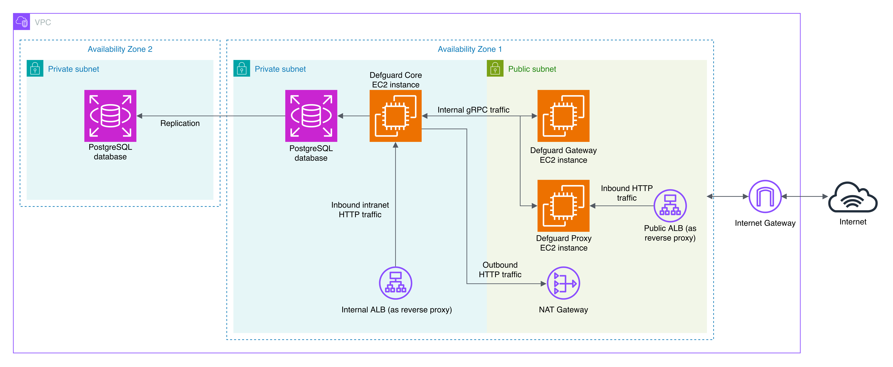

# AMIs and AWS CloudFormation


This feature is still under development. The documentation may be incomplete or refer to resources that are not yet available.


## AMIs (Amazon Machine Images)

We provide an AMI with every Defguard component (Core, Gateway and Proxy) which can be used to launch instances in AWS. The AMIs are available in the following regions:

* `us-east-1` (N. Virginia)
* `eu-west-1` (Ireland)
* `ap-northeast-1` (Tokyo)
* `eu-central-1` (Frankfurt)

We recommend using the AMIs either with our CloudFormation template as it will automatically configure all components.

## CloudFormation Templates

You can import the CloudFormation template from the AWS Marketplace or from our GitHub [deployment repository](https://github.com/DefGuard/deployment).

The template consists of the following main components:

* **Defguard Core**
* **Defguard Gateway** - The template has only one Gateway instance, but Defguard supports running multiple Gateways if you need more VPN locations.
* **Defguard Proxy**
* **PostgreSQL Database**

We recommend reading the [Architecture documentation](https://docs.defguard.net/in-depth/architecture) to understand how these components interact.

<figure><figcaption><p>Diagram showing how the components are deployed using the template</p></figcaption></figure>

### Step by step example setup


In order to use the CloudFormation template you need to subscribe to the Defguard AMI product. The most straightforward way to obtain the template is to select it during the product delivery after subscribing to the product on the marketplace.


After the CloudFormation template is uploaded either manually or via the marketplace, you will be prompted to fill the details of your deployment. This guide will go over the most important settings that need to be filled for a functional deployment.

#### Prerequisites

* Two domains: one for accessing Defguard Core (the main dashboard) and one for accessing Defguard Proxy (for external enrollment and device configuration)
* AWS issued SSL certificates for the two domains. See the [#attaching-certificates](amis-and-aws-cloudformation.md#attaching-certificates "mention") section for more information.
* An SSH key added to AWS. This will allow you to access the EC2 instances later on.

#### Obtaining the template

1. Subscribe to the product on AWS Marketplace.
2.  After subscription succeeds, click the launch your software button:<br>

    <figure><figcaption></figcaption></figure>


3.  Select the CloudFormation option and click "Launch with CloudFormation"<br>

    <figure><figcaption></figcaption></figure>


4. On the "Create stack" screen click next and proceed to the next section ( [#template-parameters](amis-and-aws-cloudformation.md#template-parameters "mention")).

#### Template parameters

After you are presented with the template configuration screen, make sure to fill out the following parameters:

<figure><figcaption></figcaption></figure>

Choose a name for the stack. This can be chosen freely but must be unique across your deployed stacks.

<figure><figcaption></figcaption></figure>

The `CoreDefaultAdminPassword` will be the password used for logging to the Defguard Core dashboard for the `admin` user.

<figure><figcaption></figcaption></figure>

The `CoreUrl` is the URL under which your Defguard Core dashboard will be accessible. This should be filled according to the domain you chose before ([#prerequisites](amis-and-aws-cloudformation.md#prerequisites "mention")). For example, if your domain for Defguard Core is `defguard.example.com`, insert `https://defguard.example.com` here.

<figure><figcaption></figcaption></figure>

This is the database password. Select a relatively strong password here as a very weak password may be rejected by the database system and may result in a deployment failure.

<figure><figcaption></figcaption></figure>

This is the URL under which the Defguard Proxy will be accessible to users. Fill the field just like the `CoreUrl` field, but this time use the domain you chose for the Defguard Proxy ([#prerequisites](amis-and-aws-cloudformation.md#prerequisites "mention")).

<figure><figcaption></figcaption></figure>

Insert here the ARN of the certificate you prepared earlier ([#prerequisites](amis-and-aws-cloudformation.md#prerequisites "mention")). This will auto configure HTTPS for both Defguard Proxy and Core.

<figure><figcaption></figcaption></figure>

Provide here the name of your SSH key. This is required for SSH access to the EC2 instances. Note that manual configuration of firewall access on the SSH port (22) is required after the deployment.

<figure><figcaption></figcaption></figure>

The VPN parameters allow for configuring the details of your VPN network (location). You may want to change the name of the location to better suit your deployment. By default, NAT is enabled on the VPN Gateway instance so connecting clients can automatically reach servers inside your private network (this is required to reach Defguard Core dashboard, for example). If you disable NAT, you will need to configure routing rules yourself.

Make sure to also check the rest of the pre-filled parameters, as you may want to change some of them. The full list is available in the [#template-parameters-1](amis-and-aws-cloudformation.md#template-parameters-1 "mention") section.

#### Stack options

Next, select the behavior on deployment failure:

<figure><figcaption></figcaption></figure>

We recommend cleaning up everything after failed deployment, to keep a clean state when retrying.

<figure><figcaption></figcaption></figure>

The template contains several IAM roles that are used to grant access required for interacting with the AWS SecretManager to pass secrets securely between components during the deployment.

The template also consists of a lambda function along with an IAM role which is responsible for creating a token that can be used by an admin to access the VPN for the first time.

This needs to be accepted to proceed further.

#### Stack output

After the deployment finishes, navigate to the outputs tab.

<figure><figcaption></figcaption></figure>

The ALB DNS name outputs will allow you to further configure your domains.

<figure><figcaption></figcaption></figure>

<figure><figcaption></figcaption></figure>

You will need to point the domains you selected ([#prerequisites](amis-and-aws-cloudformation.md#prerequisites "mention")) to the above load balancer domains using a CNAME record. See the [#setting-up-your-domains](amis-and-aws-cloudformation.md#setting-up-your-domains "mention") section for information how to proceed further with domain setup. This step is required for your domains to properly work.

The `AdminFirstDeviceToken` will allow you to get initial access to the VPN network.

<figure><figcaption></figcaption></figure>

Refer to [#getting-initial-access-to-the-vpn](amis-and-aws-cloudformation.md#getting-initial-access-to-the-vpn "mention") section for more information on how to add your first device.

After deploying the CloudFormation template, the newly created EC2 instances should be visible in the AWS console in your target region:

<figure><figcaption></figcaption></figure>

#### Accessing the dashboard

After you use the `AdminFirstDeviceToken` as described in the previous section you will gain access to the VPN network and (by default) the VPC network. To access the Defguard Core dashboard, navigate to the URL you defined in the `CoreUrl` parameter.

To login, use the default `admin` username and the password defined in `CoreDefaultAdminPassword`.

### Template parameters

#### General

* `SshKeyName` (optional): EC2 Key Pair name for SSH access to instances. If not provided, SSH access will not be available. Requires a manual setup of SSH security group rules afterwards.
* `StackPrefix` (optional): The prefix that all the deployed components will receive, for example the Defguard core EC2 instance will be named <`StackPrefix>-core-instance`.
* `SSLCertificateArn` (optional): The ARN of the AWS issued certificate to use for setting up HTTPS for Core and Proxy. This certificate must be valid for the domains specified in `CoreUrl` and `ProxyUrl`. If left empty, HTTPS won't be configured automatically.

#### Core Instance

* `CoreCookieInsecure` (optional): If set to `true`, Defguard Core will use insecure cookies. This is not recommended for production environments. Set it to `true` if you are using HTTP instead of HTTPS.
* `CoreGrpcPort` (optional): The gRPC port, default is `50051`. This is used for communication between Defguard components.
* `CoreHttpPort` (optional): The HTTP port on which Defguard Core should listen, default is `8000`. This is where the Defguard web UI will be accessible.
* `CoreInstanceType` (optional): The instance type (e.g., `t3.medium`, `m5.large`), default is `t3.micro`.
* `CoreLogLevel` (optional): The log level of Defguard Core, default is `info`. You can also set it to `error`, `debug` or `trace`.
* `CoreUrl` (required): The URL where Defguard Core will be accessible (e.g., `https://defguard.example.com`). This should be the URL that users will use to access the Defguard web interface.
* `CoreDefaultAdminPassword`: The password for the default `admin` user. Used to login to the web dashhboard.

#### Database

* `DbInstanceClass` (optional): The instance class for the PostgreSQL database, default is `db.t3.micro`.
* `DbName` (optional): The name of the PostgreSQL database, default is `defguard`.
* `DbPassword`: The password for the PostgreSQL database.
* `DbPort` (optional): The port on which the PostgreSQL database will listen, default is `5432`.
* `DbStorage` (optional): The storage size for the PostgreSQL database, default is `20`. This is the size in GB.
* `DbUsername` (optional): The username for the PostgreSQL database, default is `defguard`.

#### Gateway Instance

* `GatewayInstanceType` (optional): The instance type for the Gateway, default is `t3.micro`.
* `GatewayLogLevel` (optional): The log level for the Gateway, default is `info`. You can also set it to `error`, `debug` or `trace`.
* `GatewaySecret` (required): The secret used to authenticate the Gateway with Defguard Core. This should be a strong, random string, 64 characters long.

#### Proxy Instance

* `ProxyGrpcPort` (optional): The gRPC port for the Proxy, default is `50051`.
* `ProxyHttpPort` (optional): The HTTP port for the Proxy, default is `8000`. This is where the Defguard Proxy web UI will be accessible. The proxy UI is used for user enrollment.
* `ProxyInstanceType` (optional): The instance type for the Proxy, default is `t3.micro`.
* `ProxyLogLevel` (optional): The log level for the Proxy, default is `info`. You can also set it to `error`, `debug` or `trace`.
* `ProxyUrl` (required): The URL where the Defguard Proxy will be accessible (e.g., `https://proxy.defguard.example.com`). This should be the URL that users will use to access the Defguard Proxy web UI.

#### Network configuration

* `VpcCidr` (optional): The CIDR block for the VPC in which Defguard will be deployed, default is `10.0.0.0/16`.
* `VpcName` (optional): The name of the VPC, default is `defguard-vpc`.
* `PublicSubnet1Cidr` (optional): CIDR block for one of the public subnets. This can be chosen arbitrarily as long as it's within the VPC CIDR range.
* `PublicSubnet2Cidr` (optional): CIDR block for one of the public subnets. This can be chosen arbitrarily as long as it's within the VPC CIDR range.
* `PrivateSubnet1Cidr` (optional): CIDR block for one of the private subnets. This can be chosen arbitrarily as long as it's within the VPC CIDR range.
* `PrivateSubnet2Cidr` (optional): CIDR block for one of the private subnets. This can be chosen arbitrarily as long as it's within the VPC CIDR range.

#### VPN Network (Location) configuration

* `VpnNetworkAddress` (optional): The CIDR address for the VPN network, default is `10.10.10.1/24`. The VPN clients will receive IP addresses from this range. The gateway will have the first address in the range.
* `VpnNetworkName` (optional): The name of the VPN network (location). This is displayed both to the clients and in the Defguard web UI, default is `vpn1`.
* `VpnNetworkNat` (optional): If set to `true`, the VPN will have masquerading enabled, allowing clients to access other networks through the VPN (e.g., the internet). Default is `true`.
* `VpnNetworkPort` (optional): The UDP port on which the VPN will listen for incoming VPN connections, default is `51820`.

### Attaching certificates

To auto configure HTTPS you will need to create and attach an AWS issued certificate. This can be done in the Certificate Manager.

First, request a new certificate (if you don't have one already).

<figure><figcaption></figcaption></figure>

A public certificate is enough.

<figure><figcaption></figcaption></figure>

Specify the domains you will want to use for your Defguard instance (for accessing Defguard Proxy and Defguard Core). Those domains should be the same as those you'll use in `ProxyUrl` and `CoreUrl`.

<figure><figcaption></figcaption></figure>

Next, you will need to validate your domain ownership by adding appropriate CNAME records in your DNS provider. After you complete this step, your certificate can be used. Copy the ARN of your certificate and paste it into the `SSLCertificateArn` parameter in the CloudFormation template.

<figure><figcaption></figcaption></figure>

### Outputs and next steps

After the deployment completes, you will receive a set of outputs in the "outputs" tab. This values are required for further configuration.

#### Setting up your domains

The template will provision two domains: `InternalProxyALBDNSName` and `PublicProxyALBDNSName` . The public domain points to the Defguard Proxy instance's reverse proxy, and the internal one to Core's. You can use those domains to setup CNAME records in your DNS provider configuration, so the domains you defined in the `ProxyUrl` and `CoreUrl` point to the correct load balancers (reverse proxies) and in result, to the correct components:

<table><thead><tr><th width="261">Your domain</th><th>CNAME response</th><th>Target component</th></tr></thead><tbody><tr><td><code>&#x3C;YOUR_DEFGUARD_CORE_DOMAIN></code></td><td><code>&#x3C;InternalProxyALBDNSName></code></td><td>Defguard Core (internal)</td></tr><tr><td><code>&#x3C;YOUR_DEFGUARD_PROXY_DOMAIN></code></td><td><code>&#x3C;PublicProxyALBDNSName></code></td><td>Defguard Proxy (public)</td></tr></tbody></table>

#### Getting initial access to the VPN

In order to gain the initial access, use the token displayed in the `AdminFirstDeviceToken` CloudFormation output to add your first device. Check this [guide](https://docs.defguard.net/using-defguard-for-end-users/desktop-client/instance-configuration#adding-instance) on adding a new instance in the Desktop client, to learn more about the process. As the instance URL, use the URL you defined in your Defguard Proxy instance configuration section of the CloudFormation template (`ProxyUrl`).

<figure><figcaption></figcaption></figure>

### Accessing the EC2 instances

To access the instances, use the key provided in the `SshKeyName` parameter. Note that you will need to allow SSH access to the EC2 instances using their respective AWS security groups. The default user is `admin`.

### Customizing the deployment

By default, the CloudFormation template will deploy Defguard with the settings according to the recommended architecture, that is:

| Component | Port         | Access allowed from |
| --------- | ------------ | ------------------- |
| Core      | 8000 (HTTP)  | Gateways            |
| Core      | 50055 (gRPC) | Gateways            |
| Proxy     | 50051 (gRPC) | Core                |
| Proxy     | 8000 (HTTP)  | Anywhere            |
| Gateway   | 51820 (UDP)  | Anywhere            |

You can customize the deployment by modifying the template or doing changes in the AWS Infrastructure Composer.

To modify an existing stack deployed from the template, you can use the AWS Console, navigate to the CloudFormation service, select your stack, click on "Update stack" and then choose "Create a change set".


Next, select how you want to update the stack. If you want to modify the parameters, select "Use existing template".


If you want to modify the template itself, the easiest way is to edit it in the Infrastructure Composer: select "Edit in Infrastructure Composer" and click the "Edit in Infrastructure Composer" button.


### Upgrading components


It's important to backup your database before performing a backup. Make sure to also check the [upgrading.md](upgrading.md "mention") before upgrading to a newer version.


All Defguard components are installed from the Defguard APT repository. The upgrade process is as follows:

1. SSH into the given component's EC2 instance
2.  Execute the following commands:

    ```
    sudo apt update
    sudo apt install --only-upgrade <PACKAGE_NAME>
    ```

The corresponding package names can be found in the [Defguard APT repository documentation](standalone-package-based-installation/defguard-apt-repository.md).

## Troubleshooting and common issues

All Defguard components are deployed as systemd services. Their configuration files can be found on the respective host machine under `/etc/defguard`.
