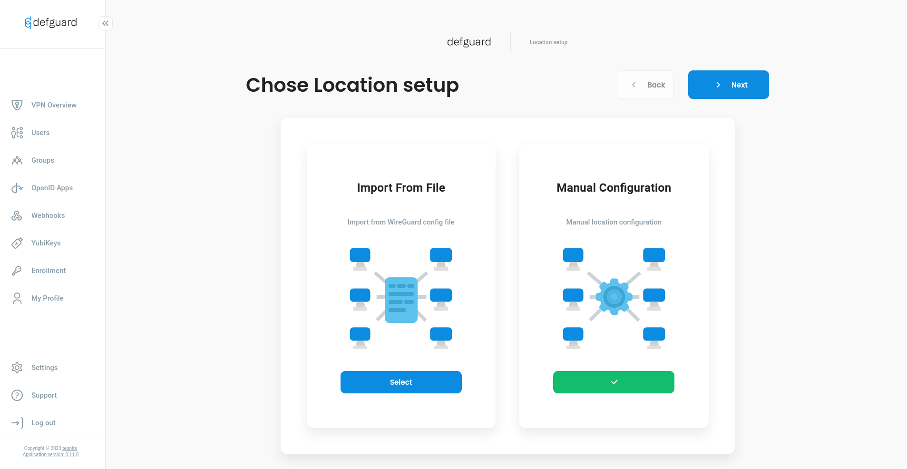
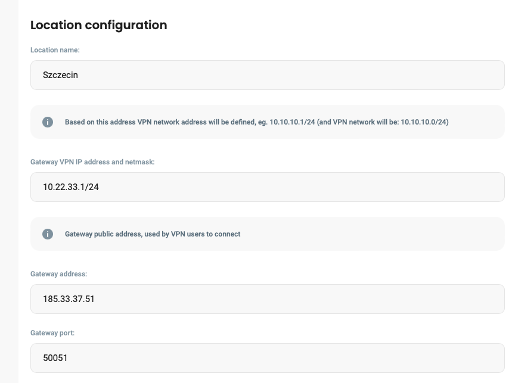
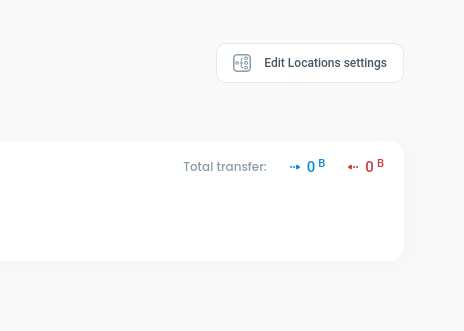
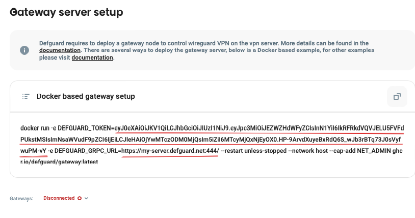

# Adding a location and getting a Gateway token

## Adding a location in Defguard Core


Please remember that **one gateway corresponds to one VPN location.**

You can also deploy multiple gateways for one location for High Availability.


Go to the address you set on `DEFGUARD_URL` with your browser and sign in using the credentials you set up during Core deployment.

Go to the _VPN Overview_ module from the main menu and click the _Edit Locations settings_.

<figure><figcaption>
Adding a new location
</figcaption></figure>

Then click the _Add new location tab_.

<figure><figcaption>
Adding a new location
</figcaption></figure>

Depending on what is more convenient for you, choose configuration from Wireguard file or do it manually.

<figure><figcaption>
Location wizard
</figcaption></figure>

<figure><figcaption>
Location configuration
</figcaption></figure>

After saving configuration for location you should be redirect to Location overview page, where at the top right corner is `Edit Locations Settings` button, click on it.

<figure><figcaption>
Manual configuration
</figcaption></figure>

In `Gateway server setup` copy two variables: `DEFGUARD_TOKEN` and `DEFGUARD_GRPC_URL`

<figure><figcaption>
Gateway server setup
</figcaption></figure>

Also, if core has a custom SSL CA to secure gRPC communication, [you need the CA certificate (more here).](grpc-ssl-communication.md#custom-ssl-ca-and-certificates)

## Deploy the Gateway service

Proceed with deploying your Gateway service using the selected [deployment strategy](setting-up-your-instance.md#choose-your-deployment-strategy):

* [package based](standalone-package-based-installation/#gateway-1)
* [Docker Compose](docker-compose.md#deploying-gateway-service)
* [Kubernetes](kubernetes.md#vpn-gateway-service)
* [Terraform](terraform.md#gateway-module)
* [AMIs and AWS CloudFormation](amis-and-aws-cloudformation/#gateway-instance)

You can also check our guides on running Gateway on [OPNsense firewall](running-gateway-on-opnsense-firewall.md) or [MikroTik router](running-gateway-on-mikrotik-routers.md).

If everything went well, Defguard Gateway should be connected to Defguard Core and you can start [adding new devices to your network](../features/network-devices.md#adding-a-new-network-device).
