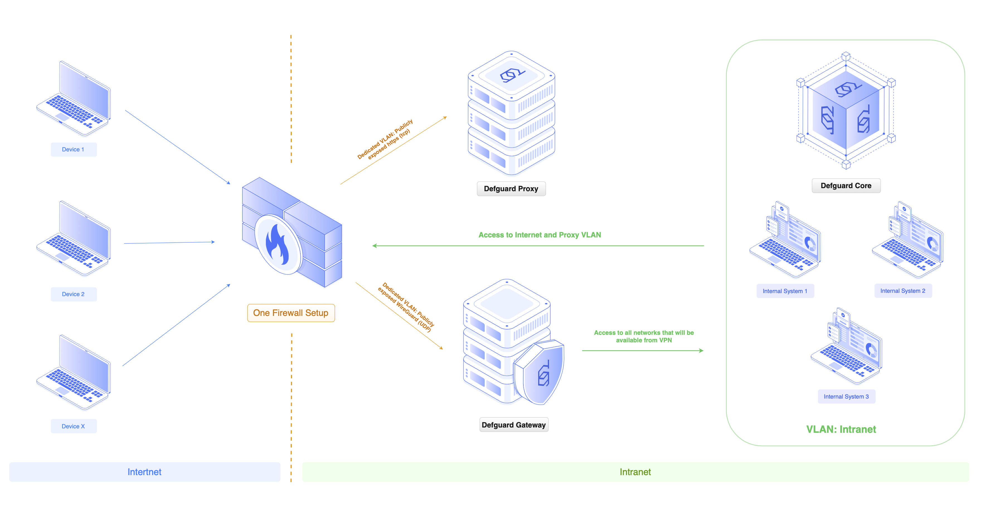

# Hardware, OS, network and firewall recommendations

## Server and environment requirements

It is recommended to split installation of Defguard components into multiple servers (physical or virtual). Installing all components onto a single server is not recommended.

Recommended setup reflects the [general system architecture](../in-depth/architecture/) with components being split into three separate machines:

1. **Dedicated server or Virtual Machine for Core (control plane)** – that should exist in the Intranet network segment, not exposed to the public Internet in any way. Core needs to be accessible from the local (secure) network and VPN (to access Defguard securely). Recommended hardware parameters:
   1. CPU: min. 1 CPU/vCPU per location - eg. if Defguard handles 2 VPN locations recommended is min. 2 CPU/vCPU
   2. RAM: min. 1GB per location
   3. Disk: min 8GB and more (for collecting statistics)

2. **Dedicated server or Virtual Machine for Edge (external and public enrollment service)** – this needs to be deployed in DMZ/public/external systems network segment as this service will be exposed and must be available publicly from the Internet. Recommended hardware parameters:
   1. CPU: min. 1 CPU/vCPU per location
   2. RAM: min. 1GB
   3. Disk: min 1GB

3. **Dedicated server or Virtual Machine for Gateway** – this needs to be deployed in:
   1. DMZ/public/external systems network segment as this service will be exposed and must be available publicly from the Internet.
   2. It requires access on Internal network interfaces to all network segments that will be exposed from VPN for users.
   3. Recommended hardware parameters:
      1. CPU: min. 1 CPU/vCPU per location
      2. RAM: min. 1GB
      3. Disk: min 4GB (mostly for logs)

In general, the hardware requirements will also have to be adjusted based on the number of active users. The numbers above should serve as a baseline.

### Operating system and software requirements

#### Package based installation

Package based installation requires:

* Debian GNU/Linux 12
* Ubuntu Linux 24.04
* Fedora Linux 40
* FreeBSD 14

#### Docker based installation

Docker deployment requires the system to have [official Docker Engine installation](https://docs.docker.com/engine/install/) (not distribution based packages).

## Network IP address and DNS setup

### Gateway server – where WireGuard VPN tunnels itself will be launched

* [**Gateway Address**](../features/wireguard/create-your-vpn-network.md#gateway-address) and [**Gateway Port**](../features/wireguard/create-your-vpn-network.md#gateway-port) **must be publicly available from the Internet**


The server on which the Gateway is installed does not need to have the public IP address (the same as the Gateway Address) assigned to it – it can have an internal network address.

The Gateway Address is the address specified in the clients’ configuration – therefore, if this address is assigned for example to a firewall or a load balancer rather than the server hosting the Gateway, then **the port from this address (Gateway Port) must be forwarded (e.g. via NAT) to the Gateway Port on the server where the Gateway is installed.**


* must have all networks on internal interfaces addresses configured, that should be accessible from VPN
* it is **recommended** to have a public domain assigned to the public IP address for the VPN server, e.g. _vpn.company.com._

More on ports and firewall can [be found below](hardware-os-network-and-firewall-recommendations.md#port-and-firewall-exposure-summary).

### Edge – public web service for enrollment & desktop client configuration

The server on which the Edge is installed does not need to have the IP address assigned to it which the **Public Edge Component URL domain** points to (_Settings -> General -> Instance settings_).

If this address is assigned for example to a firewall, a load balancer or a reverse proxy, rather than the server hosting the Edge, then just [forward proper ports acording to instruction below](hardware-os-network-and-firewall-recommendations.md#port-and-firewall-exposure-summary).

### Core and database server

Defguard Core and PostgreSQL database:

* should be internal, meaning their private IP addresses are only accessible from Intranet and VPN
* must have internal domain name assigned in the local network DNS server, eg. _defguard.company.com_

## Firewall settings

### Hardened and most secure architecture

Below is a typical Enterprise network segmentation diagram showing the minimum required segments for a De-Militarized Zone (DMZ) and the Intranet, along with the recommended placement of Defguard components within this setup:

<figure><figcaption></figcaption></figure>

### One firewall setup

For organizations with simpler network setups, we recommend an architecture that isolates Defguard components using VLANs:

<figure><figcaption></figcaption></figure>

### Port and Firewall exposure summary

#### Gateway

1. Open the private **internal TCP port** (for exmaple, the default 50066) to which the Core can connect automatically for Gateway adoption and management.
2. Open the **public UDP port for WireGuard® VPN to be working on**, (for example, 50051 – default for a new location, or 51820 – default for all-in-one Docker/OVA setup).

#### Edge

If you’ve configured your own reverse proxy for Edge, then expose the reverse proxy with your preference.

If you have used Defguard’s internal SSL termination, then expose it on the machine (or forward to Edge):

1. Open the **public TCP 443 port** on the server (**HTTPS**).

2. If you are using Defguard's automatic Let's Encrypt SSL certificate configuration, please also open port TCP 80 (HTTP) as Let’s Encrypt requires this port for validating the domain and obtaining the certificate.

3. Open an **internal TCP 50051 port** to which the Core can connect to and adopt and manage the Edge automatically.

#### Core

If you’ve configured your own reverse proxy for Core, then expose the reverse proxy in your internal network with your preference.

If you have used Defguard’s internal SSL termination, then expose it on the machine (or forward to Core):

1. TCP 443 (HTTPS) port for web interface accessible only from local/VPN network.


**Please make sure that Core can connect to Edge and Gateway internal ports mentioned above.**


## Backup strategy

In a production environment you should use your preferred backup solution to secure the following:

* Gateway and Edge **SSL certificate directory** – SSL certificates for those components were issued by Defguard’s internal Certificate Authority and are used to secure, authenticate, and authorize component communication. They are stored localy on the server (and not in the main database).
* Core **database** – preferably by doing a regular _pg\_dump_, not just a filesystem-level backup.
