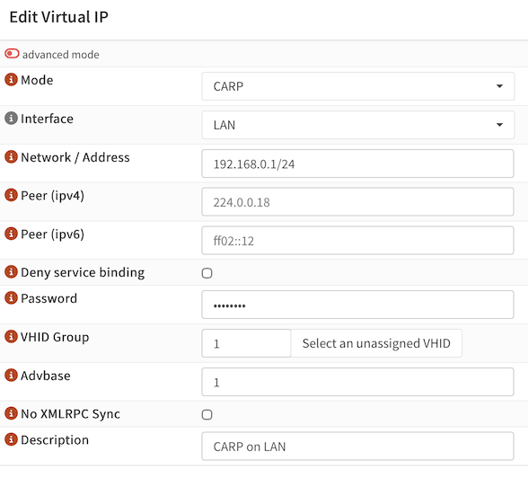
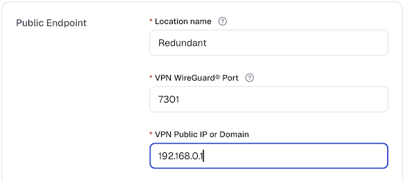

# Gateway with CARP

CARP stands for Common Address Redundancy Protocol. It is a host-based, open-source redundancy protocol designed to provide high-availability failover for IP addresses by allowing multiple machines on the same network segment to share one or more virtual IP addresses. It is often used on firewalls and routers in BSD-derived systems (FreeBSD, NetBSD, OpenBSD) and is similar in concept to the Virtual Router Redundancy Protocol (VRRP) and the Hot Standby Router Protocol (HSRP), but it was designed to avoid licensing and patent issues.

Defguard Gateway can be deployed on multiple hosts that share the same virtual IP address managed by CARP to achieve high availability.

This approach is useful when you want the VPN endpoint to remain reachable through a single public IP address while allowing another gateway node to take over if the primary one becomes unavailable. It is especially practical in BSD-based firewall environments where CARP is already available as part of the platform.

## OPNsense setup

At least two OPNsense machines are required for high availability. These machines will share the CARP configuration.

In this setup, one node normally owns the virtual IP address and handles traffic. If that node fails, the secondary node can take over the same IP address, which helps keep the gateway reachable without changing the VPN endpoint configured on clients.

To use CARP with Gateway on [OPNsense](https://opnsense.org/), first [install the Gateway package for OPNsense](deployment-strategies/running-gateway-on-opnsense-firewall.md).

In the OPNsense user interface, go to **Interfaces → Virtual IPs → Settings**, click "+" (plus), and create a new CARP Virtual IP:

* Set **Mode** to CARP.
* Choose an **Interface** (usually, WAN).
* Assign **Network/Address** (usually, a public IP address).
* Set a **Password**.
* Click on **Select an unassigned VHID**, or specify **VHID Group** by hand.
* Click **Save**.
* Click **Apply**.

<figure><figcaption></figcaption></figure>

For detailed information, refer to the [Virtual IPs](https://docs.opnsense.org/manual/firewall_vip.html) guide in the OPNsense documentation.

Make the same changes on the secondary OPNsense machine.

Now start Defguard Gateway on both machines. Gateway will also listen on the virtual IP, which can then be configured as the **VPN Public IP** in the [Location settings](../../features/wireguard/create-your-vpn-network/) in Defguard Core.

After the setup is complete, verify that the virtual IP is active on the primary node and that failover works as expected before using the configuration in production. It is also a good idea to test whether the secondary node can take over cleanly and whether clients are able to reconnect after the failover event.

<figure><figcaption></figcaption></figure>
