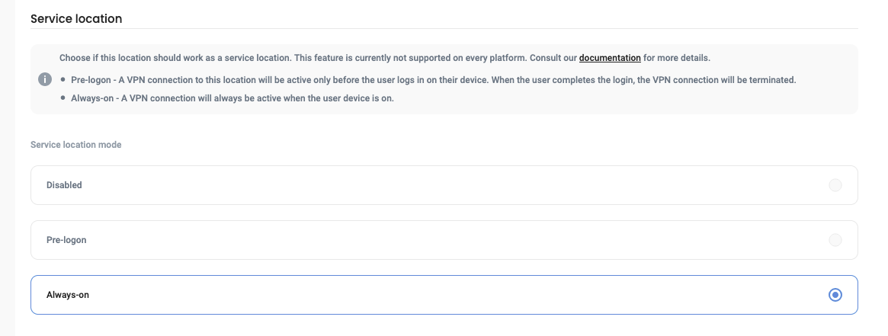

# OVA

Defguard provides OVA images that can be imported into VMware, Proxmox, or any other solution that supports the standard OVA format. The image is based on Ubuntu 24 and supports configuration via `cloud-init`. It contains the full Defguard stack (Defguard Core, Edge, Gateway), a database, and a reverse proxy (NPM).

The latest image can be downloaded here: [https://defguard-downloads.s3.eu-central-1.amazonaws.com/ova/defguard-latest.ova](https://defguard-downloads.s3.eu-central-1.amazonaws.com/ova/defguard-latest.ova)

### Importing the image

After importing the image, make sure to:

1. Attach an appropriate network interface so the virtual machine can access your network.
2. If you would like to change default user/password you can [do so with cloud-init](https://docs.cloud-init.io/en/latest/reference/yaml_examples/set_passwords.html) - if not, default user ubuntu with pass ubuntu will be created.

### Setting up Defguard

Once booted, the virtual machine will have all Defguard components pre-configured. To complete the setup, simply visit the Defguard Core dashboard: http://\<VM\_IP\_OR\_DOMAIN>:8000. Follow the on-screen wizard to finalize your configuration.


For example setup walkthrough [see this guide](/broken/pages/nNsN8zKGZVhPboFEtp8E#example-setup).


If you would like to setup a reverse-proxy beforhand (which enables automated SSL Certificates with Let's Encrypt), [go to this section for more details](ova.md#setting-up-a-reverse-proxy).

### Accessing the VM

You can access the VM using the following default credentials (requires changing after first login):

| Login    | `ubuntu` |
| -------- | -------- |
| Password | `ubuntu` |

#### Verifying the running Defguard stack

When booting the machine for the first time, the whole Defguard stack will be launched using Docker Compose. All Defguard files (Docker compose, environment variables) can be found under the `/opt/stacks/defguard/` directory.

To verify that Defguard is running, use the following command inside the VM:

```sh
sudo docker ps
```

<figure><figcaption></figcaption></figure>

Here is the breakdown of accessible services deployed on the VM:

<table><thead><tr><th>Name</th><th width="182">Port</th><th width="240">Type</th></tr></thead><tbody><tr><td>Core</td><td>8000</td><td>HTTP (web dashboard)</td></tr><tr><td>Edge</td><td>8080</td><td>HTTP (enrollment portal)</td></tr><tr><td>Gateway</td><td>51820</td><td>UDP (VPN port)</td></tr><tr><td>Nginx Proxy Manager</td><td>80, 443, 81</td><td>HTTP(S) and the management dashboard on port 81</td></tr></tbody></table>

### Setting up a reverse proxy


Defguard has a built in SSL termination and can automatically obtain certificates from [https://letsencrypt.org/](https://letsencrypt.org/) (or issue own certificates from our CA) - but deploying a Reverse Proxy is always recommended.



Setting up a reverse proxy will require you to prepare two domains: one for Defguard Core (internal), one for Defguard Edge (public)


To configure the reverse proxy, register an account in the NPM dashboard, accessible via `http://<VM_IP_OR_DOMAIN>:81`.

After creating your account, go to **Proxy Hosts** and configure the proxy for Core and Edge:

<figure><figcaption></figcaption></figure>

<figure><figcaption></figcaption></figure>

<figure><figcaption></figcaption></figure>

This will allow you to access Core and Edge via your respective domains, using the standard HTTP/HTTPS ports. We also recommend setting up SSL. Please make sure you don't expose Defguard Core publicly. See [Architecture](../in-depth/architecture/) for details.

### Managing and updating containers

Containers can be updated using the following commands in the `/opt/stacks/defguard` directory:

```
sudo docker compose pull
sudo docker compose down
sudo docker compose up
```

This can also be achieved without accessing the VM using the Dockge dashboard, refer to [this section](ova.md#dockge) for more information.

## Cloud-Init options

### Selecting what components to run (Proxmox)

As mentioned previously, the VM starts the full stack by default. If you would like to separate the components (which is the recommended [way of deploying Defguard](../in-depth/architecture/)), you can use custom `cloud-init` configuration to specify which component to run for a given VM instance.

Create the following snippet. The content can be `core`, `edge`, or `gateway`:

```
#cloud-config
write_files:
  - path: /opt/defguard/active-profiles
    content: "core"
```

In Proxmox, save the snippet to (or your selected snippet directory, if you are using a non-standard one):

```
/var/lib/vz/snippets/defguard-core-userdata.yaml
```

Then attach it to the VM on which you want to run the selected Defguard component:

```sh
qm set <ID_OF_THE_VM> --cicustom "vendor=local:snippets/defguard-core-userdata.yaml"
```

Next, boot the VM. Now, only the selected component should run.

Here is the full breakdown of what runs for each profile:

<table><thead><tr><th width="322">Profile</th><th width="411">What runs</th></tr></thead><tbody><tr><td>core</td><td>Core, database, NPM</td></tr><tr><td>edge</td><td>Edge, NPM</td></tr><tr><td>gateway</td><td>Gateway</td></tr></tbody></table>

Using different solution that Proxmox will require creating a custom cloud-init that will write one of the profiles above to the `/opt/defguard/active-profiles` file.

### Dockge

You can additionally enable [Dockge](https://github.com/louislam/dockge) to easily manage and update all Defguard containers. To do so, add the following to your cloud-init snippet (this was explained more in-depth in the [#selecting-what-components-to-run-proxmox](ova.md#selecting-what-components-to-run-proxmox "mention") section):

```
#cloud-config
write_files:
  - path: /opt/stacks/defguard/enable-docker-management
    content: ""
```

After the virtual machine starts, Dockge dashboard should be available at `http://<VM_IP_OR_DOMAIN>:5001` . Access it in order to create a Dockge admin account.
