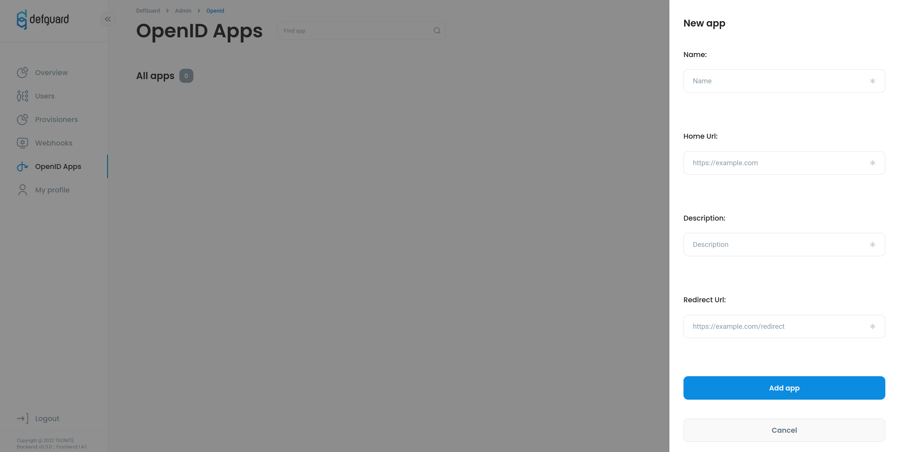

# OpenID Connect

## What is OpenID Connect?

OpenID Connect is identity layer built on top of OAuth2 it allows third party applications to get basic information about your profile and verify your identity. It's purpose is to give you one login for multiple sites. You're probably familiar with it if you used **Login with Google**. For example if you click Login with Google you'll be redirected to Google page with verify form that you allow some website to get information from your profile for example: email, name, etc.

## How Defguard implements OpenID?

As an identity provider one of our core features is Login with Defguard which allows you to log into other websites using your Defguard account so you don't have to care about multiple passwords and leaks. At this point you may have concern and ask is it safe? Yes, it's completely safe cause all information third party app will receive is the information that you allowed on redirect page. These information then are sent to third party app as IDToken which is basically JSON Web Token with additional claims like first name or email. Your password isn't send in any step of this.

## How to enable login with Defguard using OpenID?

### Client creation

To enable login with other app first you need to add it as new OpenID client.
To do it navigate to OpenID Apps on the left side navigation then click Add new button.



Here are explained inputs

**Name** Name of your client
**Redirect URI** URL on which user will be redirected with generated PKCE code example("https://myapp.com/redirect_uri")
**Scopes** Scopes which your client will be using

After creating your client you can click on it on list and be redirected to detailed client page with it unique Client ID and Client secret codes.

**Client ID** is a public identifier for apps. Something like unique login so we can verify app URL matches it's Client ID.
**Client Secret** Only known for authorization server(Defguard) and the applications as we using

Setup on authorization app if you want to login with Defguard.

### Authentication request

Set up your login with Defguard button to redirect to authorization endpoint which is `https://defguard.company.net/openid/authorize?`

Below is sample authentication request which your app should do on Login with Defguard button

```
http://defguard.company.net/openid/authorize?
client_id=<YOUR_CLIENT_ID> // Generated by defguard available on app detail page
&redirect_uri=<YOUR_REDIRECT_URI>  //Url on which user with code will be redirected
&scope=openid%20profile%20phone%20email // available scopes
&response_type=code // Currently only supported response is code
&state=<YOUR_STATE> // State to returned on redirect uri to verify request comes with Defguard
```

#### Notes:

1. Client id and secret is generated by Defguard after creating your app you can see it on app detail page
2. **Scope** must contain OpenID
3. Available scopes are profile(all available info from user profile) phone and email
4. Currently only supported **response_type** is **code**.
5. Redirect URI is URL on which user will be redirected with generated PKCE code (Redirect URI must match URI declared on client creation otherwise error will be returned)

#### Successful authentication response

```
HTTP/1.1 302 Found

Location: <YOUR_REDIRECT_URI>?
code=SplxlOBeZQQYbYS6WxSbIA
&state=af0ifjsldkj
```

### Exchange code for ID Token

After receiving code from previous step you need to exchange it for token
on token endpoint defguard.company.net/api/v1/openid/token

Request Header and URL:

```
Content-Type: application/x-www-form-urlencoded
POST defguard.company.net/api/v1/openid/token
```

Request body:
Need to be form encoded

```
grant_type=authorization_code
&redirect_uri=<YOUR_REDIRECT_URI>
&code=<CODE_RECEIVED_IN_PREVIOUS_STEP>
```

#### Note:

1. Currently only supported **grant_type** is authorization_code
2. Code is your PKCE code received in previous step

#### Successful Token Response

```
  HTTP/1.1 200 OK
  Content-Type: application/json
  Cache-Control: no-store
  Pragma: no-cache

  {
   "id_token": "eyJhbGciOiJSUzI1NiIsImtpZCI6IjFlOWdkazcifQ.ewogImlzc
     yI6ICJodHRwOi8vc2VydmVyLmV4YW1wbGUuY29tIiwKICJzdWIiOiAiMjQ4Mjg5
     NzYxMDAxIiwKICJhdWQiOiAiczZCaGRSa3F0MyIsCiAibm9uY2UiOiAibi0wUzZ
     fV3pBMk1qIiwKICJleHAiOiAxMzExMjgxOTcwLAogImlhdCI6IDEzMTEyODA5Nz
     AKfQ.ggW8hZ1EuVLuxNuuIJKX_V8a_OMXzR0EHR9R6jgdqrOOF4daGU96Sr_P6q
     Jp6IcmD3HP99Obi1PRs-cwh3LO-p146waJ8IhehcwL7F09JdijmBqkvPeB2T9CJ
     NqeGpe-gccMg4vfKjkM8FcGvnzZUN4_KSP0aAp1tOJ1zZwgjxqGByKHiOtX7Tpd
     QyHE5lcMiKPXfEIQILVq0pc_E2DzL7emopWoaoZTF_m0_N0YzFC6g6EJbOEoRoS
     K5hoDalrcvRYLSrQAZZKflyuVCyixEoV9GfNQC3_osjzw2PAithfubEEBLuVVk4
     XUVrWOLrLl0nx7RkKU8NXNHq-rvKMzqg"
  }
```

#### Note:

1. As we using HS256 algorithm ID Token is signed using your app Client Secret

#### Authorized apps:

Every user that used Login with Defguard option can see in his profile name of every authorized app. 
If you revoke app then you will have to click allow on form with permissions again.


# OpenID clients
Below you can find tutorials how to configure login with defguard in popular clients.


## Grafana

### Add grafana app on defguard

First, go to the defguard OpenID tab and click add new app button.

1. Add the name Grafana
2. Redirect Url add `https://<grafana domain>/login/generic_oauth`
where <grafana domain> is the address of your grafana instance.
3. Select the below scopes 
* OpenID 
* Profile
* Email
Then add your app.
After successfully adding your app you can see it in the OpenID apps list. When you click on it you will be redirected to the client details page.
From this page copy Client ID and Client secret values for later.

### Grafana setup

1. Open your [grafana config](https://grafana.com/docs/grafana/latest/setup-grafana/configure-grafana/#config-file-locations) 
which is located in `/etc/grafana/grafana.ini` if you're using linux if you're using other operating system see link above.

2. In auth section of your configuration file append the template from below and fill it with corresponding values.


```
#################################### Auth Defguard ##########################
[auth.generic_oauth]
name = Defguard
icon = signin
enabled = true
client_id = <YOUR_APP_CLIENT_ID>  # from defguard page
client_secret = <YOUR_APP_CLIENT_SECRET> # from defguard page
scopes = openid profile email
empty_scopes = false
auth_url = https://<your_defguard_instance>/consent
token_url = https://<your_defguard_instance>/api/v1/oauth/token
api_url = https://<your_defguard_instance>/oauth/userinfo
allow_sign_up = true
```

3. Restart your grafana server using `systemctl restart grafana-server`
4. Then on login, you'll see the `Sign-in defguard button`

## Portainer

### Add Portainer app on defguard

First, go to the defguard OpenID tab and click add new app button.

1. Add the name Portainer
2. Redirect Url add `https://yourportainer.com`
where yourpotainer.com is the address of your portainer instance.
3. Select the below scopes 
* OpenID 
* Profile
* Email
Then add your app.
After successfully adding your app you can see it in the OpenID apps list. When you click on it you will be redirected to the client details page.
From this page copy Client ID and Client secret values for later.

### Portainer configuration
When you login to portainer go to **Settings -> Authentication**

On this page select:
Authentication method:  OAuth

#### Provider
Select **Custom**

#### OAuth Configuration

- **Client ID** -> Client ID from defguard available on client details page.
- **Client secret** -> Client secret from defguard available on client details page.
- **Authorization URL** -> https://<YOUR_DEFGUARD_INSTANCE>/consent
- **Access token URL** -> https://<YOUR_DEFGUARD_INSTANCE>/api/v1/oauth/token
- **Resource URL** -> https://<YOUR_DEFGUARD_INSTANCE>/api/v1/oauth/userinfo
- **Redirect URL** -> https://<YOUR_PORTAINER_URL>
- **User identifier** -> sub
- **Scopes** -> `openid email profile` **Note** must be spaces separated as in this example
