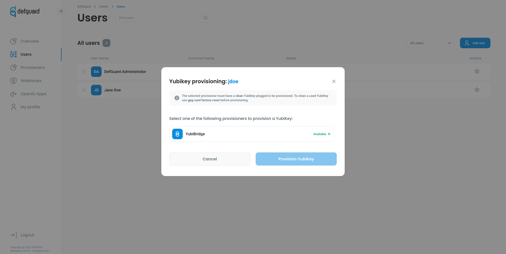
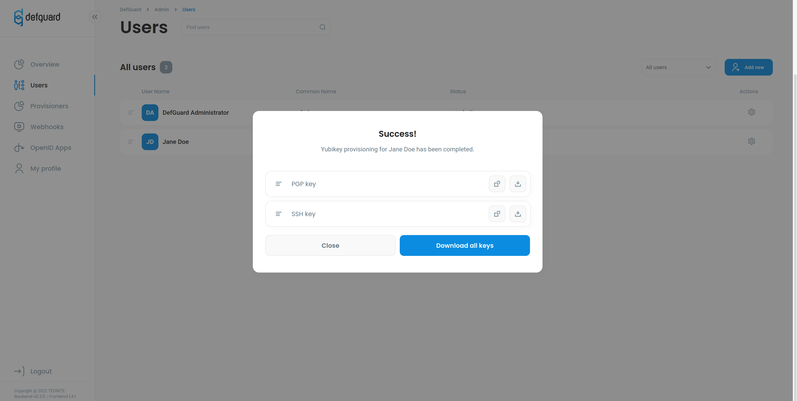

# YubiKey Provisioning

## What is YubiKey?

YubiKey is a hardware based authentication key, which allows you to store your secret keys safely and enable two-factor-authentication. Once your keys are written to YubiKey they can't be restored, it's a great alternative to holding your private keys on your computer's hard drive where malicious apps can access them. If you want to read more about YubiKey take a look at the [official site](https://www.yubico.com/products/). YubiKey supports many protocols but we will focus on OpenPGP.

## Why use OpenPGP?

OpenPGP is very popular asymmetric cryptography protocol that uses two keys - public and private - for signing. For example if you want to sign your email message you can encrypt it with your private key and receiver can decrypt it using your publicly available public key.

## What is YubiBridge?

We created YubiBridge to make creating and provisioning of GPG keys for YubiKey easy. That's why we created a python script which allows you to provision your YubiKey with automatically generated GPG keys in a few simple steps. It's completely safe, we are not storing private keys, they are completely wiped after provisioning. Only public SSH and PGP keys are sent to Defguard - you can download them at any time.

## How to use YubiBridge?

You can use YubiBridge in two ways:

* [as a Defguard client service](#as-a-defguard-client) - run the service and then provision YubiKey from Defguard web app
* [as a standalone command-line application](#as-a-cli-app) - insert your YubiKey then run the app providing your name and email as arguments

### As a Defguard client

You can see available provisioners in Defguard web-application under "provisioners" tab.

To start your own provisioner:

1. Clone YubiBridge repository:

```
git clone --recursive git@github.com:DefGuard/yubi-bridge.git && cd yubi-bridge
```

2. Copy and fill in the .env file:

```
cp .env.template .env
```

Variables to set:

* `DEFGUARD_URL`: your defguard instance, e.g.: `defguard.mycompany.com`
* `WORKER_ID`: your machine id, this is the name you'll see in Defguard "provisioners" tab, e.g.: `Jane-Laptop`

> You can find list of all environment variables and arguments with explanation [here](../in-depth/environmental-variables-configuration.md).

3. Finally, run the service with docker-compose:

```
docker-compose up
```

If everything went well, your machine (with worker id you just set) should be visible in Defguard provisioners tab.
To provision the key:

1. select the user from "Users" page in Defguard web-application (or go to "My Profile" if you're provisioning a key for
yourself)
2. insert a clean YubiKey (YubiBridge won't override existing keys)
3. click the "Provision Yubikey" button
4. select your provisioner and click the "Provision YubiKey" button



The service will take a minute to prepare and provision your keys. Once that's done you'll see a modal with your public keys that are now stored in Defguard.



### As a CLI app

Simply download source app code and run

`docker-compose run ykdev -p <first_name> <last_name> <email>`

Then your keys will be created and transferred to YubiKey.

If you want to know more about possible arguments or environmental variables take a look [here](../in-depth/environmental-variables-configuration.md).

### Common errors
In case you got `ERROR: Can't connect to smartcard` in your log messages or on Defguard panel try these steps:
1.  Stop worker docker or native
2. Run `gpg --card-edit` then follow on screen instructions to reset your YubiKey
3. Unplug YubiKey
4. Plugin your YubiKey again
5. Start worker service


