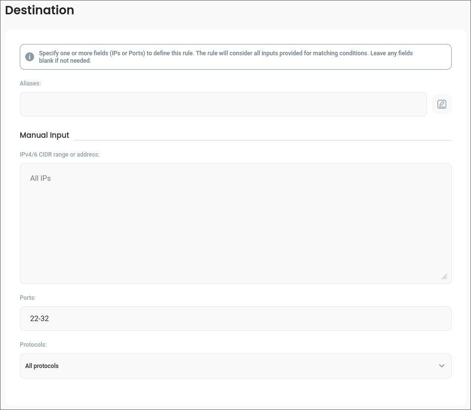

# ACL Aliases

ACL alias functionality allows administrators to create reusable elements which can then be used when defining a destination in multiple ACL rules.&#x20;

For example you can define aliases for commonly used ports (e.g. 22 for SSH) or for services within your infrustructure (e.g. 1.2.3.4:5432 for a PostgreSQL server).


Access Control is an [enterprise feature](../../license.md). To use it you'll need to [purchase a license](../../license.md#purchasing-the-license) or ensure your deployment does not [exceed the limits](../../license.md#enterprise-is-free-up-to-certain-limits).

Access Control is available in Defguard version ≥ 1.3.0 and Gateway version ≥ 1.3.0


## Alias management

All the aliases defined in your systems are displayed in the second tab of the **Access Control List** page.

### List of aliases

<figure><figcaption>
ACL alias list
</figcaption></figure>

Similarly to ACL rules themselves, the list is split into two sections:

* **Deployed Aliases** - aliases that are active and can be used by ACL rules
* **Pending Changes** - aliases that have been modified and have not yet been deployed

To deploy pending changes use the **Deploy pending changes** button. It will deploy selected changes or all pending changes if none have been selected.


When alias changes are deployed, firewall rules will be updated for all affected locations.


### How to add and modify aliases

To create a new rule, use the .png>)  button in the list view.

You can edit an existing rule by using the .png>) context menu and selecting **Edit** in the list view.

<figure><figcaption>
Alias creation form
</figcaption></figure>

In the ACL alias form you can specify alias name and [type](acl-aliases.md#alias-types).&#x20;

Below in the **Destination** section you can enter the same resource configuration as in the [ACL rule Destination](./#destination):

* IP addresses
* ports or port ranges
* protocols


Unlike ACL rules, newly created aliases have **Applied** status, since they do not affect any traffic unless used by a rule.


### Removing aliases

To remove an alias select the **Delete alias** option from the context menu.

<figure><figcaption></figcaption></figure>

Unlike with ACL rules, alias deletion is not tracked as a modification. You cannot delete an alias if it's being used by any rules and deleting unused aliases is immediate, not requiring changes to be deployed.

<figure><figcaption>
You cannot delete aliases used by ACL rules
</figcaption></figure>

## Using aliases in ACL rules

Aliases can be used to define an ACL rule destination by selecting them in the input within the **Destination** section:

<figure><figcaption>
ACL rule Destination section with Aliases field
</figcaption></figure>

<figure><figcaption>
Alias select modal
</figcaption></figure>

## Alias types

Aliases are divided into two distinct types to handle various use-cases:

* **Destination** alias - defines a complete [ACL destination](./#destination); it will be translated into a separate set of firewall rules
* **Component** alias - defines a part of  [ACL destination](./#destination); it will be merged with destination manually configured in a given ACL rule when generating firewall rules

### Examples

Let's start with an ACL rule that defines a following destination:

<figure><figcaption></figcaption></figure>

By itself this rule will allow specified users to access **all ports** and **all protocols** on the specified IP.

#### Component alias

Consider an **SSH** alias with a following definition:

<figure><figcaption>
SSH component alias definition
</figcaption></figure>

When used in the previously created ACL rule, port 22 will be added to manual inputs defined in the rule itself.

In effect the rule will now grant access **only** to port 22 on 10.2.0.5, just like if we entered the port number in the rule's **Manual Input** section.

#### Destination alias

Now consider the following alias:

<figure><figcaption>
Postgres server destination alias
</figcaption></figure>

When used in the previously defined ACL rule it will have the following effects:

* the rule will still grant access to **all ports** and **all protocols** on 10.2.0.5
* it will also independently grant access to port 5432 in 10.2.0.38

In effect this is like if the rule has two separate destination inputs.

Underneath this is achieved by creating a separate set of firewall rules (one ALLOW and one DENY) for each destination alias.
