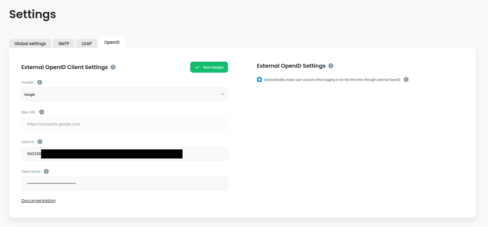

# Google


Here is [full Google documentation](https://developers.google.com/identity/openid-connect/openid-connect) about this process.


1. The Google OpenID Connect can be configured in the [Google Cloud Console](https://console.cloud.google.com)
2.  If you don't have any project setup already (or you want to create a new one for this purpose), create it by clicking the dropdown menu here:

    <figure><figcaption></figcaption></figure>

    If you already have project, make sure to select it in the above dropdown menu.
3. Now, navigate to [`APIs & Services`](https://console.cloud.google.com/apis)
4. We will focus on the consent screen first, select `OAuth consent screen`
5.  Pick the User Type according to your needs, this example will focus on the internal type

    <figure><figcaption></figcaption></figure>
6. Fill in all required details. Make sure to fill the correct domain. This should be the top domain under which your Defguard dashboard can be accessed, not the subdomain (e.g. `defguard.example.com` -> `example.com`).
7.  On the scopes config screen, click `ADD OR REMOVE SCOPES`, Defguard requires at least the following scopes:

    <figure><figcaption></figcaption></figure>
8. Proceed until the end and return to the OAuth consent screen dashboard.
9.  Now, go to [`Credentials`](https://console.cloud.google.com/apis/credentials), click `CREATE CREDENTIALS` and choose `OAuth client ID`

    <figure><figcaption></figcaption></figure>
10. On the next screen, fill out all required information:

    <figure><figcaption></figcaption></figure>

    Make sure to select "Web application" as the application type. The other thing to note here is the redirect URI. It is the URI to which the user will be redirected from the external provider's authorization. This URI is in the form of `<DEFGUARD_DASHBOARD_URL>/auth/callback`. Replace `<DEFGUARD_DASHBOARD_URL>` with the URL under which your dashboard is accessible, e.g. `https://defguard.example.com`. If you'd like to use OpenID enrollment through proxy, make sure to enter an additional URI here in the form of `<DEFGUARD_ENROLLMENT_URL>/openid/callback`.
11. After you proceed further, you will be presented with a popup containing your `Client ID` and `Client Secret`, copy them and paste on the Defguard OpenID configuration page.

    <figure><figcaption></figcaption></figure>

### Directory synchronization


Documentation regarding this feature is still work in progress and incomplete.



This feature is available only in Defguard v1.2.0 and above


Defguard supports synchronization of users and groups state based on Google Workspace. The following things can be synchronized:

* **User Groups**: Automatically create and assign user groups in Defguard to reflect them in Google Workspace.
* **User Deletion**: Removing a user in Google Workspace can also remove them in Defguard.
* **User Status**: Disabling a user in Google Workspace will disable them in Defguard.

#### Directory synchronization configuration menu

The menu can be found in Defguard settings by navigating to the "OpenID" tab.

<figure><figcaption></figcaption></figure>

The following configuration options are currently available in the directory synchronization menu:

* **Synchronize (All/User/Group):** What to synchronize.
  * **All** - synchronize both user state (disabled/enabled), their deletion and groups
  * **User** - synchronize only user state (disabled/enabled) and whether they've been deleted
  * **Group** - synchronize only user groups
* **Synchronization interval (600s by default):** How often to synchronize with Google. Very low values may cause issues with Google API. Users are also synchronized on login.
* **User behavior (Keep, Disable, Delete):** What to do with users not present in Google Workspace.
* **Admin behavior (Keep, Disable, Delete):** What to do with users with admin status (in Defguard) who are not present in Google Workspace.
* **Admin email:** The email of the Google Workspace admin user on whose behalf Defguard will call the Google API
* **Service account in use:** The email of the Google service account which is currently used

#### Directory synchronization setup

1.  Navigate to [Service Accounts](https://console.cloud.google.com/iam-admin/serviceaccounts) in the Google cloud console\

    <figure><figcaption></figcaption></figure>

2. Click "Create service account"
3.  Give your service account a descriptive name\

    <figure><figcaption></figcaption></figure>

4. Skip step 2 and 3 if you are not sure what to configure there.
5.  Go to your newly created service account and add a new key in the "KEYS" tab.\

    <figure><figcaption></figcaption></figure>

6. A JSON file will be downloaded after you click "CREATE". Store it securely as it may grant access to your Google Workspace directory.
7. Next, navigate to the "DETAILS" tab and copy the unique ID of your service account.
8. Open the Advanced settings and under Domain-wide delegation click "View google workspace admin console"
9.  Now in the admin console, navigate to [API controls](https://admin.google.com/u/1/ac/owl)\

    <figure><figcaption></figcaption></figure>

10. In the API controls, click "Manage domain wide delegation"
11. On the next screen, add a new API client\

    <figure><figcaption></figcaption></figure>

    Specify the following scopes for your client:\
    `openid, email, profile, https://www.googleapis.com/auth/admin.directory.customer.readonly, https://www.googleapis.com/auth/admin.directory.group.readonly, https://www.googleapis.com/auth/admin.directory.user.readonly`
12. Navigate to the Defguard settings and upload the JSON file you obtained previously. Make sure to also input the email of the account on which behalf the API calls will be made. This account should have access to users and their groups (e.g. email of your account as an admin).
13. Test if you properly set everything up by clicking the "Test connection" button.
