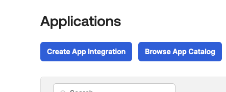
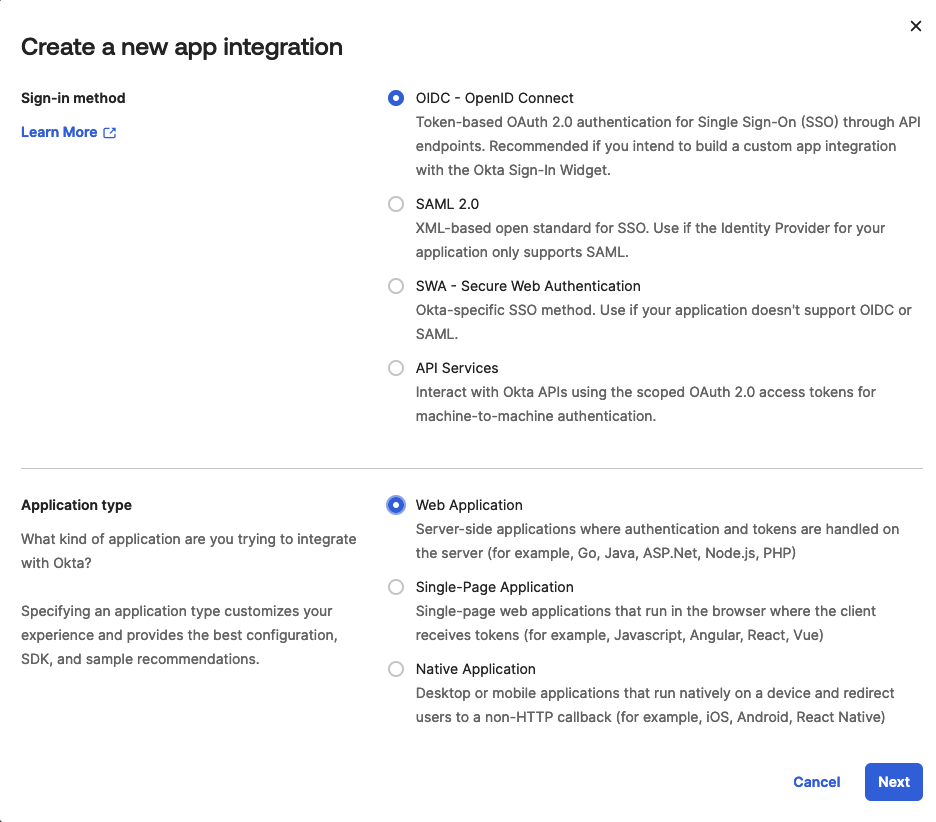
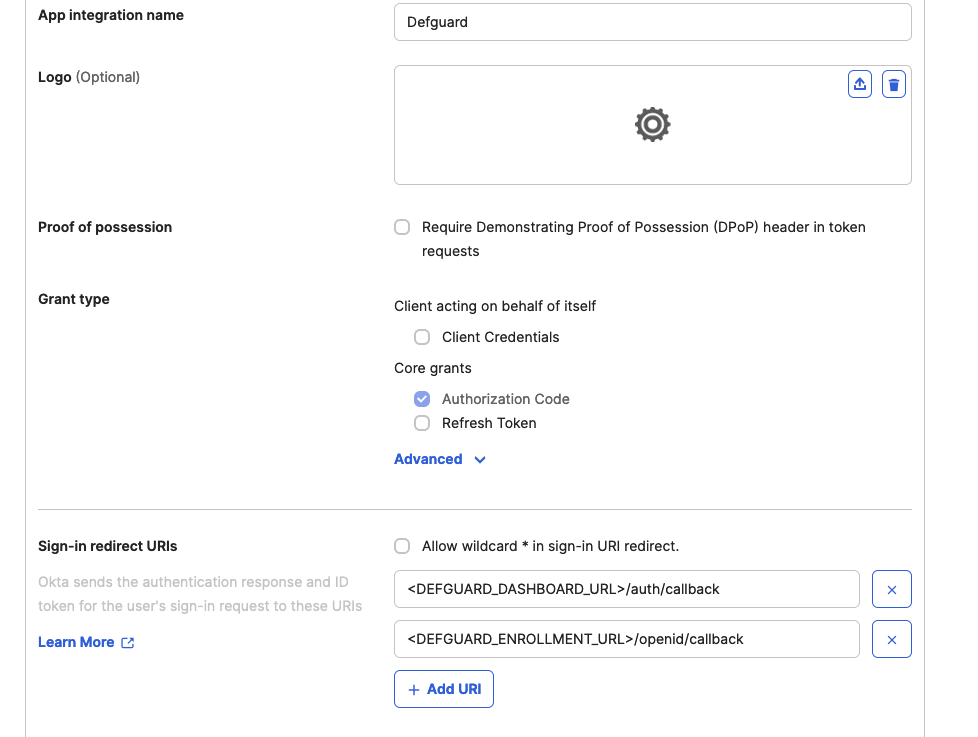
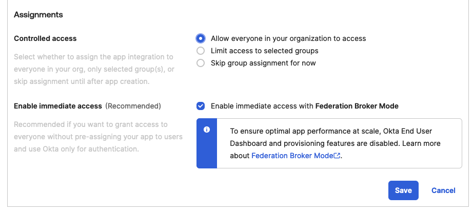
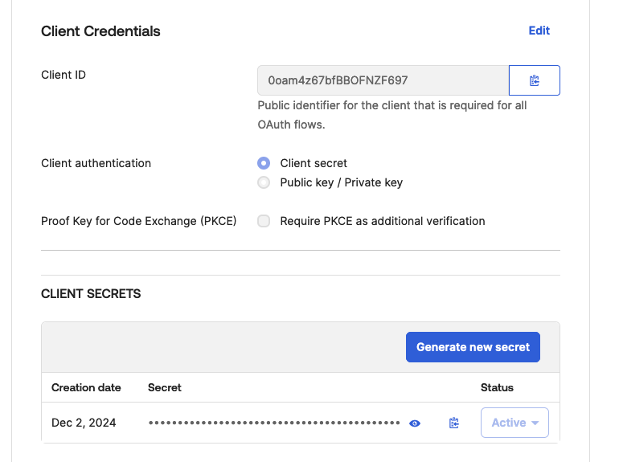
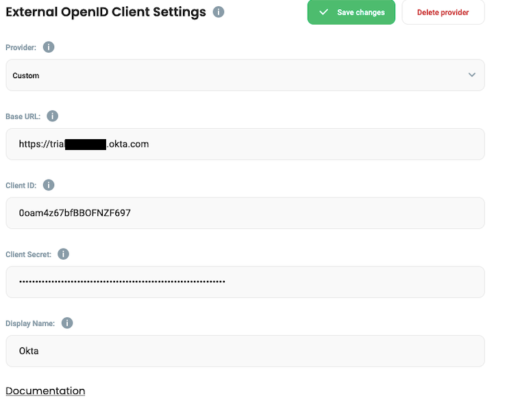

# Okta

1. First, navigate in your Okta dashboard to "Applications" and create a new app integration here:

<figure><figcaption></figcaption></figure>

2. Next, select following options like so:

<figure><figcaption></figcaption></figure>

3. On the next page, configure the application. Make sure to set the correct Sign-in URIs, those will take the form of `<DEFGUARD_DASHBOARD_URL>/auth/callback` (dashboard login) and `<DEFGUARD_ENROLLMENT_URL>/openid/callback` (if you want to perform new user enrollment using Okta). Replace `<DEFGUARD_DASHBOARD_URL>` and `<DEFGUARD_ENROLLMENT_URL>` with the URLs of your Defguard dashboard and enrollment page (proxy) accordingly. If you access your Defguard dashboard at e.g. `https://defguard.example.net` your redirect URI will be `https://defguard.example.net/auth/callback`.

<figure><figcaption></figcaption></figure>

4. Next, select the assignment according to your needs, we will select the option that allows every directory member to login:

<figure><figcaption></figcaption></figure>

5. Now, copy your client ID and secret, as you will need to paste it in your Defguard's settings.

<figure><figcaption></figcaption></figure>

6. Go to your Defguard settings, and fill all the required information, pasting the Client ID and Client secret from Okta:

<figure><figcaption></figcaption></figure>

The base URL will be based on your Okta domain. In the case of this example, the `-admin` part of the URL had to be additionally removed. To additionally verify if your Base URL is correct, you can navigate to `<YOUR_OKTA_DOMAIN>/.well-known/openid-configuration`. The issuer field here should be the same as the Base URL.

### Directory synchronization


This feature is available only in Defguard v1.2.3 and above


This documentation concerns only the Okta directory synchronization. For more general information, see the [general directory synchronization guide](./#directory-synchronization).

#### Directory synchronization configuration menu

The menu can be found in Defguard settings by navigating to the "OpenID" tab.

<figure><figcaption></figcaption></figure>

The following configuration options are currently available in the directory synchronization menu specifically for the Okta provider:

* **Directory Sync Client ID:** The client ID of the Okta directory synchronization app
* **Directory Sync Client Private Key:** The private key of the Okta directory synchronization app

To learn more about the rest of the configuration options, see the [general directory synchronization guide](./#directory-synchronization).

#### Directory synchronization setup


This feature is currently technically limited to 10000 members or groups. High user or group counts may still trigger your provider API limits even below this threshold. If you have many users (200+), we recommend you test this feature first before you decide to turn on automatic user deletion.


1.  Go to the Okta admin dashboard and navigate to the Applications menu\

    <figure><figcaption></figcaption></figure>

2. Make a completely new app integration by clicking "Create App Integration". This app will be solely responsible for communicating with Okta API.
3.  Select "API services"\

    <figure><figcaption></figcaption></figure>

4. Name your app integration, e.g. "Defguard directory sync"
5.  Go to your newly created app integration settings and change the client authentication to "Public key / Private key"\

    <figure><figcaption></figcaption></figure>

6. Next, click "Add key" and generate a new key pair.
7. Copy the generated private key in the JSON format to your clipboard
8. Paste the copied key in the Defguard Okta directory sync settings in the "Directory Sync Private Key" field.
9. Go back to Okta again. Save your new Okta configuration along with the newly generated keys. Now, copy the app integration's client ID. Paste it in the "Directory Sync Client ID" field in Defguard Okta directory sync settings. Save your Defguard settings.
10. Return to Okta and under "General settings" turn off the "Require Demonstrating Proof of Possession (DPoP) header in token requests" option. Save your changes.\

    <figure><figcaption></figcaption></figure>
11. Now, navigate to the Okta API scopes tab.\

    <figure><figcaption></figcaption></figure>

12. Grant the `okta.groups.read` and `okta.users.read` scopes.
13. Everything should be set now. Try testing your provider connection in Defguard directory synchronization settings.
