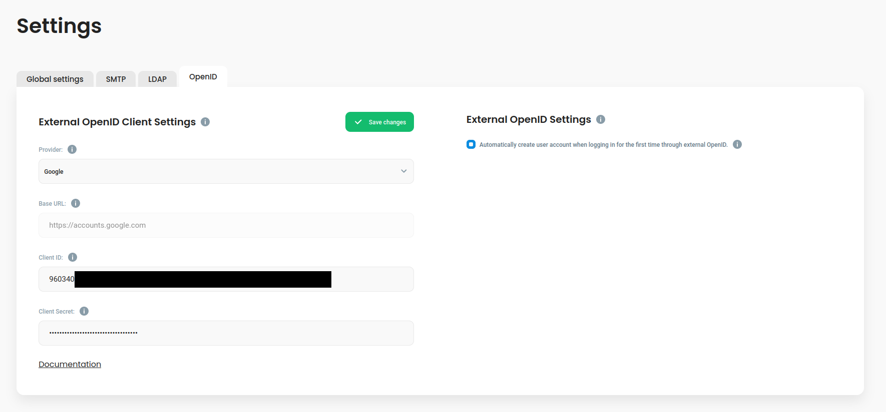

# External OpenID providers

Defguard, [apart from being an identity provider itself](../features/openid-connect/), supports logging in through external OpenID providers. Currently, there are two built in providers (Google and Microsoft) but there is also an option to specify a custom provider.

### Prerequisites

In order to configure this feature, you will need to obtain the following values from your provider of choice:

* `Client ID`&#x20;
* `Client Secret`
* (optional, only if you are using a custom provider) Your provider's base URL
* (optional, only if you are using Microsoft as your provider) `Tenant ID`

If you don't know where to find those values, go to the [Examples](external-openid-providers.md#examples) section, where you will find an example setup for the built-in providers.

#### Base URL

The base URL is used to discover all the necessary provider's endpoints which will be used during the authorization flow. Usually, all required information resides at `<PROVIDER_BASE_URL>/.well-known/openid-configuration`. Hence, in order for defguard to discover the endpoints, you need to provide it with only the base URL value, as the rest (well-known part) is appended automatically. The base URL value should be provided without the trailing slash, some examples:

* `https://accounts.google.com`
* `https:://login.microsoftonline.com/<TENANT_ID>/v2.0`
* `http://<KEYCLOAK_ADDRESS>/realms/<REALM>` (in the case of Keycloak)

#### Tenant ID

This is an optional value required only if you are using Microsoft as your provider. Insert it in the `BASE_URL` field by replacing the `<TENANT_ID>` placeholder.

### Configuration and setup

In order to configure the external OpenID provider login, go to the settings in the Defguard admin dashboard.

<figure><figcaption></figcaption></figure>

Everything related to the external OpenID configuration can be found in the OpenID tab of the settings page. First thing to do here would be to pick your provider using the dropdown menu under the "Provider" label. Next, fill out the required information with values acquired from your provider. If you picked "Microsoft" or "Custom", make sure to also make corresponding changes in the "Base URL" field. After you are done, click "Save changes" to keep your changes.&#x20;

You may have also noticed the checkbox option on the right. By default, when a new user (i.e. a user of whom DefGuard has no record) logs in for the first time using the external OpenID feature, their account in created automatically, based on the personal details (name, last name, email) received from the external provider. If you'd like to manually manage such users, uncheck the checkbox. Now users will need to be manually created in Defguard first in order to login.&#x20;

### Examples

#### Google

[Full Google documentation](https://developers.google.com/identity/openid-connect/openid-connect)

1. The Google OpenID connect can be configured in the [Google Cloud Console](https://console.cloud.google.com)
2.  If you don't have any project setup already (or you want to create a new one for this purpose), create it by clicking the dropdown menu here:

    <figure><figcaption></figcaption></figure>

    If you already have project, make sure to select it in the above dropdown menu.
3. Now, navigate to [`APIs & Services`](https://console.cloud.google.com/apis)&#x20;
4. We will focus on the consent screen first, select `OAuth consent screen`
5.  &#x20;Pick the User Type according to your needs, this example will focus on the internal type

    <figure><figcaption></figcaption></figure>

6. Fill in all required details. Make sure to fill the correct domain. This should be the top domain under which your Defguard dashboard can be accessed, not the subdomain (e.g. `defguard.example.com` -> `example.com`).&#x20;
7.  On the scopes config screen, click `ADD OR REMOVE SCOPES`, Defguard requires at least the following scopes:

    <figure><figcaption></figcaption></figure>

8. Proceed until the end and return to the OAuth consent screen dashboard.
9.  Now, go to [`Credentials`](https://console.cloud.google.com/apis/credentials), click `CREATE CREDENTIALS` and choose `OAuth client ID`&#x20;

    <figure><figcaption></figcaption></figure>

10. On the next screen, fill out all required information:\

    <figure><figcaption></figcaption></figure>

    Make sure to select "Web application" as the application type. The other thing to note here is the redirect URI. It is the URI to which the user will be redirected from the external provider's authorization. This URI is in the form of `<DEFGUARD_DASHBOARD_URL>/auth/callback`. Replace `<DEFGUARD_DASHBOARD_URL>` with the URL under which your dashboard is accessible, e.g. `https://defguard.example.com`.
11. After you proceed further, you will be presented with a popup containing your `Client ID` and `Client Secret`, copy them and paste on the Defguard OpenID configuration page.

    <figure><figcaption></figcaption></figure>

#### Microsoft

1. Go to [https://portal.azure.com/](https://portal.azure.com)
2. Navigate to Microsoft Entra ID
3.  In the Microsoft Entra ID, click Manage and select App registrations from the menu on the left.\
    \

    <figure><figcaption></figcaption></figure>

4. Click "Make new registration"
5.  Fill out the form, like in the example:\

    <figure><figcaption></figcaption></figure>

    Make sure the Redirect URL you insert here is correct. Replace `defguard.example.com` with the domain you use for your Defguard dashboard.
6.  You should be now on the registered application's management screen. You can copy the client's ID and the tenant ID from here, as you need to provide them on the Defguard settings' page.\

    <figure><figcaption></figcaption></figure>
7. Go to Defguard settings, click the OpenID tab and paste the copied client ID. The tenant ID should be inserted instead of the `<TENANT_ID>` placeholder in the base URL field.
8.  &#x20;Now back in Microsoft Entra ID, still in your newly created application, go to Certificates and Secrets\
    \

    <figure><figcaption></figcaption></figure>

9. Click Client secrets and create a new client secret. Copy its **value** and paste it in your Defguard OpenID settings.
10. Go to Token configuration (in the menu on the left) and add a new optional token claim.
11. Make sure to select the ID token type and the following claims:\

    <figure><figcaption></figcaption></figure>

12. Accept the popup or configure the API permissions manually.\

    <figure><figcaption></figcaption></figure>

13. Go to Authentication (again, it's in the menu on the left, still in the registered App settings) and enable the ID tokens field\

    <figure><figcaption></figcaption></figure>

14. Now you should be good to go. A new login button should appear on the login screen.

#### Custom OpenID provider


We currently only support custom providers that allow a `id_token` response type. This may change in the future.


You can also configure a custom OpenID provider. The key thing here is setting up the **Base URL** correctly. This URL is used to discover all the endpoints required for the authorization flow.

The easiest way of obtaining the Base URL is finding out what is the OpenID `.well-known` URL of your provider. For example, for Google it's `https://accounts.google.com/.well-known/openid-configuration`, in this case, the Base URL would be `https://accounts.google.com` (note the lack of a trailing slash). The part starting with `/.well-known` is added automatically, so it should be omitted from the Base URL. This is explained in more detail in the [Base URL](external-openid-providers.md#base-url) section.

In order to get the `Client ID` and `Client Secret` values, refer to the documentation of your custom provider of choice.&#x20;

When configuring your external OpenID provider, at some point you will need to provide a callback URL, which will redirect the user back to Defguard. This URL is in form of `<DEFGUARD_DASHBOARD_URL>/auth/callback`. Replace `<DEFGUARD_DASHBOARD_URL>` with the URL under which your dashboard is accessible, e.g. `https://defguard.example.com`.

**Keycloak**

A basic guide about securing applications using Keycloack can be found [here](https://www.keycloak.org/getting-started/getting-started-docker#\_secure\_the\_first\_application).&#x20;

