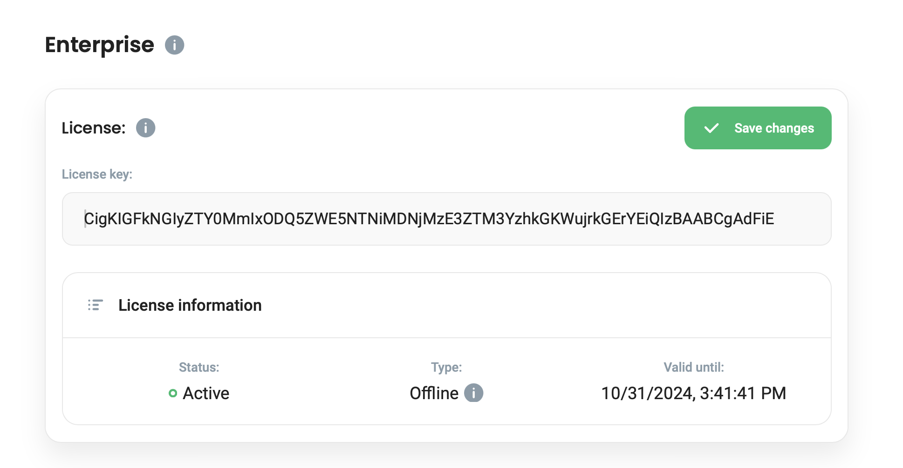

# License


1.0 with enterprise features is in **alpha** and **for now you can't buy online any of licences.**

Please contact us at: sales \[ at ] defguard.net for a **testing enterprise license**.


Defguard Enterprise offers a lot of functionalities that are not offered in the Open Source Open Core, like external OpenID Connect support, automatic\&real time desktop client synchronization and configuration, and much more (go to [All Enterprise Features](all-enteprise-features.md) to see more). In order to activate those features an Enterprise License must be obtained.&#x20;

We offert two types of licences:

1. **Monthly subscription** that can be bought on [https://defguard.net/pricing/](https://defguard.net/pricing/)
2. **Offline with a defined custom period.**

### Monthly subscription

You can buy a monthly subscription on our website: [https://defguard.net/pricing/](https://defguard.net/pricing/).

After purchasing:

1. The license will be emailed to you on the email defined in the purchase form.
2. Each month (on the date the license expires) **defguard core will contact our licensing server** and if the monthy payment was successful, our licensing server will **automatically issue a new license and the enteprise plan will be extended to new date.**


If your setup / firewall / network policy **doesn't allow that defguard will contact our licensing server, please contact us for the** [**Offline license**](license.md#offline-license)**.**


### Offline license

Defguard is build with the highest security architecture in mind, thus there may be scenarios where you don't want any of the components to contact external services (eg. defguard core will have no access to Internet).

Offline license can be also issued for any period of time, so another scenario is that you can buy the enterprise license for any duration you wish.

To obtain an offline Enterprise License please contact our sales at: **sales \[ a t ] defguard.net** and provide:

* the period for which you would like to obtain the license
* your company data and contact email address (for billing and license sharing)
* prefered payment method: bank wire transfer or card payment link

### Configuring defguard with obtained license

To configure defguard with the received license, please go to **Settings** -> enter the license in the Enterprise License configuration window -> Click Save.

The license will be vaildated and detailed information about the license will be diplayed (validity period and the license type):

<figure><figcaption>
defguard enterprise license settings
</figcaption></figure>

