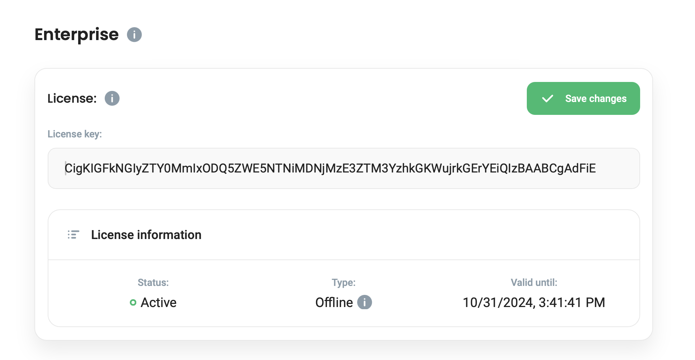

# License

Defguard Enterprise offers a lot of functionalities that are not offered in the Open Source Open Core, like external OpenID Connect/SSO support, automatic\&real time desktop client synchronization and configuration, and much more (go to [All Enterprise Features](broken-reference) to see more).

### Enterprise is free up to certain limits


From release 1.1.0 **all enterprise features up to the following limits are free and no license is required:**

* 5 active users
* 10 devices
* 1 location


Those limits should be more then enough for small businesses, home-labs or just to test out Enterprise features before committing.


At the moment your instance exceeds any of the limits, you will receive a relevant notification in the interface. Defguard will remain fully operational, and all Open Source functionalities will be available. Only the enterprise functionalities will be disabled until you activate the license.


### Purchasing the license

If you would like to purchase a license, we offer two types of licenses:

1. **Subscription** that can be bought on [https://defguard.net/pricing/](https://defguard.net/pricing/)
2. **Offline (which will not contact our license server) with a defined custom period** can be bought directly, please contact: sales @ defguard.net

#### Subscription

You can buy a monthly (soon yearly) subscription on our website: [https://defguard.net/pricing/](https://defguard.net/pricing/).

After purchasing:

1. The license will be emailed to you on the email defined in the purchase form. Also there will be a second email with the invoice.
2. Each month (on the date the license expires) **defguard core will contact our licensing server** and if the monthly payment was successful, our licensing server will **automatically issue a new license and the enterprise plan will be extended to new date.**


If your setup / firewall / network policy **doesn't allow that defguard will contact our licensing server, please contact us for the** [**Offline license**](license.md#offline-license)**.**


#### Offline license

Defguard is build with the highest security architecture in mind, thus there may be scenarios where you don't want any of the components to contact external services (eg. defguard core will have no access to Internet).

Offline license can be also issued for any period of time, so another scenario is that you can buy the enterprise license for any duration you wish.

To obtain an offline Enterprise License please contact our sales at: **sales \[ a t ] defguard.net** and provide:

* the period for which you would like to obtain the license
* your company data and contact email address (for billing and license sharing)
* preferred payment method: bank wire transfer or card payment link

### Configuring defguard with obtained license

To configure defguard with the received license, please go to **Settings** -> enter the license in the Enterprise License configuration window -> Click Save.

The license will be validated and detailed information about the license will be diplayed (validity period and the license type):

<figure><figcaption>
defguard enterprise license settings
</figcaption></figure>

