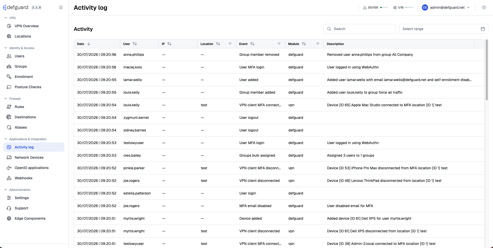
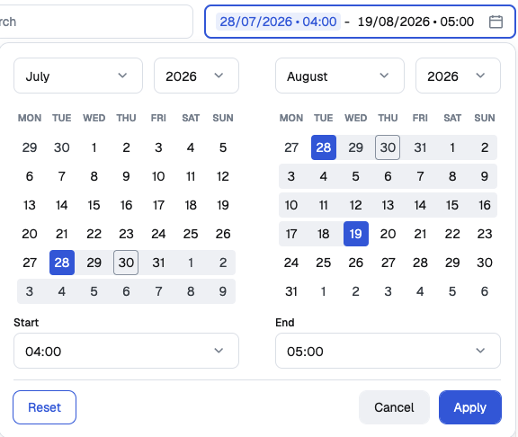

# Activity & Audit logs

The Activity Log provides a comprehensive view of user interactions within your Defguard instance. This allows you to monitor user behaviour, troubleshoot issues, and maintain an audit trail of important activities.

## Viewing Activity log events

Activity log is available as a dedicated page in Defguard core Web UI that's used to manage your instance.

To access it, click the `Activity log` button in the navbar.

<figure><figcaption></figcaption></figure>

### Overview

Activity log page displays a chronological list of user-initiated events. By default, most recent events are on top.

Each entry in the list contains following fields:

* **Date** - timestamp of when an event has occurred
* **User** - which user triggered the event
* **IP** - location from which the action was performed
* **Event** - brief description of the event
* **Module** - which module given event belongs to
* **Device** - device (or more specifically user agent) from which the action was performed

### Modules

Events are grouped into modules based on the part of the system they are related to.

Currently, there are following modules:

* **defguard** - operations performed in the core Web UI (e.g. adding users, modifying devices, managing groups etc.)
* **client** - actions performed by desktop client applications
* **enrollment** - events related to the [user enrollment](../../using-defguard-for-end-users/enrollment/) process
* **vpn -** events related to VPN clients (e.g. client connecting to a location)
* **posture** - managing [device posture checks](../device-posture-verification.md) and the result of every evaluation
* **active\_directory** and **ldap** - [LDAP and Active Directory](../ldap-and-active-directory-integration/) synchronization, in both directions
* **oidc\_directory\_sync** - [directory synchronization](../external-openid-providers/#directory-synchronization) with an external OpenID provider

LDAP synchronization events land in **active\_directory** or **ldap** depending on the `LDAP server is Active Directory` setting.

### Search

You can also use the `Search` input above the list to look for specific events.

You can search by:

* **Username**
* **Module**
* **Event**
* **Device**

The search is case-insensitive and will match partial text.

Note that filtering & searching are composable operations, so if you've already applied some filters the search will be performed only among those filtered events.

### Filtering by date

The `Select range` control next to the `Search` input limits the list to a period of time. Set **Start** and **End**, then click **Apply**; **Reset** clears the range.

<figure></figure>

Both ends of the range are inclusive. Timestamps are compared in UTC.

## Permissions

Access to the Activity log is controlled by user permissions.

Each user can always view their own activities (events triggered by themselves).

Additionally administrators can view events related to all users.

## Events tracked in Activity Log

At the moment following events are tracked in the Activity log:

* **defguard** module
  * UserLogin
  * UserLoginFailed
  * UserLogout
  * UserMfaLogin
  * UserMfaLoginFailed
  * RecoveryCodeUsed
  * PasswordChangedByAdmin
  * PasswordChanged
  * PasswordReset
  * MfaDisabled
  * UserMfaDisabled
  * MfaTotpDisabled
  * MfaTotpEnabled
  * MfaEmailDisabled
  * MfaEmailEnabled
  * MfaSecurityKeyAdded
  * MfaSecurityKeyRemoved
  * UserAdded
  * UserImportBlocked
  * UserRemoved
  * UserModified
  * UserGroupsModified
  * UserEnabled
  * UserDisabled
  * DeviceAdded
  * DeviceRemoved
  * DeviceModified
  * NetworkDeviceAdded
  * NetworkDeviceRemoved
  * NetworkDeviceModified
  * ActivityLogStreamCreated
  * ActivityLogStreamModified
  * ActivityLogStreamRemoved
  * VpnLocationAdded
  * VpnLocationRemoved
  * VpnLocationModified
  * ApiTokenAdded
  * ApiTokenRemoved
  * ApiTokenRenamed
  * OpenIdAppAdded
  * OpenIdAppRemoved
  * OpenIdAppModified
  * OpenIdAppStateChanged
  * OpenIdProviderModified
  * OpenIdProviderRemoved
  * SettingsUpdated
  * SettingsUpdatedPartial
  * SettingsDefaultBrandingRestored
  * EnterpriseSettingsUpdated
  * GroupsBulkAssigned
  * GroupAdded
  * GroupModified
  * GroupRemoved
  * GroupMemberAdded
  * GroupMemberRemoved
  * GroupMembersModified
  * WebHookAdded
  * WebHookModified
  * WebHookRemoved
  * WebHookStateChanged
  * AuthenticationKeyAdded
  * AuthenticationKeyRemoved
  * AuthenticationKeyRenamed
  * ClientConfigurationTokenAdded
  * EnrollmentTokenAdded
  * UserSnatBindingAdded
  * UserSnatBindingRemoved
  * UserSnatBindingModified
  * GatewayModified
  * GatewayDeleted
  * GatewayConnected
  * GatewayDisconnected
  * ProxyModified
  * ProxyDeleted
  * ProxyConnected
  * ProxyDisconnected
* **enrollment** module
  * EnrollmentStarted
  * EnrollmentDeviceAdded
  * EnrollmentCompleted
  * PasswordResetRequested
  * PasswordResetStarted
  * PasswordResetCompleted
* **vpn** module
  * VpnClientConnected
  * VpnClientDisconnected
  * VpnClientMfaConnected
  * VpnClientMfaDisconnected
  * VpnClientMfaSuccess
  * VpnClientMfaFailed
  * VpnClientSessionSuperseded
  * VpnClientMfaSessionSuperseded
* **posture** module
  * DevicePostureCreated
  * DevicePostureUpdated
  * DevicePostureDeleted
  * DevicePostureDuplicated
  * DevicePostureLocationsAssigned
  * LocationPosturesAssigned
  * DevicePostureCheckPassed
  * DevicePostureCheckFailed
* **active\_directory** and **ldap** modules
  * LdapSyncUserCreated
  * LdapSyncUserDeleted
  * LdapSyncUserModified
  * LdapSyncUserEnabled
  * LdapSyncUserDisabled
  * LdapSyncGroupCreated
  * LdapSyncGroupMemberAdded
  * LdapSyncGroupMemberRemoved
  * LdapSyncOutboundUserCreated
  * LdapSyncOutboundUserDeleted
  * LdapSyncOutboundUserModified
  * LdapSyncOutboundUserEnabled
  * LdapSyncOutboundUserDisabled
  * LdapSyncOutboundGroupMemberAdded
  * LdapSyncOutboundGroupMemberRemoved
* **oidc\_directory\_sync** module
  * OidcDirectorySyncUserCreated
  * OidcDirectorySyncUserDeleted
  * OidcDirectorySyncUserEnabled
  * OidcDirectorySyncUserDisabled
  * OidcDirectorySyncGroupCreated
  * OidcDirectorySyncGroupMemberAdded
  * OidcDirectorySyncGroupMemberRemoved

## Streaming to external SIEM systems

Please note, that enterprise version supports streaming of audit logs to external SIEM systems. More on this topic in[activity-log-streaming](activity-log-streaming/ "mention").
