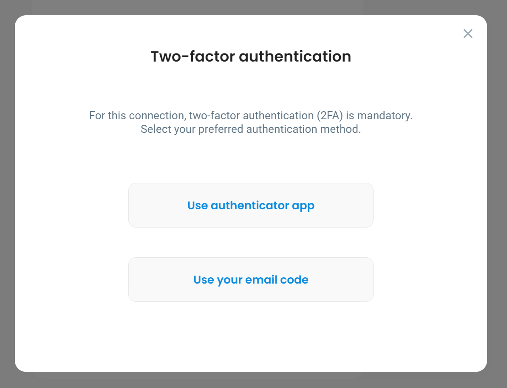

# Multi-factor authentication

DefGuard supports Multi-factor authentication (MFA). It can be enabled for a desired VPN by going to **VPN Overview**, selecting the VPN from the dropdown list and pressing the **Edit Location** button in the top right corner of the page. Next, check the "**Require MFA for this Location**" checkbox under Location Configuration section and **save changes**.

<figure><figcaption>
Checkbox enabling MFA for selected VPN/Location
</figcaption></figure>


When MFA configuration is changed, all clients must do an [Instance Update](update-instance.md).


If a VPN has MFA enabled attempting to connect to it will ask the user to complete the authentication step first:

&#x20;

### Supported MFA methods

For now MFA is only available for:

* TOTP - Time-based one-time password
* Email - requires [SMTP to be configured](../../help/setting-up-smtp-for-email-notifications.md)

### User MFA setup

After enabling MFA for a given VPN, users will need to enable MFA for their accounts to be able to connect. This process is described in [setting-up-2fa-mfa.md](../../help/setting-up-2fa-mfa.md "mention").

If users attempt to select a MFA method that has not been enabled for their accounts, an error message will be shown.

<figure><figcaption>
Attempting to use an MFA method that has not been enabled on the user's account.
</figcaption></figure>

### Successful authentication

If authentication succeeds, the Two-factor authentication modal will be closed and connection to the selected VPN will be attempted. Users will be asked to authenticate on every connection to a VPN with MFA enabled.
