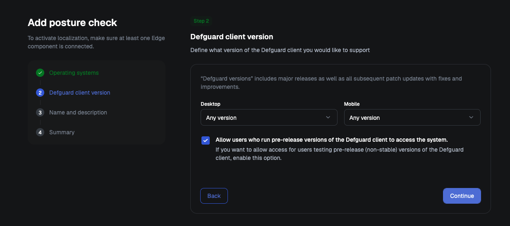
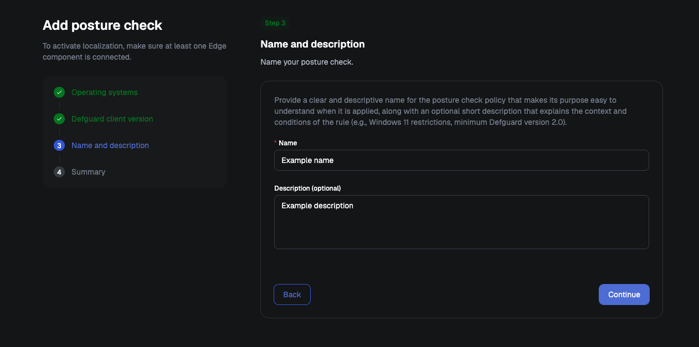
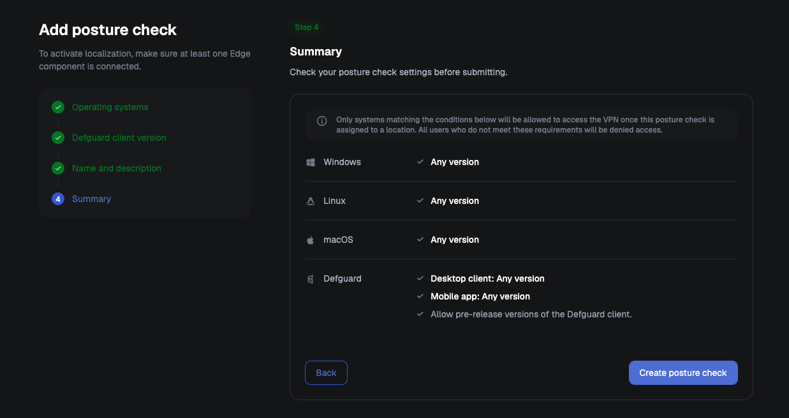
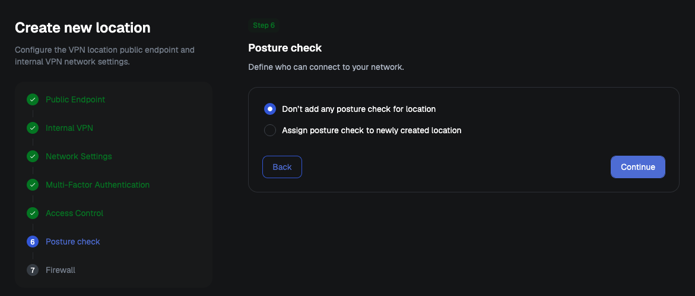

# Device posture verification


**Availability**

This feature requires an Enterprise plan. See the [pricing page](https://defguard.net/pricing/) for details.



**Posture verification requires Defguard Core 2.1 and a client that supports it:**

* **Desktop Client 2.1.0 or newer** on Windows, macOS and Linux
* **Mobile client 1.7.0 or newer** on iOS and Android

Older clients do not receive the configuration for locations with posture checks assigned, so such a location does not appear in them. See [Desktop Client](../using-defguard-for-end-users/desktop-client/) for what changed in 2.1.



The disk encryption posture check requires the macOS client to be installed from a PKG package. It is unavailable in the App Store build. [See why](device-posture-verification.md#disk-encryption-posture-availability-on-macos).


Posture checks let you verify the security state of a user’s device before allowing it to connect to a location. Instead of trusting only the user’s identity, Defguard can also evaluate device requirements such as:

* Defguard client version
* Windows version
* Windows security update age
* Windows Active Directory membership
* Windows antivirus status
* Windows disk encryption status
* macOS version
* macOS disk encryption status (stand-alone package only)
* macOS device integrity status
* Linux kernel version
* Linux disk encryption status
* iOS version
* Android version
* Android security patch level age

If a posture check fails, the user is shown a list of the unmet requirements:

<figure><figcaption></figcaption></figure>

## Configuring posture checks

You can view, edit, create, and assign posture checks to locations in **Identity & Access → Posture Checks**:

<figure><figcaption></figcaption></figure>

The section displays a table of all posture checks defined in the system. Clicking a posture name displays a handy drawer with posture details:

<figure><figcaption></figcaption></figure>

### Creating a new posture check

To create a new posture check, click the "Add new posture check" button above the posture checks table.

#### Step 1: Operating systems

Click a system to add it to the check. Each system gets its own card, where you set the minimum accepted version and the **Security conditions** available on that platform.

On Windows and Android you can additionally require the last security update to be no older than 30, 60, 90 or 180 days.


If you do not configure requirements for a specific operating system, devices running that operating system will not be allowed to connect to locations protected by this posture check.

For example, if a posture check only defines Windows and macOS requirements, Linux, iOS, and Android devices will fail the check by default. This ensures that access is granted only to platforms that were explicitly included in the posture policy.


<figure><figcaption></figcaption></figure>

#### Step 2: Defguard client version

Set the minimum accepted client version, separately for **Desktop** and **Mobile**.

Enable **Allow users who run pre-release versions of the Defguard client to access the system** if you have users on non-stable builds.

<figure><figcaption></figcaption></figure>

#### Step 3: Name and description

Give the check a name and, optionally, a description.

<figure><figcaption></figcaption></figure>

#### Step 4: Summary

Review the conditions the check will enforce, then click **Create posture check**.


Before the check is created, Defguard asks you to confirm that at least one System Administrator will still meet all the required conditions. If none does, admin access through the protected location can be lost.


<figure><figcaption></figcaption></figure>

Once the check is saved, [assign it to one or more locations](device-posture-verification.md#assigning-posture-check-to-locations). A check that is not assigned to any location does nothing.

### Editing an existing posture check

To edit one of the existing posture checks, select the "Edit" menu item from the action menu in the posture checks table:

<figure><figcaption></figcaption></figure>

<figure><figcaption></figcaption></figure>

### Assigning posture check to locations

Posture checks can be assigned to locations in 5 ways:

* "Assign to locations" action from the actions menu in the postures table
* "Assign to locations" action from the "Actions" menu in the posture details drawer
* "Posture Checks" section in the Location edit form
* "Posture check" step of the wizard used when creating a new location

<figure><figcaption></figcaption></figure>

Once a posture check is assigned to a location, every client attempting to connect to that location is verified before access is granted. If multiple posture checks are assigned, the client must satisfy all requirements from all assigned posture checks. The connection is allowed only when every required check passes; if any requirement fails, the client is denied access.

A location cannot have posture checks and be a [service location](service-locations.md) at the same time.

<figure><figcaption></figcaption></figure>

### Duplicating a posture check

If you want to create a posture check that is similar to an existing one, you can duplicate the existing posture check instead of starting from scratch. This copies its configuration and lets you adjust only the parts that need to be different, saving time and reducing the risk of mistakes.

To duplicate a posture check, use the “Duplicate” action from the posture checks table or from the action menu in the posture check details drawer.

<figure><figcaption></figcaption></figure>

The posture check is duplicated and saved immediately, then opened in the edit form. You can modify any settings that should differ from the original and assign the duplicated posture check to the appropriate locations. Duplicated posture checks are not assigned to any locations by default.

### How checks are evaluated

Operating system and kernel versions are compared by major version only. A requirement that cannot be evaluated counts as failed. Failed checks are recorded in the [activity log](activity-log/).

### Disk encryption posture availability on macOS

Defguard Desktop Client for macOS can be installed from the official App Store or using PKG packages published in the release assets. The disk encryption posture check is only available in the PKG build.

Mac App Store apps must run inside Apple's App Sandbox, which isolates them from the rest of the system. Checking whether FileVault is enabled means reading system-level state that sits outside the sandbox, and Apple provides no permission that lets a sandboxed app do this. The App Store build therefore has no way to obtain the signal at all and **will report disk encryption as disabled**.

The PKG installer is not subject to those restrictions. If your deployment relies on the disk encryption posture check, distribute the PKG build to macOS clients rather than the App Store version.

