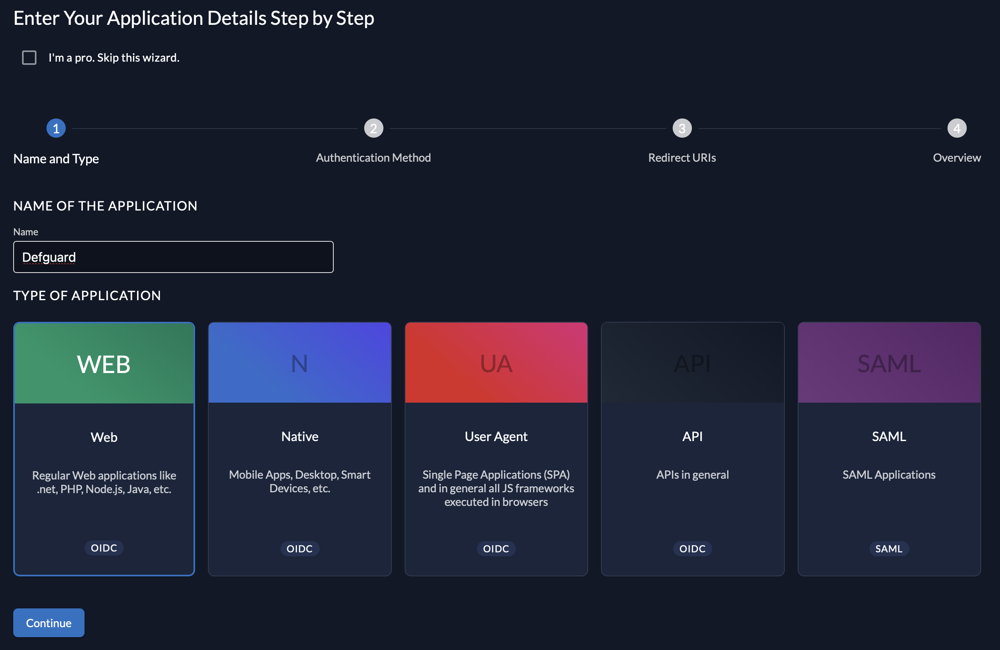
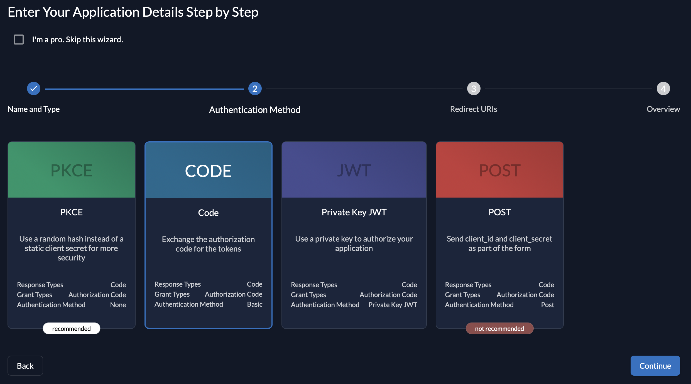
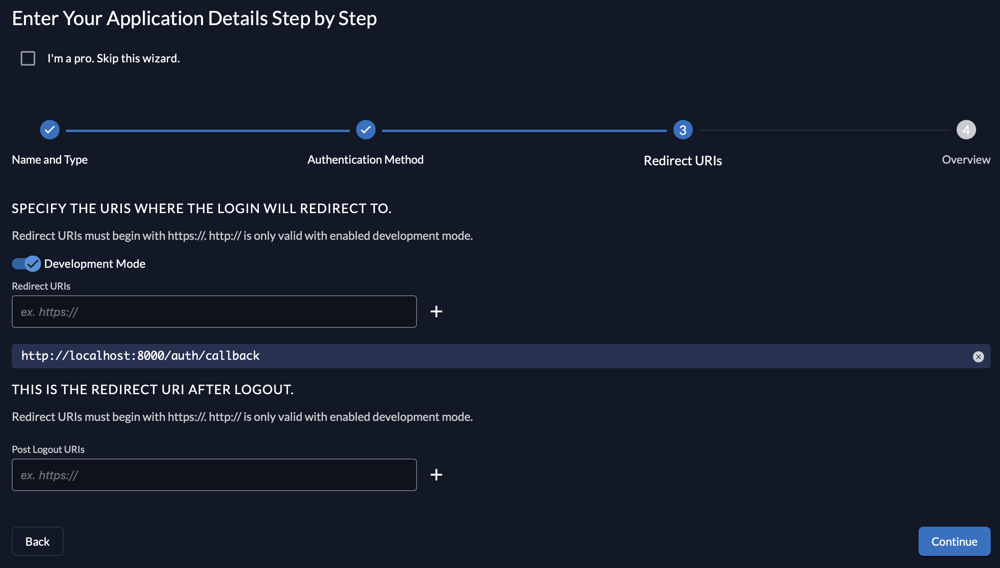
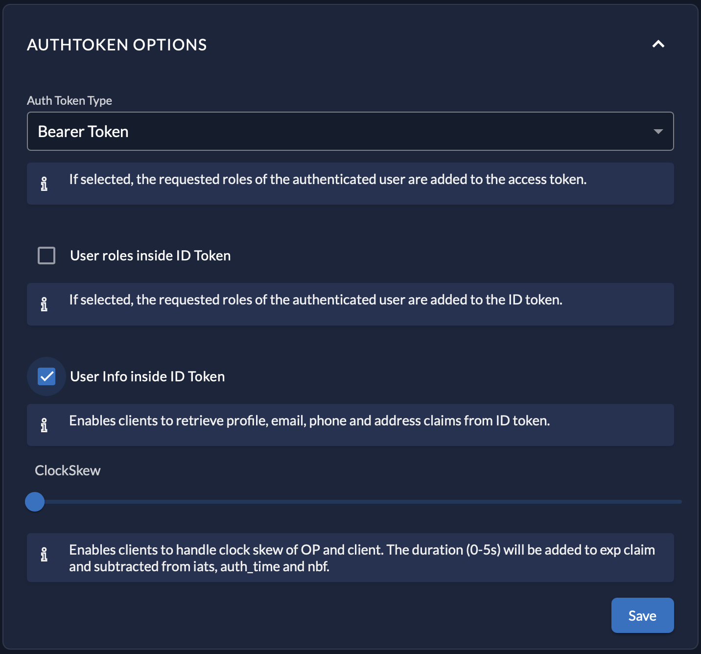

---
metaLinks:
  alternates:
    - >-
      https://app.gitbook.com/s/e86iamwJVSYnIRsyVEAV/features/external-openid-providers/zitadel
---

# Zitadel


Refer to [Zitadel's documentation](https://zitadel.com/docs) on how to install it.


1. Log in to Zitadel's web interface.
2. Create a project.
3. Add a new application within the project.
4.  Select **Web** for application type.

    <figure><figcaption></figcaption></figure>
5.  Choose **Code** for authorization method.

    <figure><figcaption></figcaption></figure>
6.  Enter a redirect URI for your Defguard instance. The URI is in the form `<DEFGUARD_URL>/auth/callback`, for example `https://defguard.example.com/auth/callback`. (If Defguard has been launched on the _localhost_, select **Development Mode** and enter `http://localhost:8000/auth/callback`). If you'd like to use OpenID enrollment through Edge, make sure to enter an additional URI here in the form of `<DEFGUARD_PUBLIC_URL>/openid/callback`.

    <figure><figcaption></figcaption></figure>
7. **Create** the application.
8. Copy the provided **Client ID** and **Client Secret** and enter these in the Defguard's OpenID settings.
9.  Finally, in the **Token Settings**, enable **User Info inside ID Token**.

    <figure><figcaption></figcaption></figure>
