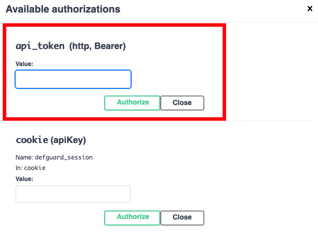
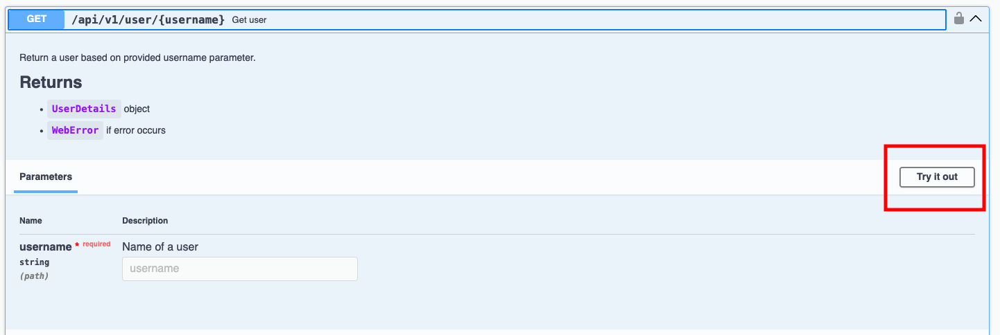
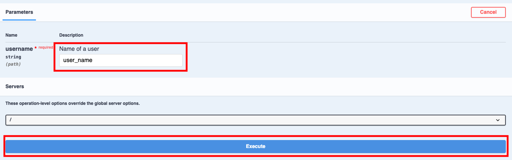
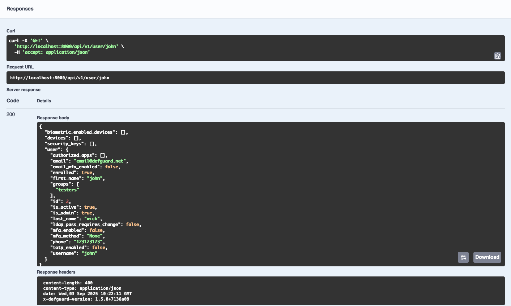
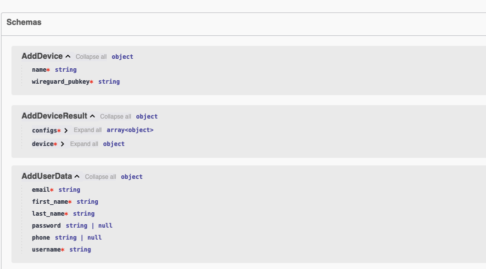

---
metaLinks:
  alternates:
    - >-
      https://app.gitbook.com/s/e86iamwJVSYnIRsyVEAV/features/integrations/api-tokens
---

# REST API


**Availability**

This feature is available in Business and Enterprise plans. See the [pricing page](https://defguard.net/pricing/) for details.


## REST API documentation

You can explore the Defguard REST API using [Swagger UI](https://swagger.io/tools/swagger-ui/) by going to `<YOUR_DEFGUARD_URL>/api-docs` or [core](../../for-developers/rest-api/core/ "mention") page.

API specification JSON in OpenAPI format can also be fetched from `<YOUR_DEFGUARD_URL>/api/v1/api-docs`.

Admin users can generate API tokens to enable request authentication for custom external tools which use Defguard REST API.

Tokens retain the same access permissions as their owner, so be careful when sharing them with others.

## Generating API token

Navigate to an user profile and open **API Tokens** tab, then click **Add new API token**.

<figure><figcaption></figcaption></figure>

Fill in your chosen token name and submit form:

<figure><figcaption></figcaption></figure>

Copy generated token. This is the only time the token will be available in plain text form. If you lose it you will have to generate a new one.

<figure><figcaption></figcaption></figure>

In the API token list you can later rename or delete a token:

<figure><figcaption></figcaption></figure>

## Usage

Defguard API uses a standard **Bearer token authentication** scheme.

This means that an API token can be passed in the `Authorization` header to authenticate a given request instead of a session cookie used by the web UI:

```sh
Authorization: Bearer <token>
```

Example GET request:

```sh
curl -H "Authorization: Bearer <token>" <YOUR_DEFGUARD_URL>/api/v1/me
```

## Swagger UI

### Using API token in Swagger

After opening Swagger UI you can add your `API token` and try out available endpoints.

1. Open Swagger UI and click **Authorize** button.

<figure><figcaption></figcaption></figure>

2. Paste your `API token.`

<figure><figcaption></figcaption></figure>

3. Click on endpoint and select **Try it out** option.

<figure><figcaption></figcaption></figure>

4. If endpoint requires a path or request body, enter it.

<figure><figcaption></figcaption></figure>

5. Click **Execute** and scroll down, you will see response body.

<figure><figcaption></figcaption></figure>

### Schemas

If you are looking for definitions of types, you can scroll down to **Schemas** section.

<figure><figcaption></figcaption></figure>
