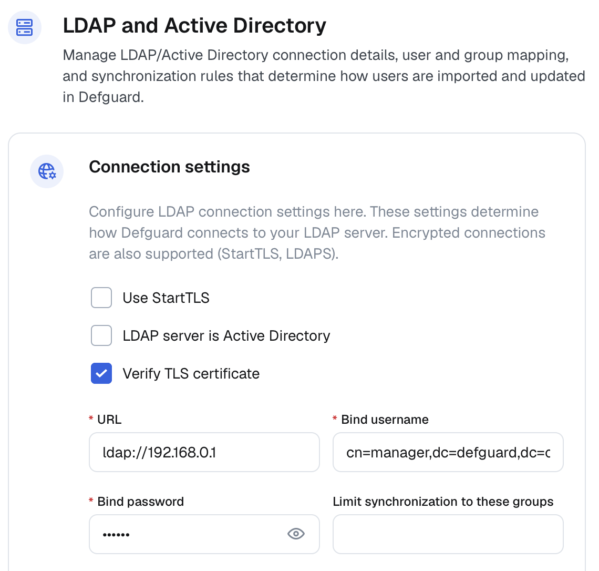
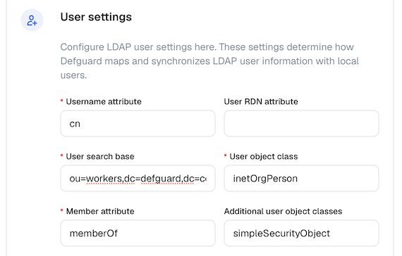
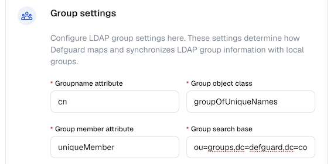
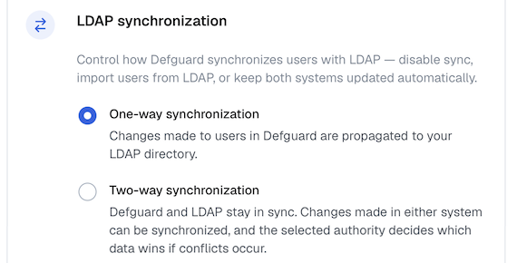
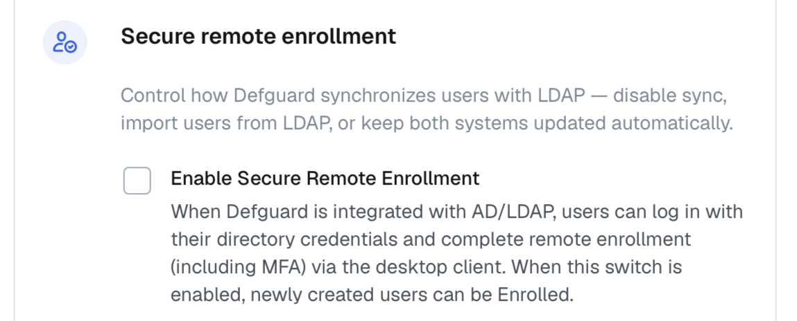

# LDAP Configuration

This page explains how to connect Defguard to your LDAP server or Active Directory instance and prepare the integration for authentication and synchronization.

The LDAP and Active Directory settings in Defguard control how the application:

* connects to your directory server,
* authenticates with a bind account,
* finds users and groups in the directory tree,
* maps directory attributes to Defguard users and groups,
* handles one-way or two-way synchronization,
* optionally enables secure remote enrollment for synchronized users.

Before you begin, make sure you know your server URL, bind credentials, user and group search bases, username attribute, and whether your environment requires `ldaps` or StartTLS. If you are configuring Active Directory and expect Defguard to create users or set passwords, verify that encrypted LDAP communication is available.


If you are using the integration across multiple nested organizational units, please read the [Multiple Nested OUs](configuration.md#multiple-nested-ous) section.


See also [example configurations](examples.md) for examples how to configure connection to OpenLDAP or Active Directory.

## Setup

In the Defguard Core user interface, navigate to **Settings → External identity providers → LDAP and Active Directory**.

It is best to start with a basic working connection first. Once Defguard can connect to the directory and authenticate successfully, you can refine the attribute mapping, synchronization scope, and authority settings.

### Connection settings

This section defines how Defguard connects to your LDAP server and authenticates against it.

<figure><figcaption></figcaption></figure>

* **Use StartTLS**: Enable this option for an encrypted connection to LDAP. StartTLS is an LDAP extended operation that begins with an unencrypted TCP connection on port 389, then sends a StartTLS request to initiate a TLS handshake without changing ports.
* **LDAP server is Active Directory**: Enable this option for an Active Directory server. Active Directory (AD) is Microsoft’s directory service for managing users, computers, and resources in Windows networks. See [#example-active-directory-configuration](examples.md#example-active-directory-configuration "mention") for a working example.
* **Verify TLS certificate**: Enable this option to validate the TLS certificate. For custom self-signed certificates, it may be reasonable to leave this option disabled.
* **URL**: The LDAP server's URL. Use the `ldap:` schema for unencrypted connections or connections with StartTLS (this defaults to TCP port 389), or the `ldaps:` schema for SSL-encrypted connections (this defaults to TCP port 636).
* **Bind username** and **Bind password**: These refer to the credentials used in an LDAP "bind" operation to authenticate a client to the directory server. The username field should contain a Distinguished Name (DN) for a service account that is able to manage LDAP entries.
* **Limit synchronization to these groups**: specifies the groups of which members should be synchronized.

Make sure the bind account has enough permissions to read the directory entries required for lookup and synchronization. If you plan to write changes from Defguard back to LDAP, it also needs permission to create, update, and manage the relevant user and group entries.

### User settings

<figure><figcaption></figcaption></figure>

This section configures how Defguard finds users in LDAP and maps LDAP attributes to Defguard user records.

* **Username attribute**: The attribute used as the username in the LDAP user schema. This is used to link Defguard users with LDAP users. The attribute must be unique across all users. Typically `cn` or `uid`.
* **User RDN attribute**: The attribute used in the Distinguished Name (DN) of LDAP users. Depending on the setup, it may differ from the attribute used for usernames. If left empty, your username attribute is used instead. For example:\
  Given a user DN of `cn=user1,cn=users,dc=ad,dc=example,dc=com`, you would set the RDN attribute to `cn`.
* **User search base**: This attribute specifies where to begin looking for users in the LDAP directory tree. It defines the starting point, as a Distinguished Name (DN), for directory queries.
* **User object class**: The object class for users in the LDAP directory. It defines the type and structure of directory entries, specifying mandatory and optional attributes for that object.
* **Member attribute**: The attribute in the user object that lists the distinguished names (DNs) of groups that a user belongs to. Usually `memberOf`.
* **Additional user object classes**: A list of LDAP object classes that should be added to a user object.

These values should match your existing directory schema. Incorrect attribute names, object classes, or search bases are some of the most common reasons why authentication works but user lookup or synchronization does not.

### Group settings

<figure><figcaption></figcaption></figure>

* **Groupname attribute**: The attribute used as the group name in the LDAP group schema. This is used to link Defguard groups with LDAP groups. The attribute must be unique across all groups. Usually `cn`.
* **Group object class**: The object class for groups in the LDAP directory. It defines the type and structure of directory entries, specifying mandatory and optional attributes for that object. Usually `groupOfNames` or `groupOfUniqueNames`.
* **Group member attribute**: The group object attribute that lists all members of a group. Usually `member` for a group of class `groupOfNames`, or `uniqueMember` for a group of class `groupOfUniqueNames`.
* **Group search base**: This attribute specifies where to begin looking for groups in the LDAP directory tree. It defines the starting point, as a Distinguished Name (DN), for directory queries.

If you want to synchronize groups or limit synchronization scope to selected groups, review these settings carefully. They determine how Defguard resolves memberships and how it links Defguard groups to directory groups.

### LDAP synchronization

This section controls how Defguard synchronizes users with LDAP.

<figure><figcaption></figcaption></figure>

* **One-way synchronization**: Enabling this option means that changes made to users in Defguard are propagated to LDAP, but not the other way around.
* **Two-way synchronization**: Enabling this option means that changes made in either Defguard or LDAP are synchronized in both directions. In the case of conflicting changes, the selected authority decides which data wins.

If you plan to enable two-way synchronization, make sure you understand which system should act as the source of truth and which users should be included in scope before enabling it in production. Those decisions affect how user records are created, updated, and removed during synchronization.

### Secure remote enrollment

<figure><figcaption></figcaption></figure>

* **Enable Secure Remote Enrollment**: When this option is enabled, newly created users can be enrolled. If enabled, an additional option shows up:
* **Automatically invite new AD/LDAP users to enroll**: Enable this option to let Defguard automatically send an enrollment email to users synchronized from LDAP. This option is available only if **Enable Secure Remote Enrollment** is enabled.

This option is useful when newly synchronized users should be able to complete onboarding without manual account preparation. It can simplify rollout in environments where accounts are created in LDAP or Active Directory first and then activated in Defguard.


You can find more brief explanations for these settings on this [page](settings-table.md).


After saving the LDAP settings, you can check whether your Defguard instance can connect to and authenticate with your LDAP server using the "Test connection" button.


Testing your connection does not mean the entire configuration is correct. Currently, Defguard only verifies whether a connection can be made and the provided bind credentials are correct.


After enabling the LDAP integration, users will be able to log in to Defguard through LDAP. Additionally, user changes made in Defguard after you enable the integration are propagated to LDAP. This is a simple one-way synchronization. If you are interested in synchronizing LDAP and Defguard in both directions, see [Two-way LDAP and Active Directory synchronization](two-way-ldap-and-active-directory-synchronization.md).

## Known issues

### Multiple nested OUs

If you are using an older version of Defguard, using the integration with multiple nested organizational units may lead to unexpected behaviour. The following issues are known to occur:

* If you have duplicate user RDNs across multiple OUs, a database error may occur: `Duplicate key violates unique constraint 'unique_ldap_rdn'`, causing issues with two-way synchronization. This would happen in the following scenario:
  * `CN=user1,OU=ou1,OU=ou,DC=example`
  * `CN=user1,OU=ou2,OU=ou,DC=example`
*   Limiting synchronization to selected groups may not work if your user's DN does not match the user search base:

    * Search base: `OU=ou,DC=example`
    * User's DN: `CN=user1,OU=ou1,OU=ou,DC=example`

    In this example, the user's DN has deeper nesting than the search base, preventing it from being matched during the group member lookup.

To fix this problem, you should limit the search base to one organizational unit only, if possible.

#### Re-triggering enrollment process 

If you'd like to retrigger the enrollment process for users that were already enrolled (e.g. by using the [#secure-remote-enrollment](configuration.md#secure-remote-enrollment "mention") option), you can currently achieve this by using the following workaround:

1. You will need to access the database. This can be achieved in several ways:
   1. If your Defguard database is running in a Docker container, for example if you deployed from the one line script, you can use the PSQL client inside the database container:
      1. Execute `sudo docker container ls` to see what containers are running
      2. Copy the container ID or name of the Defguard database container.
      3. Do `sudo docker exec -it <CONTAINER_ID_OR_NAME> psql -U defguard` to gain access to the database
   2. If your database is not running inside a Docker container but as standalone process, you will need to use the PSQL tool directly. If you are on the same server as a database the correct PSQL CLI should already be installed. Otherwise, you will need to install the appropriate version (matching the PostgreSQL version of your Defguard database) of the tool, for example by doing `sudo apt install postgresql-client-17` (for systems using APT) if your PostgreSQL version is 17. After installing the client:
      1. Run `psql -h <DATABASE_HOST> -p <DATABASE_PORT> -d defguard -U defguard`
      2. You will be prompted for a password. The database password can be found in your Defguard Core environment variables (for example, in it's `.env` file, or `/etc/defguard/core.conf` if you installed from DEB/RPM packages).
2. After you gain access to the database and are in the PSQL prompt, you can execute the following to force given LDAP user to go through the enrollment process: `update "user" set enrollment_pending = true where username = '<USERNAME>';` You can also match the user by their `email`, if you prefer. And if you want to do this for **all** LDAP users: `update "user" set enrollment_pending = true where from_ldap = true;`
3. Performing those commands will cause the user to be forced to go through the enrollment process when they try to configure a new device in the Desktop client. This method comes with some caveats:
   1. The enrollment token must be sent manually by the admin, if the user doesn't have access to the Defguard dashboard and can't add a new device.
   2. If your users already have their devices configured they will need to remove the instance from the Desktop Client and [go through the process of enrollment again](../../using-defguard-for-end-users/desktop-client/instance-configuration.md).
   3. During the enrollment process the user will be forced to enter a new password.
