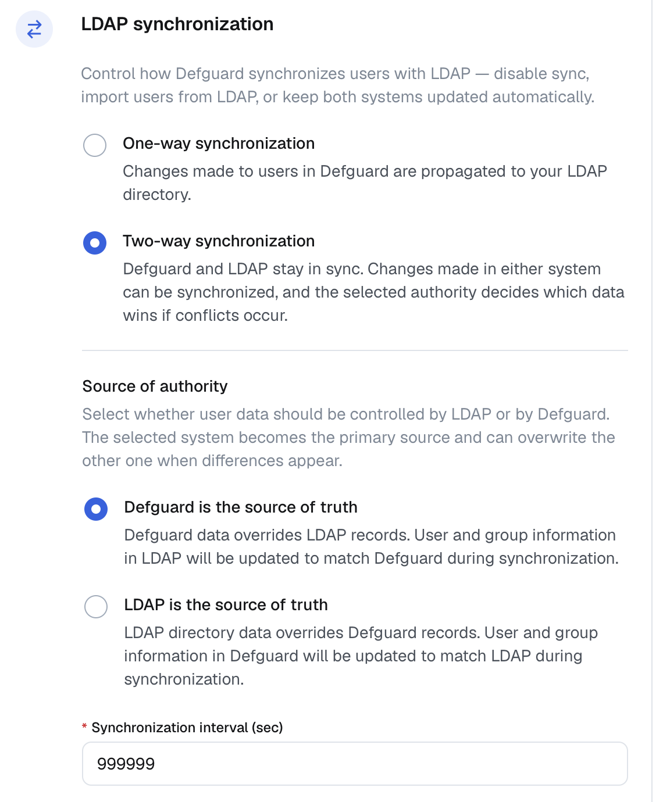

---
metaLinks:
  alternates:
    - >-
      https://app.gitbook.com/s/e86iamwJVSYnIRsyVEAV/features/ldap-and-active-directory-integration/two-way-ldap-and-active-directory-synchronization
---

# Two-way LDAP and Active Directory synchronization


**Availability**

This feature is available in all plans, with usage limits. See the [pricing page](https://defguard.net/pricing/) for details.



This feature is available since Defguard version 1.3.0.



Make sure to be aware of the mechanisms described in [Authority and full synchronization](two-way-ldap-and-active-directory-synchronization.md#authority-and-full-synchronization) and [First synchronization](two-way-ldap-and-active-directory-synchronization.md#first-synchronization) before enabling this feature.

We recommend testing the integration first in a non-production environment, as improper configuration may cause loss of user data.


LDAP synchronization allows you to synchronize users and groups between Defguard and your LDAP server.

This feature has been mainly tested with OpenLDAP and Active Directory.

## Requirements

* An LDAP server
* One of the following user object classes set for your LDAP users: `user`, `inetOrgPerson`
* The following attributes must be set for users you want to synchronize: username attribute (e.g. `sAMAccountName` or `cn`), `sn`, `givenName`, and `mail` - these are required by Defguard
* The username attribute must conform to the restrictions specified in the [Settings table](settings-table.md)

For Active Directory:

* A 128-bit encrypted TLS/SSL connection to the AD server. You can read more about it in the [official guide](https://learn.microsoft.com/en-us/troubleshoot/windows-server/active-directory/enable-ldap-over-ssl-3rd-certification-authority) or these step-by-step [instructions](https://gist.github.com/magnetikonline/0ccdabfec58eb1929c997d22e7341e45).

For OpenLDAP:

* SHA1 as the hashing algorithm and the `simpleSecurityObject` user object class

## Setup

First, you will need to configure your LDAP connection. Refer to [Configuration](configuration.md) for instructions. See [example configuration](examples.md) for how to configure an OpenLDAP server without SSL/TLS.

Make sure you have selected "Enable LDAP integration", as the two-way synchronization will not work without it. After you fill out all the fields, test your configuration using the "Test LDAP connection" button.

To enable two-way synchronization, in **Settings → External identity providers → LDAP and Active Directory → LDAP synchronization**, select the **Two-way synchronization** option.

<figure><figcaption></figcaption></figure>

* **Enable LDAP two-way synchronization**: This option enables two-way synchronization. Check it if you want to pull changes from LDAP.
* **Consider the following source as the authority**: makes the selected server the source of truth. See [authority and full synchronization](two-way-ldap-and-active-directory-synchronization.md#authority-and-full-synchronization) for more details.
* **Synchronization interval**: How often, in seconds, to pull LDAP changes.

If you enabled the LDAP integration but not the two-way synchronization, your changes in Defguard will be propagated to LDAP but not the other way around.

### Selecting which users to synchronize


Before enabling this feature, check whether you meet the requirements described in the [Settings table](settings-table.md).


If you want to synchronize only selected users, in **Connection settings → Limit synchronization to these groups** you can specify the groups of which members should be synchronized.

This can be useful if you have a lot of users in your LDAP server and want to synchronize only the users who belong to a given group, e.g. `defguard-sync`.

Another use case is when you have some Defguard users that you do not want to synchronize with LDAP. If those users are not members of the synchronization groups, they will not be touched or deleted by the integration.

This setting is described in more depth in [settings-table.md](settings-table.md) and affects both LDAP → Defguard and Defguard → LDAP synchronizations.

After specifying synchronization groups, only members of those groups will be kept in sync.

#### Pruning users after changing the synchronization groups


The following advice should be applied only when you are using LDAP as the authoritative server.


After you change your synchronization groups, users who do not belong to the new groups will not be automatically deleted. This may be an issue if you first used two-way synchronization without any synchronization groups, effectively synchronizing everyone, and later decided to narrow the scope of synchronization. This can result in many redundant, unsynchronized user records remaining in your Defguard instance. If you want to prune your Defguard users to only those who are in your synchronization groups, you can follow these steps, assuming you have already set your synchronization groups:

1. Wait for a two-way periodic synchronization to complete. You can recognize it by the `LDAP sync completed` log message.
2. Temporarily disable the whole LDAP integration by turning off the "Enable LDAP integration" knob.
3. In the Defguard user list, bulk-assign all users to one of your synchronization groups to bring them into the scope of synchronization. You may want to leave out any users that you do not want the LDAP integration to ever touch, e.g. the default admin user or other users you want to keep only in Defguard.
4. Re-enable LDAP integration by turning on the "Enable LDAP integration" knob.
5. Now, the next two-way synchronization will remove all users from Defguard who have the synchronization group you just assigned in Defguard but don't have it in LDAP, effectively leaving you only with users that have the group in both sources.

## Synchronization mechanism overview

The goal of the LDAP two-way synchronization is to make the two data sources (LDAP and Defguard) equal. To achieve this, two variants of synchronization are used: synchronous and asynchronous.

#### Synchronous synchronization

Synchronous synchronization happens every time a change occurs in Defguard, e.g. when a user is modified, added, or removed. In this case, the respective change is immediately sent to the LDAP server. This synchronization always happens if you select "Enable LDAP integration". It is part of the so-called "incremental synchronization".

#### Asynchronous synchronization

Asynchronous synchronization happens periodically in the background, and it happens only when you enable two-way synchronization. This synchronization pulls changes from your LDAP server to be applied in Defguard. The interval for this synchronization can be configured using the "Synchronization interval" setting in the LDAP settings. It is part of the "incremental synchronization".

#### Authority and full synchronization

Authority is the setting that allows you to choose which source should be considered more important, or where a change is most likely to occur. You can select the authority based on the following:

* If you are most likely to manage your users in the LDAP server with occasional changes in Defguard, select the LDAP server as the authority.
* If you are most likely to manage users in Defguard, leave Defguard as the authority.

The selected authority is used during a full synchronization. This type of synchronization may occur when Defguard assumes that the two sources may have diverged and regular synchronization will not be possible. This can happen in the following scenarios:

* The first synchronization after enabling two-way synchronization will always be a full synchronization, since Defguard cannot gracefully merge changes that were made before.
* Some issue prevented Defguard from synchronously sending a change to the LDAP server.
* You switched the authority or disabled LDAP integration.

Full synchronization takes both sources, compares them, and produces changes according to the selected authority. For example, given the following sources:

* **LDAP users**: `user1`, `user2`
* **Defguard** **users**: `user2`, `user3`

With LDAP authority:

* `user3` will be removed from Defguard, since the user is not in LDAP.
* `user1` will be added to Defguard, since the user is in LDAP but not in Defguard.

With Defguard authority:

* `user1` will be removed from LDAP, since the user is not in Defguard.
* `user3` will be added to LDAP, since the user is in Defguard but not in LDAP.

This can be summarized as follows: authority indicates the most likely place where a change occurred, which explains the current state. If the LDAP server is set as the authority, we assume that any difference between LDAP and Defguard is caused by some change in LDAP that has not yet been reflected in Defguard, so we must perform actions in Defguard to make the two equal.

### First synchronization

The first synchronization will replace all your records with the records from the other source, so it is important to select the direction correctly. This is done by setting the authority, as discussed in [authority and full synchronization](two-way-ldap-and-active-directory-synchronization.md#authority-and-full-synchronization). In short:

* LDAP → Defguard: If you want to replace all Defguard users with LDAP users, set LDAP as the authority.
* Defguard → LDAP: If you want to replace all LDAP users with Defguard users, set Defguard as the authority.

### Logging in and passwords

As passwords are stored as hashes, with possibly incompatible hashing algorithms between sources, Defguard does not synchronize passwords in both directions.

#### Defguard → LDAP

Passwords are set in LDAP only when a Defguard user account is created, enrolled, or has its password changed or reset. In other words, this happens only when the password is explicitly provided by the user with the intent to set or change it.

This means that if you want to import all Defguard users to LDAP who were created before enabling LDAP integration, they will have to change their passwords in Defguard for the password to be propagated to and set in LDAP.

Because some LDAP implementations require a password when a user is created, Defguard sets a temporary long random string as the LDAP user password until it is changed, set, or reset by the user in Defguard.

#### LDAP → Defguard

Defguard does not pull passwords from LDAP in any form. Instead, when a user tries to log in to Defguard and LDAP integration is enabled, a test login attempt is made against the LDAP server using the provided credentials. If the test login attempt succeeds, Defguard authenticates the user just as it would during a regular login.

## Known issues and other unexpected behavior

### General

#### Groups are not being synced from LDAP

Only non-empty groups are currently synchronized. Groups that do not have any synchronizable members will not be created in Defguard.

#### A user is not being synced

Your user may be missing one of the required attributes. Check [requirements](two-way-ldap-and-active-directory-synchronization.md#requirements) for a full list. Users without one of those attributes will be skipped.

#### Defguard users are losing their groups (e.g. "admin" group)

Your LDAP server may have silently refused to create a Defguard admin group. A common cause may be a DN conflict, e.g. when the DN for your groups and users has the same structure (`cn=<NAME>,cn=users,dc=example,dc=com` for both users and groups). To solve this, create a new group with a name that will not conflict with any other DN.

Otherwise, report it on our GitHub along with any appropriate logs.

#### Something wasn't updated in LDAP

If you notice that your Defguard change is not being propagated properly to LDAP, run Defguard with debug logs enabled using the `DEFGUARD_LOG_LEVEL=debug` environment variable. Some LDAP errors may not be reported as errors by the LDAP server, but most operation outputs are logged in the debug logs to help you narrow down the issue.

#### Defguard logs suggest that it uses LDAP authority during synchronization despite setting something different in the settings

Incremental synchronization, as opposed to full synchronization, internally uses LDAP as the authority. This is only an implementation detail used to pull and apply changes from LDAP. The authoritative source you picked in the settings is used only during full synchronization.

### Active Directory

#### SysErr: DSID-031A1262, problem 22 (Invalid argument)

You are trying to synchronize a Defguard user with a username longer than 20 characters, which [AD does not support](https://learn.microsoft.com/en-us/windows/win32/adschema/a-samaccountname?redirectedfrom=MSDN).
