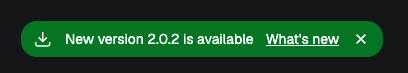
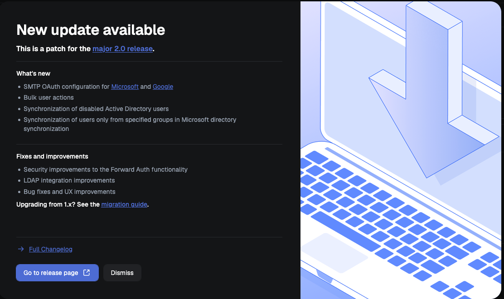

# New version notifications

Defguard will periodically (every 6 hours) check for a new version. If there is one that is newer than the current one, a toast will be displayed in the admin dashboard.

<figure><figcaption></figcaption></figure>

You can display the release notes by clicking "What's new".

<figure><figcaption></figcaption></figure>

If the update is considered critical (e.g. fixes a vulnerability) it will have the "critical update" badge.

Clicking **Dismiss** in the release notes window stops the notification for that version. Closing the toast itself only hides it until you reload the page.
