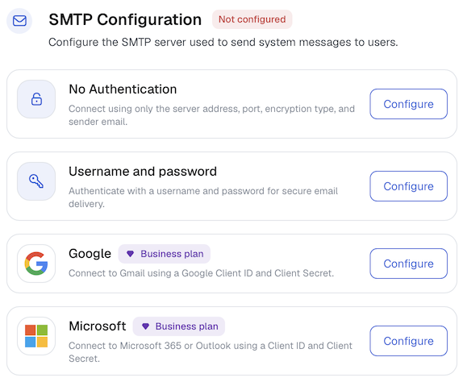
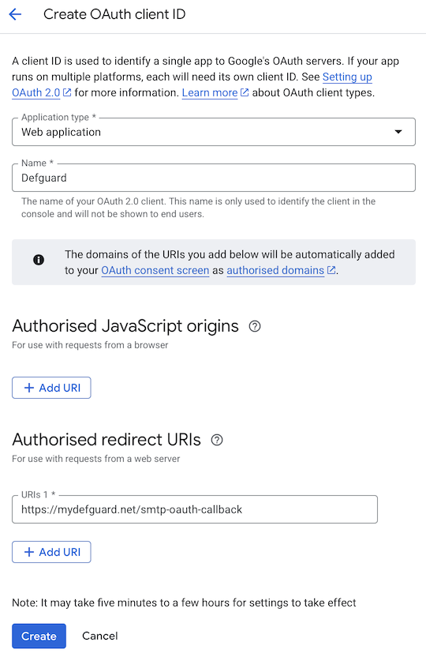

# Email notifications

Defguard Core can send email notifications to users and admins for security events, enrollment flows, and account activity. For this feature to work, you must configure a connection to an SMTP (Simple Mail Transfer Protocol) server.

## Notification kinds

* **Welcome message after enrollment**: welcome message sent to the user after completing enrollment and activating the account
* **Support data**: diagnostic data sent manually by an admin to Defguard support
* **Desktop client configuration**: configuration link sent when an admin starts desktop client configuration for a user
* **User enrollment**: enrollment link and token sent to user when admin triggers it in Defguard
* **New device added to your account**: notification sent when a new device is added to the user's account
* **New device logged in to your account**: notification sent when logging in from a new, unrecognized device/browser
* **New login to OIDC application**: notification sent on the first login to an OpenID application
* **Multi-Factor Authentication activation**: activation code sent when the user starts email MFA configuration
* **Multi-Factor Authentication {method} has been activated**: confirmation that an MFA method has been activated
* **Multi-Factor Authentication code for login**: MFA code sent on request during login
* **Password reset**: password reset link sent when an admin initiates a reset or the user [requests one in Edge](../../using-defguard-for-end-users/changing-your-password.md)
* **Password reset success**: confirmation sent after a successful password reset
* **Password reset disabled**: sent when a reset was requested for an account that cannot use it, for example a user with [password management disabled](../external-openid-providers/#disabling-password-management)
* **User import blocked**: alert to admins when user import from LDAP/directory is blocked
* **User enrollment completed**: notification to an admin when a user completes enrollment
* **Gateway disconnected** and **Gateway reconnected**: alerts to admins about gateway connectivity, configured separately in [Gateway notifications](gateway-notifications.md)
* **Automatic Let's Encrypt certificate refresh failed**: alert to admins when the automatic Let's Encrypt certificate renewal fails
* **Certificate expiration**: warning to admins when a custom-uploaded HTTPS/TLS certificate (Core or Edge) is approaching expiration
* **Certificate has expired**: alert to admins when a custom-uploaded HTTPS/TLS certificate (Core or Edge) has already expired

## Configuration

To configure a connection to an SMTP server, go to **Settings → Notifications → SMTP Configuration**.

<figure><figcaption></figcaption></figure>

Then, select one of the configuration methods by clicking **Configure** on the right side of a panel:

<figure><figcaption></figcaption></figure>

* **No Authentication**: use this option for an SMTP server that doesn't require any authentication. Usually, this kind of server is protected with firewall rules and is not accessible outside an internal network.
* **Username and password**: use this option for SMTP servers that require credentials to authenticate.
* **Google**: use this option to send email notifications through Gmail; it requires OAuth2 authentication.
* **Microsoft**: use this option to send email notifications through Microsoft 365 Exchange; it requires OAuth2 authentication.


**Availability**

The Google and Microsoft methods are available in Business and Enterprise plans. See the [pricing page](https://defguard.net/pricing/) for details.


Only one method can be active at a time, so configuring a new one replaces the currently active configuration and Defguard asks you to confirm that. The active method is listed under **Active SMTP configuration** and marked **Applied**, the remaining ones under **Other configuration methods**.

Below is the detailed information on how to configure each of the methods.

### No Authentication

This option requires the following:

* **Server Address**: IP address or domain name of the SMTP server.
* **Server port**: port number of the SMTP server. Common values are `587` (message submission), `465` (message submission over TLS), or `25` (SMTP relay).
* **Sender email address**: email address that will appear as the sender.
* **Encryption**: choose from _None_, _Start TLS_, or _Implicit TLS_. Use _Implicit TLS_ (port `465`) or _Start TLS_ (port `587`) whenever your server supports it; plain _None_ should only be used on trusted internal networks.
* **Verify TLS certificate**: leave it enabled unless your server uses a self-signed certificate.

Click **Submit** to confirm the settings.

### Username and password

This option requires the following:

* **Server Address**: IP address or domain name of the SMTP server.
* **Server port**: port number of the SMTP server. Common values are `587` (message submission), `465` (message submission over TLS), or `25` (SMTP relay).
* **Sender email address**: email address that will appear as the sender.
* **Encryption**: choose from _None_, _Start TLS_, or _Implicit TLS_.
* **Verify TLS certificate**: leave it enabled unless your server uses a self-signed certificate.
* **Server username**: username used to authenticate with the SMTP server.
* **Server password**: password used to authenticate with the SMTP server.


If your mail provider uses two-factor authentication (e.g. a personal Gmail account), you may need to generate an app-specific password instead of using your regular account password.


Click **Submit** to confirm the settings.

### Google

This option uses OAuth2 to send email through Gmail. Defguard sets the server address, port and encryption itself, so you only provide the sender address and the OAuth2 credentials.

Before configuring it in Defguard, you need to create OAuth2 credentials in the Google Cloud Console:

1. Go to [Google Cloud Console](https://console.cloud.google.com/) and open or create a project.
2. Navigate to **APIs & Services → OAuth consent screen** and configure the consent screen for your organisation.
3. Go to **APIs & Services → Credentials** and click **Create credentials → OAuth client ID**.
4. Select **Web application** as the application type, and give it a **Name**.
5. Add the Defguard callback URL, in the form of `https://mydefguard/smtp-oauth-callback`, to **Authorized redirect URIs**.
6. Click **Create** and copy the generated **Client ID** and **Client secret**.
7. Publish app **APIs & Services → OAuth consent screen → Audience → Publish app**

<figure><figcaption></figcaption></figure>

Then fill in the following fields in Defguard:

* **Sender email address**: Gmail address that will be used to send notifications.
* **Client ID**: the OAuth2 Client ID obtained from Google Cloud Console.
* **Client Secret**: the OAuth2 Client secret obtained from Google Cloud Console.

Click **Submit** to confirm the settings. A pop-up window will appear asking you to sign in to your Google account and grant Defguard permission to send email on your behalf, so make sure your browser does not block pop-ups for the Defguard dashboard.

### Microsoft

This option uses OAuth2 to send email through Microsoft 365 Exchange. As with Google, Defguard sets the server address, port and encryption itself.

Defguard authenticates as the application, not as a signed-in user, which is why the app registration needs an application permission and admin consent. Before configuring it in Defguard, register an application in Azure Active Directory:

1. Go to [Entra portal](https://entra.microsoft.com/) and navigate to **Entra ID → App registrations**.
2. Click **New registration**, give the app a name, and click **Register**.
3. After registration, note the **Application (client) ID** and **Directory (tenant) ID** shown on the overview page.
4. Go to **Entra ID → App registrations → Certificates & secrets**, select **Client secrets** tab, and click **New client secret**. Copy the generated secret value immediately, it will not be shown again.
5. Go to **Entra ID → App registrations → API permissions**, select the new app, and add the **SMTP.SendAsApp** permission under **Office 365 Exchange Online**.
6. Go to **Entra ID → Enterprise apps**, select the new app, and then go to **Permissions**. Click on **grant admin consent for…**.

Then fill in the following fields in Defguard:

* **Sender email address**: Microsoft 365 email address that will be used to send notifications.
* **Tenant ID**: the Directory (tenant) ID of your Azure AD.
* **Client ID**: the Application (client) ID of the registered app.
* **Client Secret**: the client secret value generated in Azure AD.

Click **Submit** to confirm the settings.

## Testing

After saving the configuration, you can verify it works by sending a test email. Click **...** next to the active configuration to expand the menu, then select **Send test email**. In the dialog that appears, enter the recipient's email address and click **Send email**. The same menu holds **Reset settings**, which clears the SMTP configuration and disables all email notifications.

If the test email does not arrive, check the following:

* **Server address and port**: confirm the host is reachable from the machine running Defguard Core and that the port is not blocked by a firewall.
* **Encryption mismatch**: make sure the port and the encryption mode are consistent, for example port `465` requires _Implicit TLS_, while port `587` is used with _Start TLS_. Mixing these will cause the connection to fail or produce a TLS handshake error.
* **Credentials**: for the _Username and password_ method, double-check the username and password. If your provider requires an app-specific password, make sure you are using that instead of your regular account password.
* **OAuth2 token**: for the _Google_ and _Microsoft_ methods, the OAuth2 token may have expired or been revoked. Re-open the configuration panel and go through the authentication flow again to obtain a fresh token.
* **Spam folder**: the test email may have been delivered but filtered into the spam or junk folder.
* **Defguard Core logs**: check the application logs for SMTP-related error messages, which will give the most precise indication of what went wrong.
