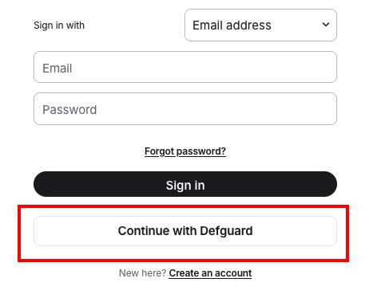
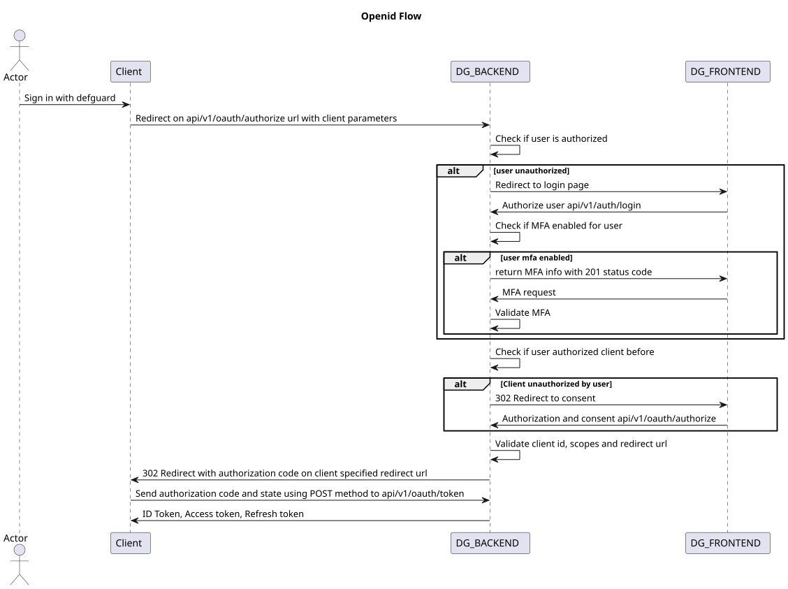

---
metaLinks:
  alternates:
    - https://app.gitbook.com/s/e86iamwJVSYnIRsyVEAV/features/openid-connect
---

# Internal SSO (OpenID Connect Provider)

## OpenID Connect

### What is OpenID Connect?

OpenID Connect is an identity layer built on top of OAuth2, it allows third-party applications to get basic information about your profile and verify your identity. Its purpose is to give you one login for multiple sites. You're probably familiar with it if you used **Login with Google**. For example, if you click Login with Google you'll be redirected to the Google page with verify form that you allow some website to get information from your profile for example email, name, etc.

### Defguard as an OpenID Connect Provider

Defguard is a full-featured OIDC provider enabling SSO (Single Sign-On) across third-party applications. Apps can authenticate users through Defguard identity system using standard [OIDC flow](./#defguard-openid-flow).

Example:

<figure><figcaption></figcaption></figure>

### How Defguard implements OpenID?

As an identity provider, Defguard enables you to sign in to third-party services using your Defguard account, so you don't have to worry about managing multiple passwords.

At this point, you may wonder whether this is safe? And yes, it is completely safe. Third-party applications only receive the data based on the scopes you approve during consent screen.

This information is then sent to the third party application as an `ID Token` which is a JSON Web Token containing additional claims such as first name or email. Your password is **never** sent at any stage of this process.

### Defguard OpenID flow



### How to enable login with Defguard using OpenID?

#### Client creation

To enable logging in with third-party application first you need to register it as new **OpenID client**.

To do it, navigate to **OpenID applications** on the left side navigation, then click **Add new application.**

<figure><figcaption></figcaption></figure>

After clicking "**Add new application**" button, you will see "**Add new OpenID application**" modal

<figure><figcaption></figcaption></figure>


**Application name** - Your application name

**Redirect URL** - URL to which user will be redirected with generated PKCE code example (`https://myapp.com/redirect_uri`).  You can specify multiple redirect URL, to add another click "**Add URL".**

**Scopes** - select scopes which your client will be using


After creating new OpenID application you will see it inside the "**All applications**".

<figure><figcaption></figcaption></figure>

#### Client credentials

Applications must be registered with the authorization server to enable secure authentication and identification. To do it, you need to obtain credentials described below.

**Client ID** - Public identifier assigned to application during registration. It is used to identify the client in authentication request and doesn't need to be secret.

**Client Secret** - A confidential credential only known to the authorization server and client application. It is used to authenticate the application during communication.

To obtain `Client ID`/`Client Secret`, click three dots on the right side of the row containing your  OpenID application.

<figure><figcaption></figcaption></figure>

After clicking `Copy client ID`/`Copy client secret`, credential will be saved to your clipboard.

### OpenID endpoints

#### Discovery endpoint

OpenID Connect defines a discovery mechanism, called OpenID Connect Discovery, where an OpenID server publishes its metadata at a well-known URL, typically. This URL returns a JSON listing of the OpenID/OAuth endpoints, supported scopes and claims, public keys used to sign the tokens, and other details. The clients can use this information to construct a request to the OpenID server.

`https://defguard.company.net/.well-known/openid-configuration`

#### Authorization

```
https://defguard.company.net/api/v1/oauth/authorize
```

#### Token

```
https://defguard.company.net/api/v1/oauth/token
```

#### UserInfo

```
https://defguard.company.net/api/v1/oauth/userinfo
```

#### Authentication request

Set up your login with Defguard button to redirect to authorization endpoint, which is `https://defguard.company.net/openid/authorize?`

Below is a sample authentication request which your app should do on Login with Defguard button

```
http://defguard.company.net/api/v1/openid/authorize?
client_id=<YOUR_CLIENT_ID> // Generated by Defguard available on app detail page
&redirect_uri=<YOUR_REDIRECT_URI>  //Url on which user with code will be redirected
&scope=openid%20profile%20phone%20email // available scopes
&response_type=code // Currently only supported response is code
&state=<YOUR_STATE> // State to returned on redirect uri to verify request comes with Defguard
```

**Notes:**

1. `Client ID` and `Client Secret` are generated by Defguard after creating your app.
2. **Scope** must include `OpenID`
3. Available scopes are `Profile` (all available info from user profile) `Phone` and `Email`
4. Currently, only supported **response\_type** is **code**.
5. Redirect URI is URL to which the user will be redirected with and authorization code. It must exactly match the redirect URL registered during client creation, otherwise error will be returned.

**Successful authentication response**

```http
HTTP/1.1 302 Found

Location: <YOUR_REDIRECT_URI>?
code=SplxlOBeZQQYbYS6WxSbIA
&state=af0ifjsldkj
```

#### Exchange code for ID Token

After receiving code from previous step, you need to exchange it for token on token endpoint:

```http
https://defguard.company.net/api/v1/oauth/token
```

Request Header and URL:

```http
Content-Type: application/x-www-form-urlencoded
POST defguard.company.net/api/v1/oauth/token
```

Request body: Need to be form encoded

```http
grant_type=authorization_code
&redirect_uri=<YOUR_REDIRECT_URI>
&code=<CODE_RECEIVED_IN_PREVIOUS_STEP>
```


* Currently, only supported **grant\_type** is authorization\_code
* Code is your PKCE code received in previous step


**Successful Token Response**

```http
  HTTP/1.1 200 OK
  Content-Type: application/json
  Cache-Control: no-store
  Pragma: no-cache

  {
   "id_token": "eyJhbGciOiJSUzI1NiIsImtpZCI6IjFlOWdkazcifQ.ewogImlzc
     yI6ICJodHRwOi8vc2VydmVyLmV4YW1wbGUuY29tIiwKICJzdWIiOiAiMjQ4Mjg5
     NzYxMDAxIiwKICJhdWQiOiAiczZCaGRSa3F0MyIsCiAibm9uY2UiOiAibi0wUzZ
     fV3pBMk1qIiwKICJleHAiOiAxMzExMjgxOTcwLAogImlhdCI6IDEzMTEyODA5Nz
     AKfQ.ggW8hZ1EuVLuxNuuIJKX_V8a_OMXzR0EHR9R6jgdqrOOF4daGU96Sr_P6q
     Jp6IcmD3HP99Obi1PRs-cwh3LO-p146waJ8IhehcwL7F09JdijmBqkvPeB2T9CJ
     NqeGpe-gccMg4vfKjkM8FcGvnzZUN4_KSP0aAp1tOJ1zZwgjxqGByKHiOtX7Tpd
     QyHE5lcMiKPXfEIQILVq0pc_E2DzL7emopWoaoZTF_m0_N0YzFC6g6EJbOEoRoS
     K5hoDalrcvRYLSrQAZZKflyuVCyixEoV9GfNQC3_osjzw2PAithfubEEBLuVVk4
     XUVrWOLrLl0nx7RkKU8NXNHq-rvKMzqg"
  }
```


ID Tokens are signed using RS256 (RSA Signature with SHA-256).

The public key is available via endpoint `/api/v1/oauth/discovery/keys`


#### Authorized apps

<figure><figcaption></figcaption></figure>

Every user that used **Login with Defguard** option can see (on own profile) name of every authorized app. If you revoke app, then you will have to click allow on the form with permissions again.


## OpenID clients

Below, you can find tutorials on how to configure OpenID for:


[portainer.md](portainer.md)



[grafana-setup.md](grafana-setup.md)



[proxmox.md](proxmox.md)



[django.md](django.md)



[proxmox-1.md](proxmox-1.md)



[minio.md](minio.md)



[vault.md](vault.md)

