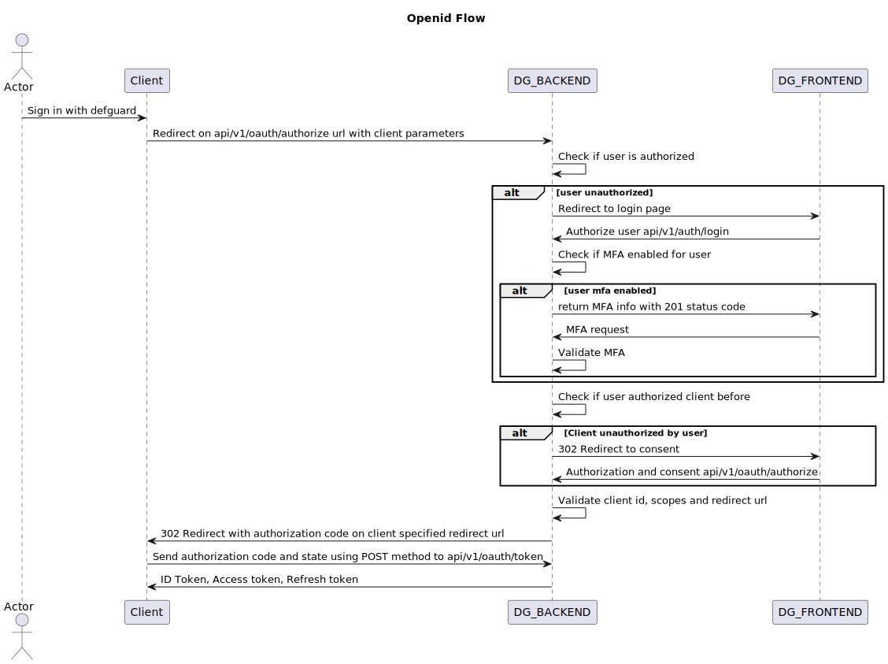
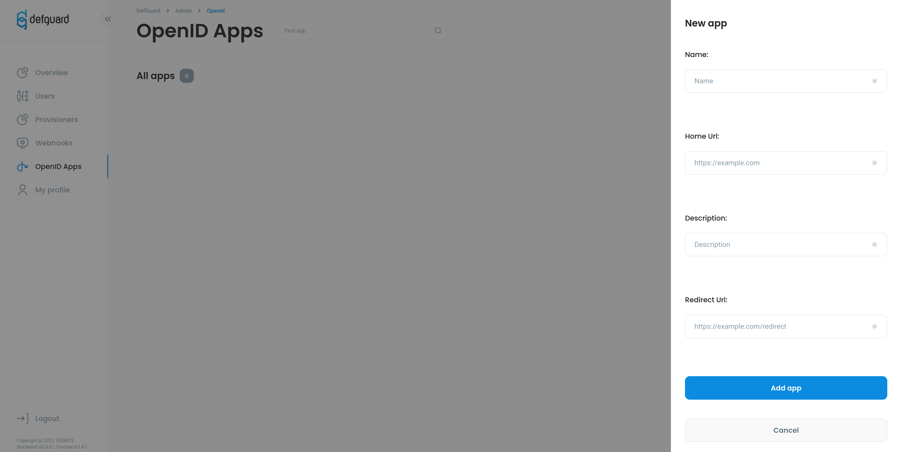

# OpenID Connect

## OpenID Connect

### What is OpenID Connect?

OpenID Connect is an identity layer built on top of OAuth2 it allows third-party applications to get basic information about your profile and verify your identity. Its purpose is to give you one login for multiple sites. You're probably familiar with it if you used **Login with Google**. For example, if you click Login with Google you'll be redirected to the Google page with verify form that you allow some website to get information from your profile for example email, name, etc.

### How Defguard implements OpenID?

As an identity provider one of our core features is Login with Defguard which allows you to log into other websites using your Defguard account so you don't have to care about multiple passwords and leaks. At this point you may have concern and ask is it safe? Yes, it's completely safe cause all information third party app will receive is the information that you allowed on redirect page. These information then are sent to third party app as IDToken which is basically JSON Web Token with additional claims like first name or email. Your password isn't send in any step of this.

### Defguard OpenID flow



### How to enable login with Defguard using OpenID?

#### Client creation

To enable login with other app first you need to add it as new OpenID client. To do it navigate to OpenID Apps on the left side navigation then click Add new button.



Here are explained inputs

**Name** Name of your client **Redirect URI** URL on which user will be redirected with generated PKCE code example("https://myapp.com/redirect\_uri") **Scopes** Scopes which your client will be using

After creating your client you can click on it on list and be redirected to detailed client page with it unique Client ID and Client secret codes.

**Client ID** is a public identifier for apps. Something like unique login so we can verify app URL matches it's Client ID. **Client Secret** Only known for authorization server(Defguard) and the applications as we using

Setup on authorization app if you want to login with Defguard.

### OpenID endpoints

#### Discovery endpoint

OpenID Connect defines a discovery mechanism, called OpenID Connect Discovery, where an OpenID server publishes its metadata at a well-known URL, typically. This URL returns a JSON listing of the OpenID/OAuth endpoints, supported scopes and claims, public keys used to sign the tokens, and other details. The clients can use this information to construct a request to the OpenID server. **Note** For this endpoint to work correctly you have to set env variable named `DEFGUARD_URL` with URL of your defguard instance.

`https://defguard.company.net/.well-known/openid-configuration`

#### Authorization

`https://defguard.company.net/api/v1/oauth/authorize`

#### Token

`https://defguard.company.net/api/v1/oauth/token`

#### Userinfo

`https://defguard.company.net/api/v1/oauth/userinfo`

#### Authentication request

Set up your login with Defguard button to redirect to authorization endpoint which is `https://defguard.company.net/openid/authorize?`

Below is sample authentication request which your app should do on Login with Defguard button

```
http://defguard.company.net/api/v1/openid/authorize?
client_id=<YOUR_CLIENT_ID> // Generated by defguard available on app detail page
&redirect_uri=<YOUR_REDIRECT_URI>  //Url on which user with code will be redirected
&scope=openid%20profile%20phone%20email // available scopes
&response_type=code // Currently only supported response is code
&state=<YOUR_STATE> // State to returned on redirect uri to verify request comes with Defguard
```

**Notes:**

1. Client id and secret is generated by Defguard after creating your app you can see it on app detail page
2. **Scope** must contain OpenID
3. Available scopes are profile(all available info from user profile) phone and email
4. Currently only supported **response\_type** is **code**.
5. Redirect URI is URL on which user will be redirected with generated PKCE code (Redirect URI must match URI declared on client creation otherwise error will be returned)

**Successful authentication response**

```
HTTP/1.1 302 Found

Location: <YOUR_REDIRECT_URI>?
code=SplxlOBeZQQYbYS6WxSbIA
&state=af0ifjsldkj
```

#### Exchange code for ID Token

After receiving code from previous step you need to exchange it for token on token endpoint `defguard.company.net/api/v1/openid/token`

Request Header and URL:

```
Content-Type: application/x-www-form-urlencoded
POST defguard.company.net/api/v1/openid/token
```

Request body: Need to be form encoded

```
grant_type=authorization_code
&redirect_uri=<YOUR_REDIRECT_URI>
&code=<CODE_RECEIVED_IN_PREVIOUS_STEP>
```

**Note:**

1. Currently only supported **grant\_type** is authorization\_code
2. Code is your PKCE code received in previous step

**Successful Token Response**

```
  HTTP/1.1 200 OK
  Content-Type: application/json
  Cache-Control: no-store
  Pragma: no-cache

  {
   "id_token": "eyJhbGciOiJSUzI1NiIsImtpZCI6IjFlOWdkazcifQ.ewogImlzc
     yI6ICJodHRwOi8vc2VydmVyLmV4YW1wbGUuY29tIiwKICJzdWIiOiAiMjQ4Mjg5
     NzYxMDAxIiwKICJhdWQiOiAiczZCaGRSa3F0MyIsCiAibm9uY2UiOiAibi0wUzZ
     fV3pBMk1qIiwKICJleHAiOiAxMzExMjgxOTcwLAogImlhdCI6IDEzMTEyODA5Nz
     AKfQ.ggW8hZ1EuVLuxNuuIJKX_V8a_OMXzR0EHR9R6jgdqrOOF4daGU96Sr_P6q
     Jp6IcmD3HP99Obi1PRs-cwh3LO-p146waJ8IhehcwL7F09JdijmBqkvPeB2T9CJ
     NqeGpe-gccMg4vfKjkM8FcGvnzZUN4_KSP0aAp1tOJ1zZwgjxqGByKHiOtX7Tpd
     QyHE5lcMiKPXfEIQILVq0pc_E2DzL7emopWoaoZTF_m0_N0YzFC6g6EJbOEoRoS
     K5hoDalrcvRYLSrQAZZKflyuVCyixEoV9GfNQC3_osjzw2PAithfubEEBLuVVk4
     XUVrWOLrLl0nx7RkKU8NXNHq-rvKMzqg"
  }
```

**Note:**

1. As we using HS256 algorithm ID Token is signed using your app Client Secret

**Authorized apps:**

Every user that used Login with Defguard option can see in his profile name of every authorized app. If you revoke app then you will have to click allow on form with permissions again.

## OpenID clients

On the sidebar or by clicking links below you can find tutorials how to configure OpenID for:


[portainer.md](portainer.md)



[grafana-setup.md](grafana-setup.md)



[proxmox.md](proxmox.md)



[django.md](django.md)



[proxmox-1.md](proxmox-1.md)

