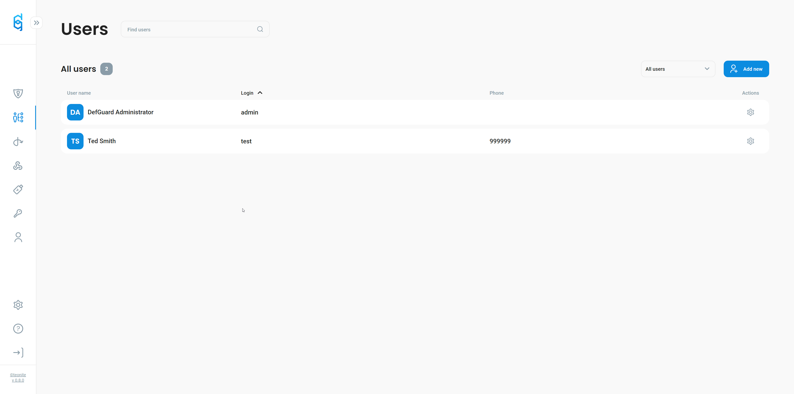

# MinIO

MinIO has OpenID Connect functionality out of the box. We will use it to authenticate users from Defguard to MinIO.

## RSA Setup

MinIO, like Django, requires Defguard to use RSA key instead of our default HMAC. This is due to the different response schema that MinIO expects.

Generate RSA key file if you don't have one :

```bash
openssl genpkey -out rsakey.pem -algorithm RSA -pkeyopt rsa_keygen_bits:2048
```

Now we need to set **DEFGUARD\_OPENID\_KEY** variable to path pointing to that _<mark style="color:purple;">rsakey.pem</mark>_ file.

When starting Defguard now you should be able to see the following info log :&#x20;

```log
INFO defguard: Using RSA OpenID signing key
```

## Add MinIO OpenID Client

Navigate to the OpenID page in Defguard and add MinIO to the client's list. Redirect URL need to point to your MinIO console root domain and path should be /oauth\_callback like:

```
http://localhost:9001/oauth_callback
```

<figure><figcaption></figcaption></figure>

## MinIO Configuration

In this example, we will use the environment variables.

Reference MinIO docs for more detailed explanation: [https://min.io/docs/minio/linux/reference/minio-server/minio-server.html#environment-variables](https://min.io/docs/minio/linux/reference/minio-server/minio-server.html#environment-variables)

The table below assumes MinIO console exists on minio.example and Defguard exists on defguard.example

| Variable                                | Example Value                                            | Description                                                                                                                                                                                                            |
| --------------------------------------- | -------------------------------------------------------- | ---------------------------------------------------------------------------------------------------------------------------------------------------------------------------------------------------------------------- |
| MINIO\_IDENTITY\_OPENID\_CLIENT\_ID     | client\_id\_from\_defguard                               | Click on Minio app row in OpenID page, copy from opened modal                                                                                                                                                          |
| MINIO\_IDENTITY\_OPENID\_CLIENT\_SECRET | client\_secret\_from\_defguard                           | Click on Minio app row in OpenID page, copy from opened modal                                                                                                                                                          |
| MINIO\_IDENTITY\_OPENID\_CONFIG\_URL    | http://defguard.example/.well-known/openid-configuration |                                                                                                                                                                                                                        |
| MINIO\_IDENTITY\_OPENID\_DISPLAY\_NAME  | Defguard                                                 | This will be displayed in minio login page.                                                                                                                                                                            |
| MINIO\_IDENTITY\_OPENID\_SCOPES         | openid,email,profile                                     | Scopes that Minio will ask access to                                                                                                                                                                                   |
| MINIO\_BROWSER\_REDIRECT\_URL           | http://minio.example                                     | This should point to valid minio console domain. Check docs for more info.                                                                                                                                             |
| MINIO\_IDENTITY\_OPENID\_ROLE\_POLICY   | consoleAdmin                                             | MinIO policy that will be granted to all users authneticated via OpenID Connect. This can be custom policy set by you or one of default ones like in this example every Defguard user will be regared as consoleAdmin. |
