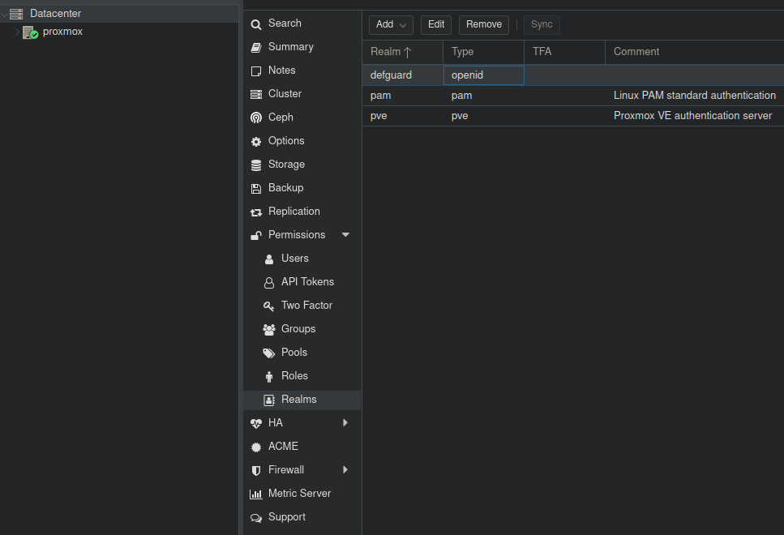
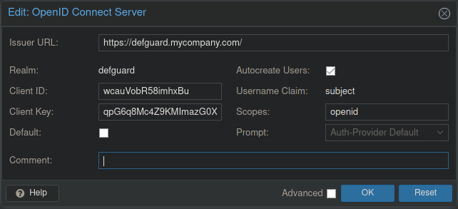

# Proxmox


For Proxmox OIDC to work you'll have to run Defguard with [RSA signing key](../setting-up-your-instance/docker-compose.md#openid-rsa-setup).


## Add Proxmox app to Defguard

First, go to the Defguard OpenID tab and click add new app button.

1. Add the name `Proxmox`
2. Add your proxmox address as redirect URL (e.g. `https://yourproxmox.com`)
3. Select scopes:

* OpenID
* Profile
* Email
* Phone

4. Submit the form.

After successfully adding your app you can see it in the OpenID apps list. When you click on it you will be redirected to the client details page. From this page copy Client ID and Client secret values for later.

## Proxmox configuration

1. Log into your proxmox instance.
2. Select `Datacenter`
3. Select `Permissions -> Realms`

4. Select `Add -> OpenID Connect Server`
5. Fill in the form:

* Issuer URL: Your Defguard instance URL (e.g. https://defguard.mycompany.com)
* Realm: Name for the realm, internal for Proxmox, (e.g. `Defguard`)
* Client ID: Client ID you copied after creating Defguard OpenID app
* Client Key: Client secret you copied after creating Defguard OpenID app
* Default: leave unchecked
* Comment: leave empty
* Autocreate users: check


Without `Autocreate users` option Proxmox won't be able to create new users, only log in existing ones.


* Username claim: subject
* Scopes: openid
* Prompt: Auth-Provider Default

6. Save the form.

After logging out of Proxmox you should now be able to select your new realm and login with Defguard using OpenID Connect.
