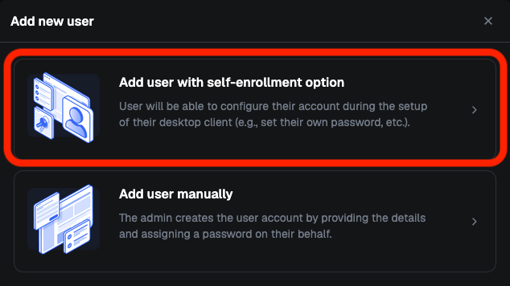
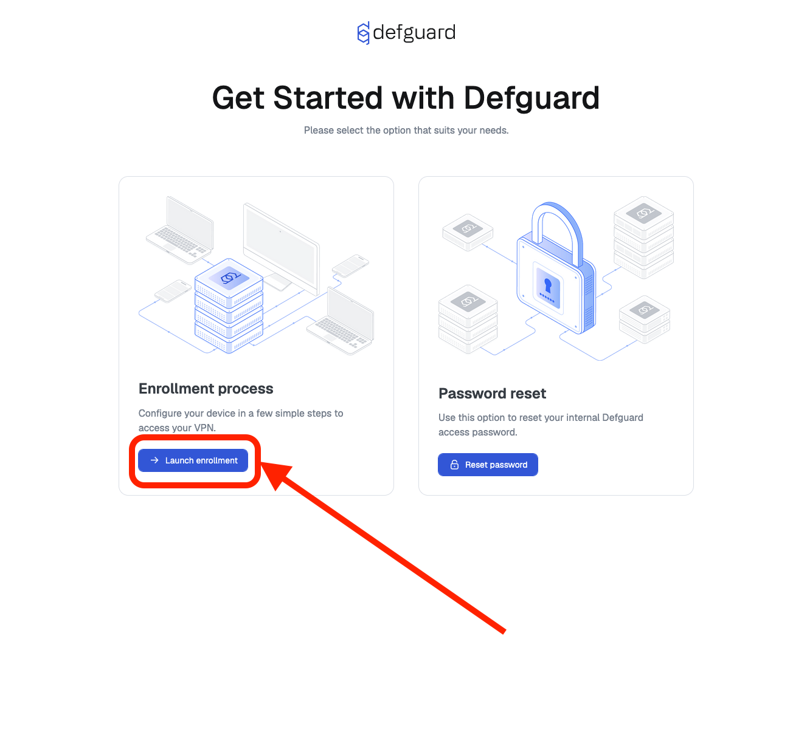

# Remote user enrollment

By design, **Defguard Core** is meant to be deployed **securely** within your infrastructure and only accessible from within the internal network or by VPN.

This introduces an issue with onboarding **new users** and forces the admin to choose an initial password, set up a VPN device for them, and pass on those details to the end user using possibly **insecure** channels.

To avoid this issue you can deploy a **public** [Defguard Edge](https://github.com/DefGuard/proxy) (formerly Proxy) which enables a **secure enrollment process.**

**Here is a video showcasing:**

* how admin adds a user with secure remote enrollment
* then how the enrollment process looks like for the user




Edge is included when using the default [deployment instructions](../../deployment-strategies/overview.md).

Please also see the relevant configuration options for [core](../../deployment-strategies/configuration.md#settings) and the [edge itself](../../deployment-strategies/configuration.md#edge-deployment-parameters).


## How to initiate user secure enrollment

When adding a new user please choose "Add user with self-enrolment option"

<figure><figcaption></figcaption></figure>


**By choosing this option, the admin will only provide the user data and will not be able to set the user’s password, the user will create their own password during the enrollment process in the desktop client.**


If [SMTP](../notifications/setting-up-smtp-for-email-notifications.md) is configured, you will see "**Send enrollment details to user by email"** checkbox.

<figure><figcaption></figcaption></figure>


If **"Send enrollment details to user by email"** is checked - the user will receive an email with all enrollment instructions


If you don't have any [SMTP](../notifications/setting-up-smtp-for-email-notifications.md) configuration, `Defguard instance URL` and `Activation token` must be handed over to the user personally.


The email address you specify for delivering the enrollment token can be any email available to the user. It **does not** have to be the same one used when creating an account as we assume that a new user does not yet have access to their official company email account.


When the user adds a Defguard instance in the Desktop client using the received token, not only is the VPN client configured, but the user can also:

* set up their password
* configure [MFA](../wireguard/multi-factor-authentication-mfa-2fa/), which is required to connect to MFA-protected locations

This means the user may not even have access to Defguard itself, but can still configure both VPN and MFA!


**For MFA configuration to be mandatory during the enrollment process, there must be at least one VPN location with MFA enabled. Otherwise, MFA setup will remain optional.**


## Restarting enrollment manually

If there are any issues with the enrollment process (failed notification delivery, a lost token etc) you can restart it:

* Go to **Users** page
* Find the relevant user and click on the **"…"** button on the right
* An **Initiate self-enrollment** option should be available in the pop-over menu

<figure><figcaption></figcaption></figure>

* Clicking it will open the same modal as before.

<figure><figcaption></figcaption></figure>

## Performing remote enrollment (as a user)

#### **Obtaining token manually (e.g., via encrypted chat)**

1. Go to Edge page

<figure><figcaption></figcaption></figure>

2. Enter your enrollment token and click "Continue" button

<figure><figcaption></figcaption></figure>

3. Download **Desktop Client** compatible with your Operating System.

<figure><figcaption></figcaption></figure>

4. Now, enrollment can be performed in **Desktop Client**

<figure><figcaption></figcaption></figure>

Now you can click **"One-Click Configuration"** which will open **Desktop Client** and enter credentials for you.

#### **Obtaining token via email**

1. Click **"Enroll with desktop client"**, or copy `URL`/`Token` manually to **Desktop Client**

<figure><figcaption></figcaption></figure>

Entering URL/Token inside **Desktop Client** will trigger user enrollment process.

<figure><figcaption></figcaption></figure>

By following the **enrollment wizard** in **Desktop Client**, you'll be able to do the following:

* verify that your data is correct
* activate your user account
* choose your password
* setup MFA method
* add an initial device for VPN access

After completing enrolment process, you will be able to connect to the VPN.

## Enrollment settings

As an admin, you can configure enrolment-related settings on the **Enrollment** page. This includes:

* Setting token validity time
* Enrollment session duration

<figure><figcaption></figcaption></figure>

* Customizing the user [onboarding messages](user-onboarding-after-enrollment.md).

<figure><figcaption></figcaption></figure>

#### Message template tags

There are several **template tags** (similar to [Jinja2](https://jinja.palletsprojects.com/en/3.1.x/) tags) that you can use in the onboarding messages to insert some dynamic content:

* `{{ first_name }}` - newly created user first name
* `{{ last_name }}` - newly created user last name
* `{{ username }}` - newly created user username/login
* `{{ admin_first_name }}` - first name of the administrator who initiated the enrollment process
* `{{ admin_last_name }}` - last name of the administrator who initiated the enrollment process
* `{{ admin_phone }}`- phone number of the administrator who initiated the enrollment process
* `{{ admin_email }}`- email of the administrator who initiated the enrollment process
* `{{ defguard_url }}`- internal Defguard URL (your Defguard instance address)
* `{{ defguard_version }}` - Defguard version
