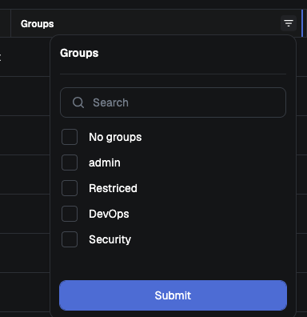
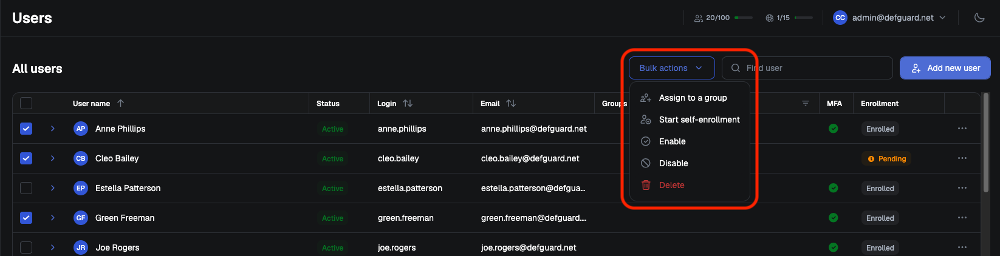

# User management

The **Users** page lists every account in your Defguard instance. Individual accounts are managed from the menu at the end of each row; this page covers the tools that act on the whole list.

## Filtering by group

The filter on the **Groups** column lists every group you have defined, plus an extra **No groups** entry matching accounts that belong to no group at all.

<figure></figure>

Selecting several groups returns users who are in **any** of them, and adding **No groups** widens the result rather than narrowing it.

## Bulk actions

Select accounts with the checkboxes in the rows, then use the **Bulk actions** menu:

* **Assign to a group**
* **Start self-enrollment** - begins [enrollment](remote-user-enrollment/) and sends each user an enrollment email
* **Disable**
* **Enable**
* **Delete**

<figure></figure>

Each action asks for confirmation and states how many accounts it will affect.


**Start self-enrollment** requires [SMTP to be configured](notifications/setting-up-smtp-for-email-notifications.md).



Deleting accounts cannot be undone.

