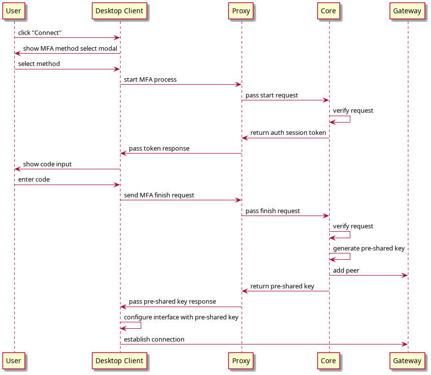

# MFA Architecture

WireGuard by itself does not have a concept of MFA or any additional authorization aside from validating peers cryptographically by their public and pre-shared keys.&#x20;

Desktop Client MFA functionality is build entirely in defguard as a layer above the WireGuard protocol. Below is a brief explanation of its architecture and the authorization process itself.

## Pre-shared keys

Our additional authorization is enabled by using [pre-shared keys](https://www.wireguard.com/protocol/#key-exchange-and-data-packets). They are similar to peer public keys but while public keys identify a specific device and are static, pre-shared keys can be safely rotated.

When you configure your defguard location to require MFA it tells the Gateway to not add any peers (clients) to the WireGuard interface unless they are authorized and have a pre-shared key assigned.

On the other side a Client must have a valid pre-shared key (received after successful authorization) to establish a connection to the Gateway.

In typical REST API terms the pre-shared key can be thought of as an analogue to a session token.

## Authorization process

To enable MFA functionality Desktop Client uses the [proxy ](https://github.com/DefGuard/proxy)to bridge communication between itself and defguard Core. Below is a diagram of the authorization process that is performed each time the Client initiates a connection to an MFA-enabled location:

<figure><figcaption></figcaption></figure>

## Disconnecting peers

Since the WireGuard protocol is by definition stateless, there's no native concept of "connection" which would allow us to detect disconnected peers and remove them from the Gateway.

As a workaround we use the `latest handshake` parameter available for each peer on a WireGuard interface. For each WireGuard connection both sides negotiate a "[mini-session](https://www.wireguard.com/protocol/#dos-mitigation)" about every 2 minutes. We can therefore assume that if the `latest handshake` value is more than 3 minutes (as a buffer for potential delays) the client has disconnected.

If a disconnected device is detected we mark it as unauthorized, delete the pre-shared key and remove the peer from Gateway interface, thus enforcing a "logout" for our MFA session.
