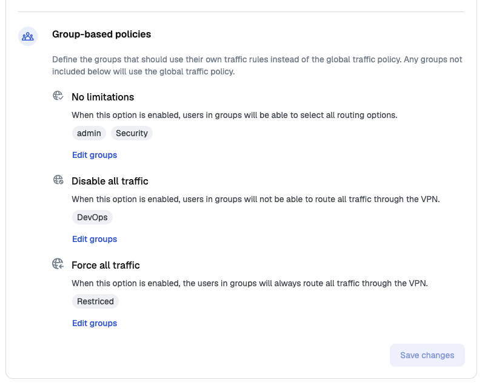

# Client behaviour customization


**Availability**

This feature is available in Business and Enterprise plans. See the [pricing page](https://defguard.net/pricing/) for details.


Navigate to **Settings → General → Client behaviour.**

<figure><figcaption></figcaption></figure>

<figure><figcaption></figcaption></figure>

### Client configuration Permissions

Options that affect ability to interact with device management for users.

#### Device management

This option defines if users can create / manage their own devices.

<figure><figcaption></figcaption></figure>

#### WireGuard configuration

This option disables ability to create native WireGuard configurations for users. This way users can only enroll new devices via Defguard client applications.

### Client traffic rules

One of the unique features of Defguard desktop client is the ability for users to choose whether to route only **predefined network traffic** or **all traffic** from their device through a connected VPN location.

<figure><figcaption></figcaption></figure>

However, in some cases administrators may want to enforce a specific behaviour - allowing access only to predefined traffic or requiring all traffic to pass through the VPN.

<figure><figcaption></figcaption></figure>

\
The **Client Traffic Policy** setting enables administrators to control this behaviour as needed. The available options are:

* **No limitation** - Users can freely choose between routing predefined traffic or all traffic through the VPN.
* **Disable all traffic** - Only predefined traffic is allowed, the "All traffic" option is disabled for users.
* **Force all traffic** - All traffic is routed through the VPN, the "All traffic" option is enforced and cannot be changed by users.


Please note that this option is only client-side enforced, meaning the user may manually modify Wireguard interface to force all traffic to go through the VPN.


### Group-based policies

In addition to the global **Client traffic policy**, you can define traffic rules for selected groups. Groups listed in this section use their own traffic rules instead of the global policy; any group that is not listed uses the global policy.

The available options are the same as for the global policy - **No limitations**, **Disable all traffic** and **Force all traffic** - but they apply only to users in the selected groups. Use the **Edit groups** button next to an option to choose which groups it applies to.

<figure></figure>

A group can be assigned to only one option. The **Groups** page shows the assigned policy in the **Traffic policy** column, or `-` when the group follows the global policy.


Group-based policies are useful when most of your users should keep the default behaviour, while a specific group - for example contractors or a set of managed workstations - must have all traffic forced through the VPN.


When a user belongs to several groups with different policies, **Disable all traffic** wins, then **Force all traffic**, then **No limitations**.
