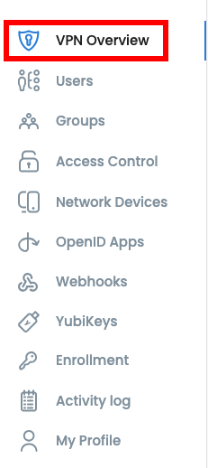
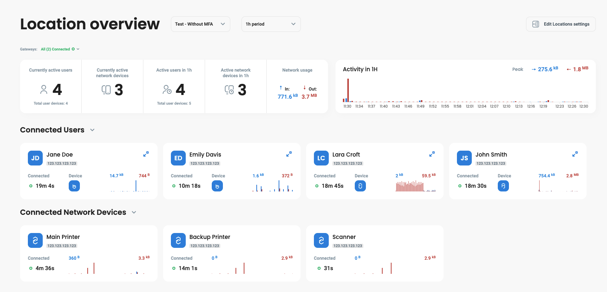
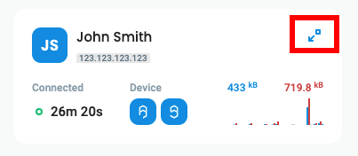
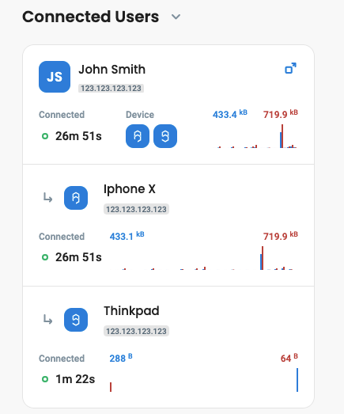

# Network overview

Once your gateway service is up and users start connecting to the VPN, upload/download summary data is stored and can be displayed in "overview" tab of Defguard web application. See [architecture overview](../../in-depth/architecture/) for details of core-gateway interaction.

On the overview page, you'll see who is currently connected and how much data each connected user transferred. You'll also see overall network transfer charts.

Since **version 1.4**, Defguard dashboard allows administrators to see:

* Current amount of active users / network devices
* Active users / network devices during time period
* Network usage
* Gateway status

### Dashboard

To access this dashboard, go to **VPN Overview** tab.

<figure><figcaption></figcaption></figure>

Dashboard looks like this, if you want to see more details about location, proceed to [this section.](network-overview.md#detailed-location-overview)

<figure><figcaption></figcaption></figure>

### Detailed location overview

To access a dashboard with detailed information, you can:

* Select location at the top of the page

<figure><figcaption></figcaption></figure>

* Click **See Location Details** next to location

<figure><figcaption></figcaption></figure>

***

In this view, you can see individual users and network devices using this specific location.

<figure><figcaption></figcaption></figure>

To access detailed information about a specific user, click the blue icon located next to the username.

<figure><figcaption></figcaption></figure>

After expanding, you will see devices which are currently being used by the user.

<figure><figcaption></figcaption></figure>
