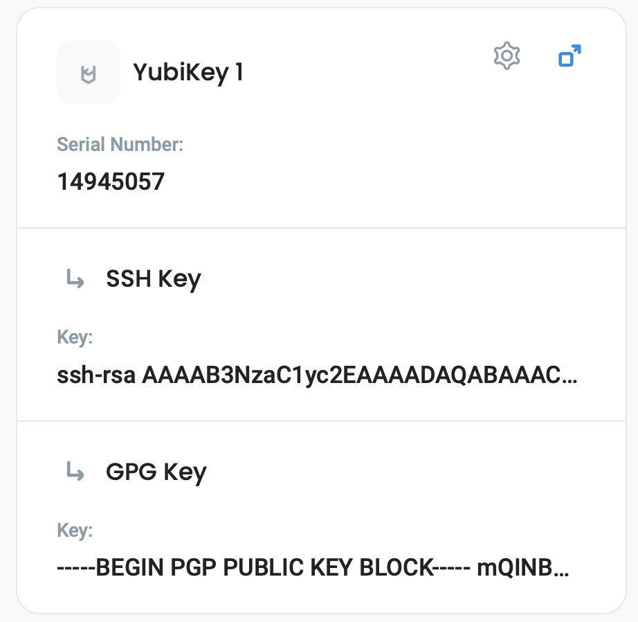

# YubiKey Provisioning

## Overview

Our provisioning service (installed on a computer that has USB access and securely communicating with defguard) allows you to easily create and populate the **SSH and GPG/OpenPGP** keys on a YubiKey hardware key, and share its public information inside defguard - which can be [used for example to authenticate to servers using defguard](ssh-authentication.md).


Defguard allows also of uploading/managing any GPG/SSH keys in the user profile.


It's completely safe, defguard does not store private keys. Every key is provisioned inside an encapsulated session so any **gpg-related files are deleted right after the process ends successfully or not**. Only public PGP and SSH keys are sent to defguard so you can access them at any time.


**GPG keys warning!**


That also means that the **master key** is deleted and only sub-keys are stored - so you will not be able for example to edit the GPG key and add additional emails, etc - as that requires the **master key** to be imported to GPG.

As we do not want to store any private keys for security reasons, we have some ideas and plans for **optional master-key** storage based on **HSM encryption**, but we want to see if any actual companies/users need that, as there is always a way just to overwrite the existing YK and provision with new data.&#x20;


## Installation of provisioning service


The provisioning service is required as we need physical access to the USB and to the YK device.

It's good for example to prepare a _provisioning station_ in your organization that will be available for just plugging in new YK's and provisioning them with ease..


Currently, we provide Linux .rpm and .deb packages alongside Docker image, but provisioning clients can also be compiled and run under Windows and MacOS.

Note that if you decide to use Docker make sure your container has access to host machine devices, otherwise, you will encounter `No keys detected` error.

## Configuration

All of the available options are described in the help:

```bash
yubikey-provision -h
```

### CLI options and configuration

Configuration can be provided in CLI with options, in environment variables, or via `.env` file. &#x20;

<table><thead><tr><th>Name</th><th>Description</th><th data-type="checkbox">Required</th><th>CLI option</th><th>Environment variable</th><th>Default value</th></tr></thead><tbody><tr><td>Provisioner ID</td><td>Shown in Defguard UI</td><td>true</td><td>--id</td><td>WORKER_ID</td><td>YubikeyProvisioner</td></tr><tr><td>Log level</td><td>Sets logging level</td><td>false</td><td>--log-level</td><td>LOG_LEVEL</td><td>info</td></tr><tr><td>GRPC Endpoint</td><td>Url of your Defguard instance GRPC endpoint. Make sure you include <strong><code>http</code></strong> or <strong><code>https</code></strong>  !</td><td>true</td><td>--grpc</td><td>GRPC_URL</td><td><a href="http://127.0.0.1:50055">http://127.0.0.1:50055</a></td></tr><tr><td>GRPC CA File</td><td>Path to CA file. Needed if you want GRPC to use TLS. <br><br>You don't need to change http in endpoint if this is present.</td><td>false</td><td>--ca-file</td><td>GRPC_CA</td><td></td></tr><tr><td>Authorization Token</td><td>Authorization Token found in Defguard UI on Provisioners page.</td><td>true</td><td>--token</td><td>DEFGUARD_TOKEN</td><td></td></tr><tr><td>Detection retries</td><td>How many times provisioner will check for YubiKey presence in system before abandoning the process.</td><td>false</td><td>--smartcard-retries</td><td>YUBIKEY_RETRIES</td><td>1</td></tr><tr><td>Retry interval</td><td>How long between retries provisioner will wait ( in seconds )</td><td>false</td><td>--smartcard-retry-interval</td><td>YUBIKEY_RETRY_INTERVAL</td><td>15</td></tr><tr><td>GPG debug level</td><td>Sets debug level for gpg command during gpg operations</td><td>false</td><td>--gpg-debug-level</td><td>GPG_DEBUG_LEVEL</td><td>none</td></tr></tbody></table>

## Example command

Example of working command to run a provisioner.

This will run the provisioner with an id of "example" for instance with GRPC endpoint on 50055.

```bash
yubikey-provision --id example --token <TOKEN> --grpc http://localhost:50055
```

## Client access token

To register a new provisioning client you will need an access token provided by your instance. You can find it in the info card on the "Provisioners" page.\


## Example of use


This path describes how the admin can provision a key for a user, but the same provisioning modal is also available to the users on the user profile if any workers are available on the instance.


web applicationYou can see available clients in Defguard web-application under "provisioners" tab.

<figure><figcaption></figcaption></figure>

To provision the key:

1. select the user from "Users" page in Defguard web application (or go to "My Profile" if you're provisioning a key for yourself)\

2. insert a YubiKey to machine that is running the provisioner client.
3.  select "Add YubiKey" from the actions menu for a User in the list.\


    <figure><figcaption></figcaption></figure>
4.  select your provisioner and click the "Provision YubiKey" button.\


    <figure><figcaption></figcaption></figure>

The service will take a short moment to prepare and provision your keys. Once the process is done, the modal will close and you will see a notification in the corner of the screen.

After provisioning a YK with serial number and all keys details will be visible in yousr profile:

<figure><figcaption></figcaption></figure>

## Common problems

#### YubiKey is not detected by the client

If the client will not detect your YubiKey, it may work if you unplug and plug it back into your machine. If you are running on Linux, try to restart the pcscd service. If you are using a docker image, make sure the container has access to your host devices.

#### Provisioning failed / IO Error in logs

This is very similar to Yubikey not detected issue. If run under VM with no direct access to host USB devices, the provisioner or rather gpg program itself can have trouble with sending proper commands to YubiKey smartcard. In this case, ensure that gpg can access the smartcard and write into it from VM without problems, for testing this, follow this [guide](https://support.yubico.com/hc/en-us/articles/360013790259-Using-Your-YubiKey-with-OpenPGP) from Yubico.

#### Failed to register worker

This error is most commonly caused by your provisioner having problems making a connection to the defguard GRPC endpoint. Make sure to:

* Include `http://` in your GRPC URL.
* Run docker on the host network with the `--privileged` option. If you are using a docker container.
* The host that runs the provisioner can connect to the defguard GRPC endpoint.
