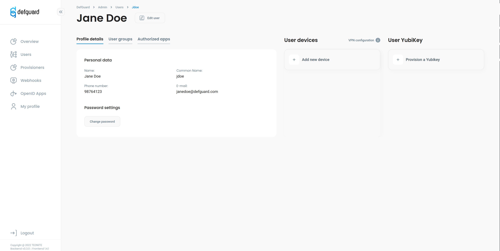
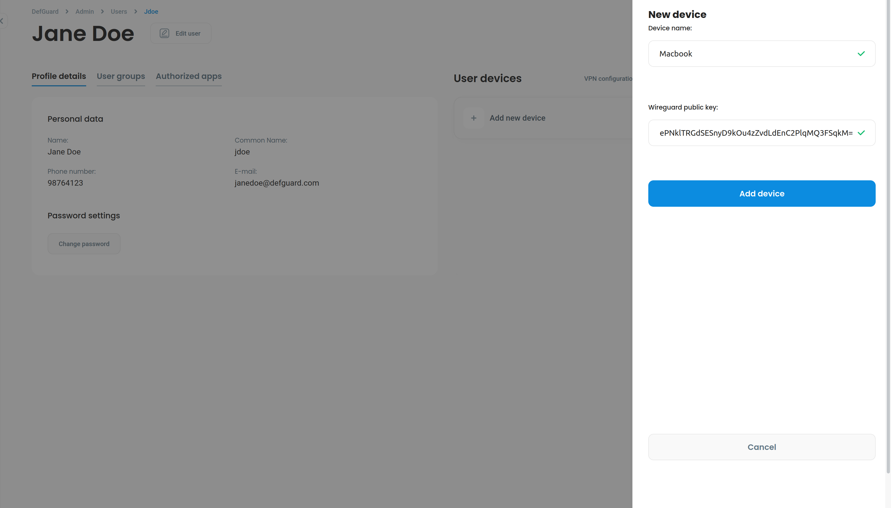

# Adding Wireguard devices

### On this site you learn how to:

* Add new wireguard device
* Download it's config
* Start your vpn connection

First make sure you have installed wireguard on this [site](https://www.wireguard.com/install/) you can find detailed info how to download wireguard for any operating system.

### Creating new device

After you installed wireguard client and configured your network you can go to your profile which you''ll find on nav on the left side of the screen where you can add modify delete or download configuration file for your device.




Before creating new device make you sure generated your public and private keys which are necessary for vpn connection setup.

You can easly create keys by running command:

```
wg genkey | tee privatekey | wg pubkey > publickey
```

Click on add new device button then add contents of publickey file to form and pick a name for your newly created device.



After you created new device you will see it in your profile if you hover on it the settings button will pop up after you click on it you'll se option to download config.

```
[Interface]
PrivateKey = YOUR_PRIVATE_KEY
Address = 10.10.1.202


[Peer]
PublicKey = yKNQWaynkiZad6NJDycTm0tgLzKxI6r6yvq++QYncmA=
Endpoint = 10.1.1.0:7400
PersistentKeepalive = 25
```

After downloading config which look like this above you need to replace with `YOUR_PRIVATE_KEY` with contents of created before privatekey file and move it to `/etc/wireguard` directory on  unix-like systems and on windows copy it contents run wireguard program and paste into new tunnel option.

After doing this you can run to start your vpn connection.

`wg-quick up <device_name>`&#x20;

&#x20;**Note** device name is default downloaded config file name without .conf in our case its macbook\
&#x20;but if you rename your file remember it no more will be name of device
