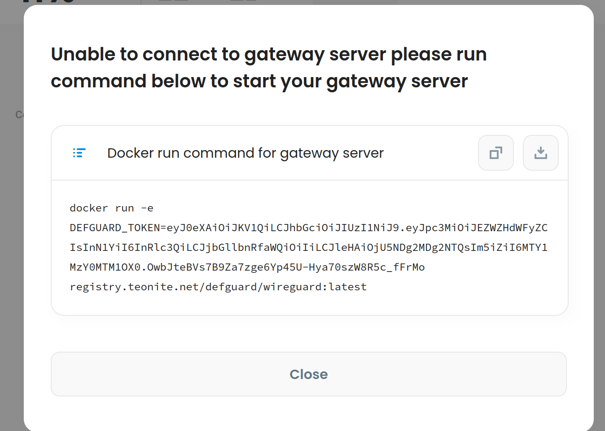

# Create your VPN network

## Before we start

* Make sure your defguard instance is [deployed](setting-up-your-instance.md) and running
* Make sure you downloaded our [Wireguard Gateway](https://github.com/DefGuard/wireguard-gateway)
* Make sure you know what [Wireguard](https://www.wireguard.com/) is and have basic understanding of how it works

## Network creation wizard

After deploying your defguard instance first screen you'll see will look like this 

## Network name and type

Nothing fancy in this step yet just pick your network name and type

.png>)


Currently only supported network type is regular  but we hope it'll change in short future 


## Network configuration

After choosing a name for your network you"ll be on to the next step which is network configuration this is where things might feel a little bit complicated but no worries it be as painless as possible.

## Let's briefly discuss all of these weird inputs

### **Address** 

 It’s the IP address of the  network interface that WireGuard sets up for the peer.

The IP address for a WireGuard interface is defined with a network prefix, which tells the local host what other IP addresses are available on the same virtual subnet as the interface. In the above example, this prefix is /24. That indicate to the localhost that other addresses in the same /24 block as the address itself (10.1.1.0 to 10.1.1.255) are routable through the interface.

### Network port

It's a port on which Wireguard listens on the gateway

### Gateway endpoint

It's IP address of your [gateway](https://github.com/DefGuard/wireguard-gateway) in Wireguard words Endpoint is the remote peer's "real" IP address and port, outside of the WireGuard VPN. This setting tells the localhost how to connect to the remote peer in order to set up a WireGuard tunnel.


Network port and gateway endpoint port can be different in gateway is behind NAT/Firewall


## Optional settings:

### Allowed IPs

is the set of IP addresses the local host should route to the remote peer through the WireGuard tunnel. This setting tells the localhost what goes in a tunnel.

### DNS 

DNS specifies DNS resolvers to query when the Wireguard interface is up and domaints to search for unqualified hostnames.


No worries if you get something wrong you can always change it later


## What to do after wizard completion?

After completing all steps from above you will be redirected to Network overview page which detect if your gateway is connected or not if your gateway  never connected to defguard you'll see modal looking like this

### Wireguard Gateway setup

