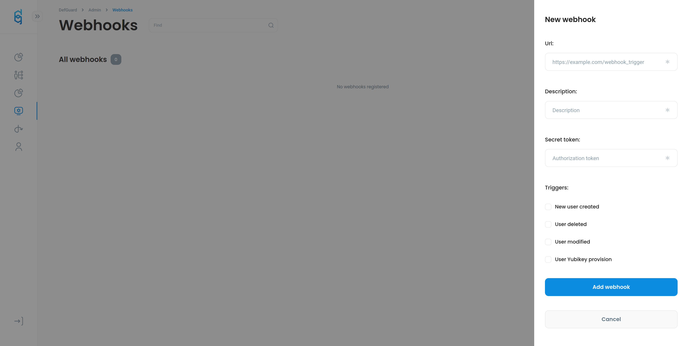

# Webhooks

## Basic idea

Basic idea of webhooks is to send user data to external systems in order to automate certain tasks like for example sending welcome email to newly created user.

## Setup

On the left side of defguard navigation you'll find webhooks page



On above form you'll se inputs like url description token and triggers

* **Url** is an url on which data will be sent after certain triggers
* **Description** short description of your webhook to remember it's use case
* **Secret token** is a token sent with request in authorization header **Note** if receiver didn't implement any token check it'll do nothing
* **Triggers** are events which will trigger the webhook

## Sample request

**Note** all requests are using `GET` method and sends data in body of request in JSON format.

### New user created

Header with name of trigger

`X-Defguard-Event: user_created`

Body example:

```json
{
"email":"janedoe@email.pl",
"first_name":"jane",
"last_name":"doe",
"groups":[],
"is_admin":false,
"pgp_cert_id":"",
"pgp_key":"",
"phone":"123456789",
"ssh_key":"",
"username":"jdoe"
}
```

### User deleted

Webhook will be triggered on new user deletion sample request:

Header&#x20;

`X-Defguard-Event: user_deleted`

Body example:


