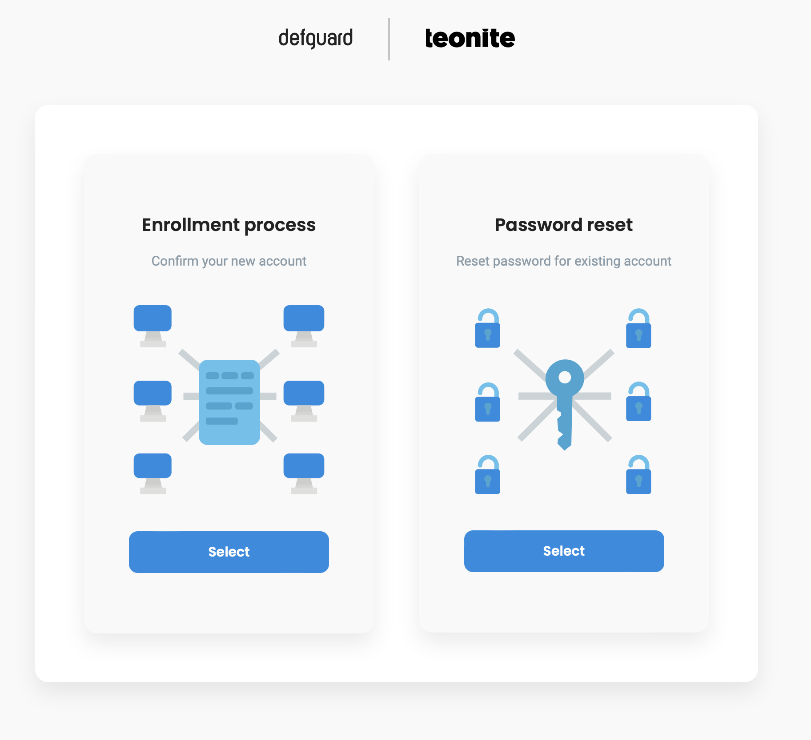

# Password change / Reset

## Resetting your password

If you don't have access to defguard you can reset your password with a link that will be sent to you on your email. Can be done in two ways:

#### Enrollment public page

The same url you have used to do your remote enrollment & onboarding has the functionality of password reset:

<figure><figcaption>
Password reset in enrollment service
</figcaption></figure>


The enrollemnt service URL should be avaialbe in the onboarding email you have received when finishing the [onboarding\&enrollment process.](enrollment.md)


#### By admin

Ask your administrator to send you the password reset link.&#x20;


You should have you admin contact data on the onboarding message that was sent automatically after you have finished the [onboarding\&enrollment process.](enrollment.md)


## Changing your password in defguard

Go to _My Profile_ and click _Edit:_

<figure><figcaption></figcaption></figure>

Then scroll down and choose _Change Password:_

<figure><figcaption></figcaption></figure>

Setup a new secure password according to the password rules and click _Save new password_

<figure><figcaption></figcaption></figure>
