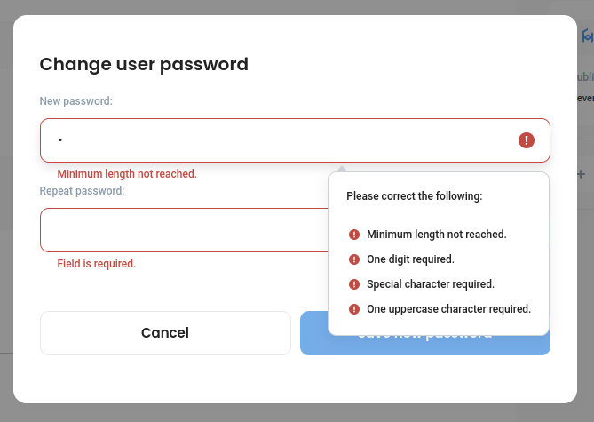

# Changing your password

Go to _My Profile_ and click _Edit:_

<figure><figcaption></figcaption></figure>

Then scroll down and choose _Change Password:_

<figure><figcaption></figcaption></figure>

Setup a new secure password according to the password rules and click _Save new password_

<figure><figcaption></figcaption></figure>
