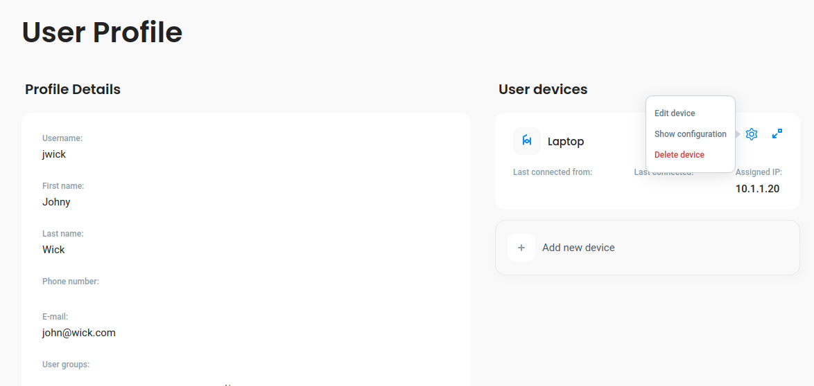
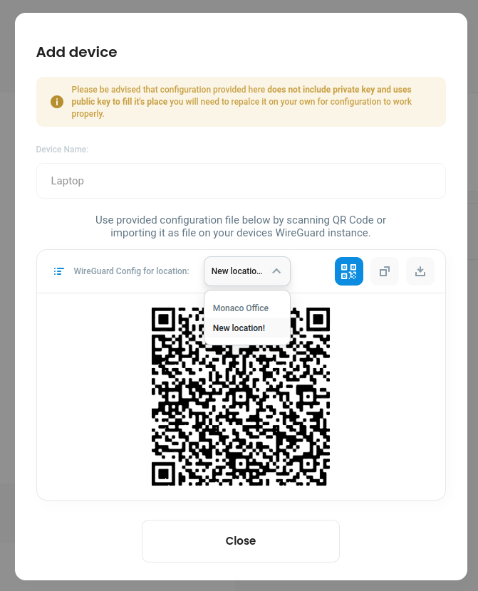

# Configuring a device for a new VPN Location

If you (or your defguard administrator) have added a new VPN Location and you would like to connect to that location from your **already existing device** (which you have downloaded configuration for any previous locations), you need to:

1. Go to **your profile** (_My Profile -_ which you'll find on the navigation on the left side of the screen)&#x20;
2. Click on the **gear icon on the device you want to download Location configuration** - a menu for that device will apear:

<figure><figcaption></figcaption></figure>

3. Choose **Show configuration**

The same configuration screen will popup as you were adding this device, but now you can choose a new location:

<figure><figcaption></figcaption></figure>

4. **Download and configure your Wireguard VPN** exactly the same way you did it during the [adding device process](adding-wireguard-devices.md).&#x20;

The configuration will be named **LocationName-device.conf** - just add a new configuration to Wireguard client.

5. **Replacing the PrivateKey**


**defguard doesn't store any user devices' private keys - you need to provide them**


Since defguard doesn't have access to your private keys - **but has your public key stored for that device** - you need to replace the **PrivateKey value** in the new configuration location.


**Where to find the private key for that device?**

Yon can just **copy the whole line** from any other configurations from any other working locations for that device.


