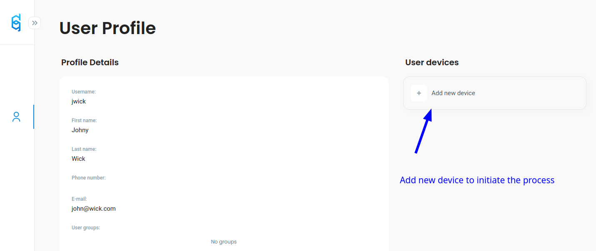
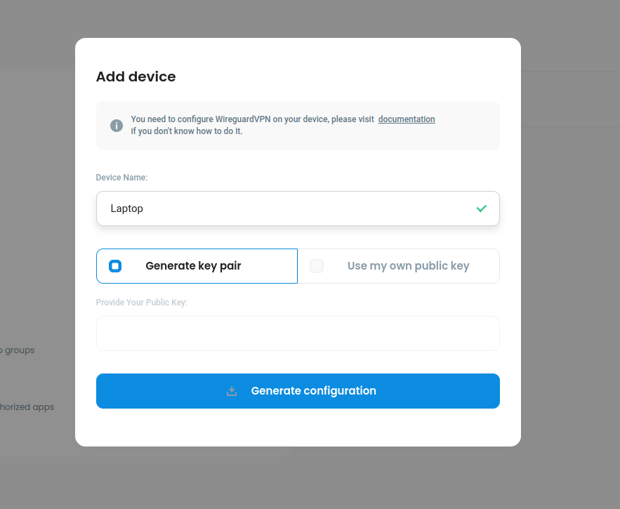
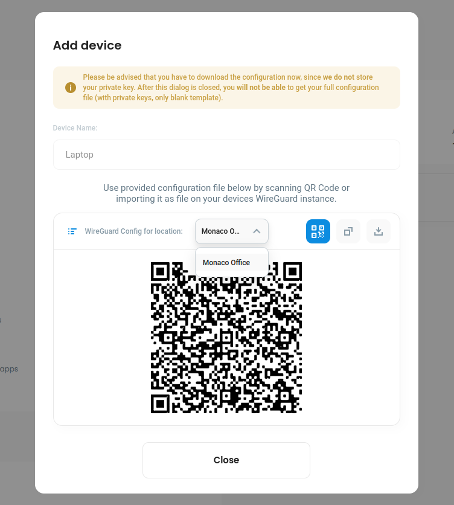

# Adding a device manually

## Installing Wireguard/VPN client

First, you have to install Wireguard application. On this [site](https://www.wireguard.com/install/) you can find information on how to download Wireguard for any operating system.

## Adding a device to connect to VPN

1. Go to **your profile** (_My Profile -_ which you'll find on the navigation on the left side of the screen)&#x20;
2. Click on _Add new device_

<figure><figcaption></figcaption></figure>

3. Now you can **name your device (like Laptop, Phone, whatever you like)** and then you have two options:

<figure><figcaption></figcaption></figure>

a. **Generate key pair** - if you are a new user, just select this option - it will generate a secure key pair (private and public key) - **securly in you browser (defguard doesn't store user private keys)**


Choosing this option - when you download your configuration (or use QR Code to configure Wireguard on your mobile device) - **the private key will be included in your configuration and there will be noting else you need to do**


b. **Use my own public key** - if you are an advanced user and know how to generate a key pair yourself - you can choose this option and enter **your own public key (keeping your private key to yourself)**


Choosing this option - **you will need to change PrivateKey (insert the private key you hold)** in the configuration file you download&#x20;


4. Now you can **download/configure your Wireguard/VPN client by:**
   1. **downloading** the configuration
   2. **Copy** configuration to Clipboard
   3. Use Wireguard feature to configure by scanning the **QR Code**

<figure><figcaption></figcaption></figure>


If you have **multiple VPN locations** - you can choose to download configuration for **each of the location - by selecting the location as shown**


