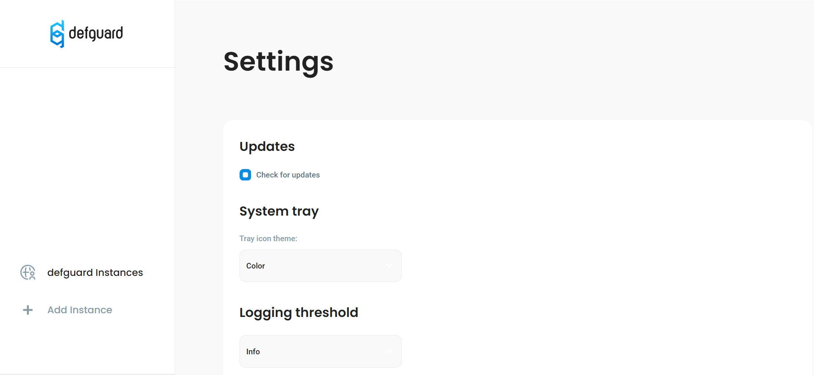
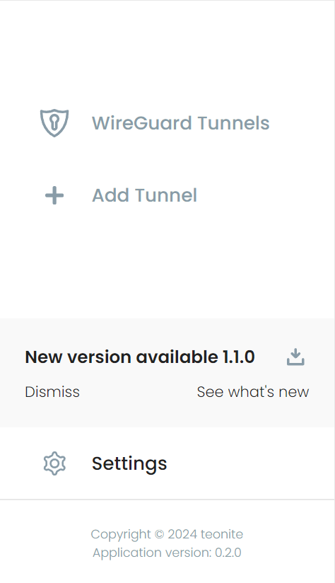

# Desktop Client

## Overview

Desktop client provides an easy way to access VPN locations of multiple Defguard instances via user-friendly UIA.


This feature requires Defguard [proxy ](https://github.com/DefGuard/proxy)service.


## Support Platforms

* MacOS
* Linux
* Windows

## Installation

### Prerequisites

To avoid potential issues, please update:

* Safari on MacOS
* #### webkit2gtk on Linux

### Install the latest release

#### Debian packages, macOS, and Windows packages

You can download the latest release of the desktop client for your platform from our github :\
&#x20;[https://github.com/DefGuard/client/releases](https://github.com/DefGuard/client/releases)

#### ArchLinux

There is an [AUR package](https://aur.archlinux.org/packages/defguard-client)[: defguard-client](https://aur.archlinux.org/packages/defguard-client).

If you don't know how to install AUR packages, please follow these guidlines:

* Manual install: [https://wiki.archlinux.org/title/Arch\_User\_Repository](https://wiki.archlinux.org/title/Arch\_User\_Repository)
* Installation through PARU (AUR Helper): [https://owlhowto.com/how-to-install-paru-on-arch-linux/](https://owlhowto.com/how-to-install-paru-on-arch-linux/)

## Client update

Defguard Client regularly checks for updates and in order to do so operating system name and installed application version are sent to the Defguard update service.

This functionality can be turned off in the Client settings under Updates section so that no data is sent.

<figure><figcaption>
"Check for updates" setting
</figcaption></figure>

If a new version is available, a notification with a download button will be shown near the bottom of the menu.

<figure><figcaption>
New Desktop Client version available for download
</figcaption></figure>
